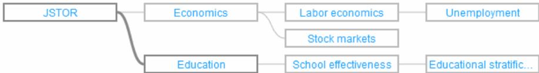
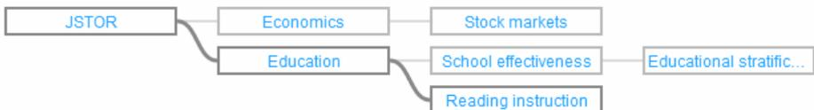
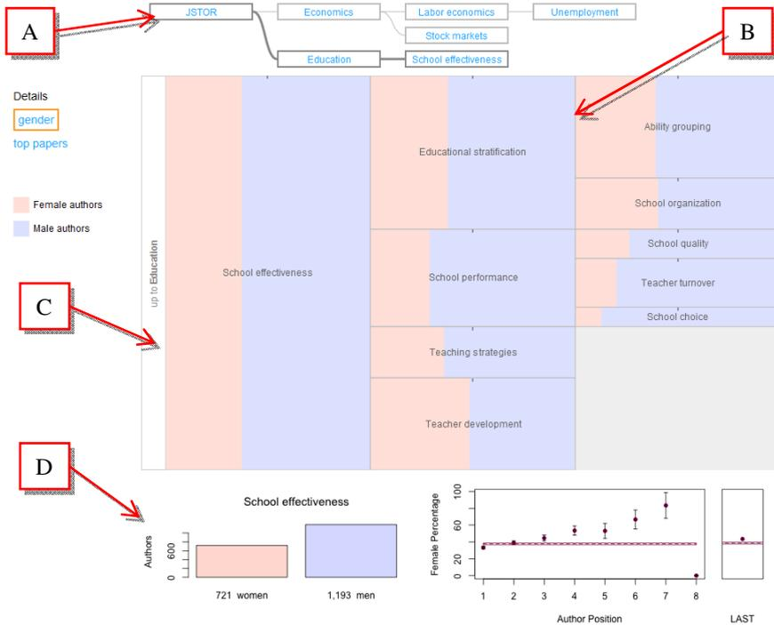
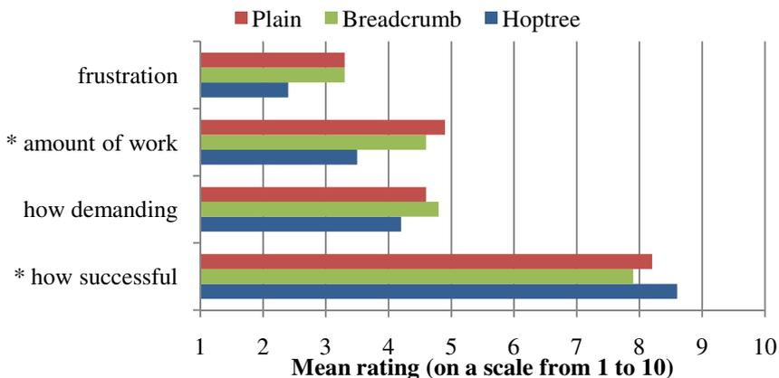
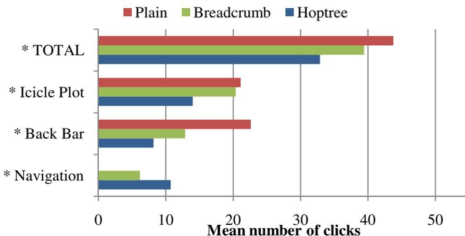
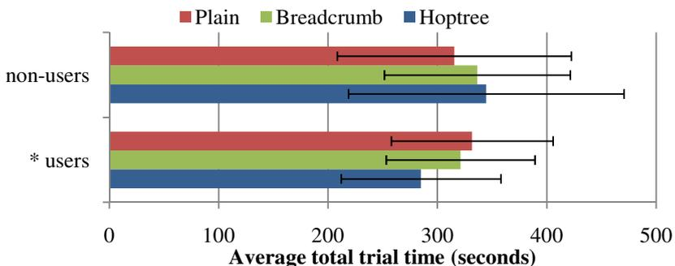

# Hoptrees: Branching History Navigation for Hierarchies

Michael Brooks, Jevin D. West, Cecilia R. Aragon, and Carl T. Bergstrom

University of Washington Seattle, USA

{mjbrooks, jevinw, aragon, cbergst}@uw.edu

**Abstract.** Designing software for exploring hierarchical data sets is challenging because users can easily become lost in large hierarchies. We present a novel interface, the hoptree, to assist users with navigating large hierarchies. The hoptree preserves navigational history and context and allows one-click navigation to recently-visited locations. We describe the design of hoptrees and an implementation that we created for a tree exploration application. We discuss the potential for hoptrees to be used in a wide variety of hierarchy navigation scenarios. Through a controlled experiment, we compared the effectiveness of hoptrees to a breadcrumb navigation interface. Study participants overwhelmingly preferred the hoptree, with improved time-on-task with no difference in error rates.

**Keywords:** Navigation, tree visualization, hierarchy, breadcrumbs, visual interfaces, usability.

## 1 Introduction

Numerous visualization techniques have been developed to help users extract useful information from *hierarchical* data sets [1]. In large trees, the huge number of nodes presents a significant challenge. Many interfaces for browsing hierarchical structures show only a subset of the full hierarchy at one time; the user alters the view by refocusing on a new section of the tree, navigating without viewing an overwhelming amount of information at once.

Narrowing the focus solves one problem, but in doing so creates another: focusing on a subset of the tree makes it easy to get lost. Users seeking to return to a previous focus must exert additional cognitive effort to remember how the previous location relates to the current location, and must continue to remember that relationship as they navigate through the tree to the new focal point. Due to the limitations of human working memory, users may need to revisit locations multiple times, especially when comparing several areas in the tree.

Navigation tools such as breadcrumb trails assist users with navigating complex website hierarchies, and browsing history features are included in all major web browsers. However, with either of these tools, if a user follows a non-linear series of steps through the hierarchy, part of the user's browsing history becomes inaccessible. Moreover, these techniques fail to relate the structure of the user's browsing history to the organization of the hierarchy.

In this paper, we present the hoptree, an interactive graphical interface for exploring hierarchical data that addresses these issues by displaying a clickable, branching history of nodes visited, structured according to their relationships in the hierarchy. The hoptree was designed to reduce cognitive effort by preserving and displaying recently visited paths in the hierarchy. We describe the design of the hoptree, and a prototype implementation that we have released for public use in web-based tree navigation applications. To evaluate the effectiveness of the hoptree, we conducted a controlled usability study comparing the hoptree widget to breadcrumb trails. With the hoptree, users completed comparison tasks more quickly, with fewer mouse clicks, and with greater satisfaction.

## 2 Related Work

### 2.1 Browsing Hierarchies

Analysis and understanding of large, hierarchically structured data sets is of critical importance in many fields. The visualization research community has studied this problem, leading to a variety of visualization and exploration techniques. These employ strategies to make large, complex trees easier to interpret, e.g. specialized zoom techniques [2–4] and layout algorithms [5, 6]. This work has led to a variety of innovative designs and strategies for presenting the most important information to users and hiding unneeded information, while simultaneously maintaining a sense of location and context within the tree, such as the SpaceTree [7]. However, most existing techniques are targeted to specific tasks or domains and in large hierarchies, becoming lost continues to be a challenging problem.

### 2.2 Breadcrumb Navigation

For many classic hierarchy exploration and navigation tasks, such as browsing the web or working with a file system, the sophisticated techniques in the literature have not been widely adopted. The hoptree widget is a simple design that could make tree navigation tasks easier and faster in a variety of general applications.

Breadcrumbs, or breadcrumb trails, are widely employed for helping users navigate on the web. Breadcrumbs usually consist of a linear sequence of links that provide a sense of location and facilitate quick navigation. Three types of breadcrumb trails are distinguished based on whether the trail reflects the application's hierarchy, the user's navigation history, or a set of dynamic attributes [8].

The benefits of breadcrumbs have been studied within the web usability community. A 2003 lab study of navigation within a test website found that only 6% of users' total page clicks were on the breadcrumbs, and did not detect any significant efficiency gains from using the breadcrumb [9], although the breadcrumb trail did lead to more accurate mental models of website structure.

Hull found that demonstrating and explaining the use of breadcrumbs beforehand improved efficiency for search tasks [10]. Look-ahead breadcrumbs, an augmentation of traditional breadcrumbs where clicking on the breadcrumb trail provides a menu with pages reachable from that item [11], were preferred by participants in a lab study, although no significant speed improvements were detected [12].

### 2.3 History Tracking

History tracking functionalities are available in many software applications, where they help users explore and recover application states. For supporting visual analysis tasks, Heer et al. describe a design space of graphical history tools and provide a review of recent research in this area [13]. History tracking widgets with branching structures have also been investigated for visual analytics tasks [14, 15]. For history tracking in web browsers, the MosaicG graphical history constructed a node-link representation of web browsing history with pages connected according to the order that they were visited by the user [16]. Similarly, PadPrints constructs a graphical hierarchy of pages that the user visits in their web browser [17]. PadPrints was found to reduce the number of page accesses and reduce the time taken to complete tasks requiring revisiting pages. Graphical history mechanisms can facilitate exploration and iterative analysis because they provide the ability to easily return to a prior state.

These history tracking tools present a history of linked *states* or *actions*. In the terminology of Cockburn and Greenberg's analysis of requirements for effective revisitation tools for web browsing, MosaicG and PadPrints structure their page display organization temporally, according to the user's visit history [18]. Our goal in this paper is to help the user understand and navigate a predefined hierarchical information structure. Accordingly, the hoptree primarily structures the graphical history according to the underlying information hierarchy, not according to user behavior.

## 3 Hoptree Design

We describe the features of the hoptree widget and the navigational problems each feature is designed to solve. We explain the hoptree design in terms of how it differs from breadcrumb trails.

### 3.1 Preserving Navigation History

Traditional breadcrumb trails display the “path” to the current location in the hierarchy. Hoptrees display not only the path to the current location, but also the paths to previously visited locations. Before the user begins exploring the tree, the hoptree widget shows only the path to the current node (e.g. the tree's root node). With each navigation action, the path to the new location is added to the hoptree's representation. Thus, the hoptree gradually builds up a more complete diagram of the hierarchy that the user is exploring (Fig. 1).

**Fig. 1.** A hoptree showing nodes that the user recently visited. The user is currently viewing the *Education* node.

Because it shows multiple paths at once, the hoptree helps users construct a mental model of the tree. While a breadcrumb trail may help users remember where they are relative to the root of the tree, the hoptree may also help the user remember how their current location relates to several previous locations.

The hoptree lays out its node-link representation of the hierarchy according to a left-to-right, top-to-bottom algorithm. Within the bounds of the hoptree widget, the root node is positioned on the left. Child nodes are positioned to the right of their parents, with siblings grouped together and aligned vertically. Nodes are connected to one another by curved edges.

### 3.2 Interactivity

As with breadcrumb trails, the hoptree widget is interactive. The user may click on a node in the hoptree to quickly “hop” to that position in the hierarchy. This increases the speed with which users may navigate the tree. The hoptree is especially effective when the user wishes to compare several tree locations, because it facilitates quick revisiting of recently accessed nodes.

### 3.3 Automatic Pruning

A crucial aspect of hoptrees is a pruning strategy by which tree locations that are no longer of interest are removed from the display. Without such a pruning strategy, the hoptree would rapidly increase in size and complexity as the user explored new areas of the hierarchy, becoming unwieldy and hard to use.

The hoptree’s design assumes that, most of the time, users do not require access to their entire history. The pruning strategy we selected allows the hoptree to display up to three different tree leaves. If the user’s next navigation would result in a fourth leaf being added to the hoptree, the update algorithm removes the oldest leaf in the hoptree, along with all of its parents that are not parents of a remaining leaf. Fig. 2 illustrates how a branch is removed after a typical update.

**Fig. 2.** The same hoptree from **Fig. 1**, after the user has visited *Reading instruction*, causing a layout adjustment and the pruning of the *Labor economics* subtree.

Displaying *three* branches provides a balance between utility and usage of screen real-estate. At least two branches are needed to support simple two-way comparison tasks. Showing three branches also permits comparisons among three locations, or, alternatively, the preservation of a related branch while two other locations are compared. The benefits of displaying more than three branches are not as clear; we leave alternative pruning strategies and branch limits to future work.

All decisions about which tree locations to preserve and which to prune are handled automatically by the hoptree update algorithm, eliminating maintenance work for the user. The tradeoff is that when the heuristic for estimating the relevance of nodes is incorrect, nodes that the user actually planned to revisit may occasionally be pruned from the tree. Thus, it is also be reasonable to investigate ways of giving the user more direct control over the hoptree's pruning strategy.

## 4 Prototype Implementation

We created an implementation of the hoptree for a specific tree exploration tool, the Gender Browser, an application under ongoing development in our research group. The Gender Browser1 is implemented in JavaScript for display in HTML5-compliant web browsers. For completeness, we briefly describe the Gender Browser because it provides the context for our experiment. Then, we describe the architecture of our prototype hoptree implementation.

### 4.1 The Gender Browser

The Gender Browser is a tree exploration application that shows gender patterns in scholarly authorship across academic disciplines. The tree structure comes from automatic hierarchical clustering of a database of published journal articles provided to us by JSTOR2. The database used in our study contained approximately 350,000 articles by 480,000 authors, from over 2,000 different journals.

The Gender Browser displays a tree of scientific disciplines, and sub-disciplines based on articles a clustering of the article citation network using the hierarchical map equation algorithm [19]. In the version we used for our experiment, the tree contained 15 top-level disciplines, each of these disciplines containing several sub-disciplines. There were 448 nodes total, with 283 leaves at a depth of about 6 levels. All but 36 (8%) of the disciplines were manually labeled by examining its most-cited papers. We approximated the ratio of female to male authors in each discipline by automatically assigning a gender to every author using an approach similar to [20].

The tree of academic disciplines is displayed using an Icicle Plot visualization built using the JavaScript InfoVis Toolkit (JIT) [21] and jQuery. Each node in the tree is broken into two blocks of different colors, illustrating the percentage of women and men authors in that discipline. When the mouse cursor hovers over a node, a tooltip displays the associated discipline's name and the percentage of female and male authors. Fig. 3 shows the Gender Browser with the hoptree positioned above it.

1 <http://eigenfactor.org/gender>

2 <http://www.jstor.org>

**Fig. 3.** The Gender Browser. The user has visited several specialties within *Economics*, and is now focused on *School effectiveness*, an area within *Education*. The hoptree (A) is positioned above the main icicle plot (B). On the left, the back bar (C) allows the user to return to *Education*. The detail views at the bottom (D) show the number of women and men authors in *School effectiveness* and the percentage of female authors in different positions on author lists. The red bar indicates the overall percentage of female authors in the field.

Below the icicle plot are two additional displays showing details about the gender breakdown of the currently selected discipline, including the absolute number of men and women authors in the discipline, and the percentage of women authors in the discipline for each position in article author lists. On the left side of the window, the “top papers” button allows the user to swap out the two detail displays with a list of the 10 most cited papers within the current discipline.

When the user clicks on a node in the icicle plot, the clicked node zooms to fill the height of the display. Parent and sibling nodes fade out, and child nodes expand. This allows the user to drill down into the hierarchy to explore finer disciplinary subdivisions. A bar on the left side of the icicle plot shows the name of the discipline that is the parent of the currently selected discipline. Clicking on this “back” bar will jump up one level in the tree with an animated transition.

### 4.2 Hoptree Implementation

We used the JavaScript InfoVis Toolkit to implement the hoptree prototype for the Gender Browser. The toolkit includes a SpaceTree visualization that was easily extended to display a hoptree. We wrapped the SpaceTree visualization with code to manage updates to the hoptree structure, including node additions and pruning.

Users can navigate by clicking on either the Gender Browser's icicle plot or nodes in the hoptree, and updates are synchronized between the two widgets. We have released our hoptree implementation as an open-source jQuery plugin that could be applied to a variety of web-based hierarchy browsing applications3. The hoptree prototype exposes a simple programming interface for integration with hierarchy browsing applications. On navigation events, the only information that must be passed to the hoptree is a string representing the new path.

## 5 Empirical Evaluation

In order to determine whether hoptrees are helpful for navigating a hierarchy, we compared our hoptree implementation to a breadcrumb trail navigation widget in a controlled experiment.

We developed three versions of the Gender Browser that differed only in the type of navigational support provided. A “plain” version lacked any special navigation support beyond the “back” bar for navigating up one level in the tree. A second version added a breadcrumb trail displayed above the icicle plot. The breadcrumb trail is implemented as a simplification of the hoptree (it displays only one branch at a time), providing a uniform visual appearance. The third version displays a hoptree widget above the icicle plot (Fig. 3).

### 5.1 Hypotheses

We designed the experiment to test three hypotheses. First, we expected that users would recognize the navigation advantages of the hoptree and breadcrumb interfaces over the plain version. Therefore, we hypothesized that they would express higher preferences for either the hoptree or the breadcrumb, and lower preferences for the plain interface. Because users might prefer familiar breadcrumb trails, we did not expect that the hoptree would necessarily have the highest preference scores overall.

Second, because the breadcrumb and hoptree versions provide instant access to nodes that the user may be interested in, we hypothesized that users would complete tasks faster in the breadcrumb condition than the plain condition, but would be fastest in the hoptree condition. For the same reason, we expected users to perform fewer mouse clicks while completing the tasks with the hoptree, followed by the breadcrumb trail and the plain interface.

Third, we hypothesized that for more complicated comparison tasks, the rate of correct answers would be highest with the hoptree version of the Gender Browser,

3 <http://github.com/michaelbrooks/hoptree>

and to a lesser extent, the breadcrumb version. If users complete tasks faster using these interfaces, they may be better able to remember the data needed to make comparisons between several tree locations. For the same reason, we hypothesized that users would have higher confidence in their answers when using the hoptree and breadcrumb interfaces.

### 5.2 Experiment Design

We compared the three versions of the Gender Browser interface (Plain, Breadcrumb, and Hoptree) in a within-subjects experiment where participants completed three trials, one with each version of the Gender Browser. Each trial consisted of a set of eight questions that required comparisons among several different nodes at varying degrees of separation in the tree. We developed three distinct sets of questions that matched each other as closely as possible in difficulty and structure. We describe the questions in greater detail in the Tasks section, below.

To control for ordering, we carefully considered all possible pairings of *Interface* and *Question Set*, all possible orderings of *Interface* and *Question Set*, and orderings of the combined factor *Interface* x *Question Set*. We assigned participants to interface and question set orderings so as to balance all of these combinations as closely as possible, given the number of participants in our study.

Before beginning the experiment, participants were given a brief tutorial that explained the plain Gender Browser, but did not show or discuss either the breadcrumb trail or the hoptree. The purpose of the tutorial was to reduce the difficulty of learning how to answer questions about the Gender Browser's main icicle plot and detail displays. For example, after completing the tutorial, users would already have an idea of where to look to find the percentage of first female authors in a given discipline. We did not explain or even show the hoptree or breadcrumb trail during the tutorial, in order to avoid unfairly biasing participants towards using these features. Each trial was preceded by an easy practice question so that participants could get used to the task format and the new interface.

We handed participants cards with the questions printed on them one at a time. Participants were asked to read and understand the question on the card, and allowed to ask clarification questions. Once the question was understood, we began a timer and the participant attempted to use the Gender Browser to answer the question. When the participant had an answer ready, we stopped the timer and recorded the time taken to answer question, the number of clicks in different parts of the interface (recorded by the prototype itself), the correctness of the answer, and the participant's confidence in their answer on a 1-to-10 scale. In between each question, the Gender Browser was *not* reset, so that on each question participants could benefit from the history they had already accumulated in the breadcrumb and hoptree widgets.

After finishing each of the three trials, we asked participants to rate their own level of success, the difficulty of the questions, how much work was required to answer the questions, and level of frustration, all on 1-to-10 scales. Once all three trials were complete, we asked participants to choose from among the three different versions of the Gender Browser the one they preferred, which one was easiest to use, which one

was the most frustrating, and which one allowed them to complete the tasks fastest. We asked follow-up questions to understand the reasons behind these answers.

### 5.3 Tasks

In selecting tasks for the experiment, we emulated the activities users might normally engage in while using the Gender Browser. Based on our own usage of the tool and discussions with colleagues, we determined that a plausible usage pattern could include looking up a few specific disciplines of personal interest and comparing the gender patterns among them. For example, a researcher using the tool might first locate her own specialty within the tree. She might then compare the gender frequency in her specialty with some other fields she is familiar with. We based the experiment tasks on this style of exploration, focusing on comparisons among multiple fields.

Using this approach, we developed a set of tasks, including revisiting [7, 22] and comparison tasks [23]. These task types are based on plausible user behavior and are supported by previous literature, a naturalistic evaluation would be required to determine if they are actually the tasks that users would normally perform using the tool.

Because every participant used each version of the Gender Browser (Plain, Breadcrumb, and Hoptree), we needed to develop three sets of questions. We first created one set of questions that we used as a template for the other two. Each question set followed the same structure, but was scoped within a different top-level branch of the Gender Browser's tree, reducing the likelihood of direct interference during the study. The template question set focused on the *Ecology and Evolution* subtree, and began by asking the user to answer a few easier retrieval questions such as “*What was the percentage of women authors in Small mammal ecology?*” Questions grew progressively more difficult, involving more comparison between ever more distant tree locations. For example, the last question in this set was “*How much larger is the number of women who published papers in Migratory birds (within Avian reproductive ecology) than on Ungulates (within Mammalian herbivore ecology)?*” As illustrated in this example, for fields that would be difficult to locate because of their depth in the tree and unfamiliarity (e.g. *Ungulates*), we included a reference to the usually easier-to-find parent node (e.g. *Mammalian herbivore ecology* in the above example).

After creating the first question set as a template, we analyzed the trajectory through the tree that users would need to follow as they progressed from question to question. For the second and third question sets, we chose two different top-level branches of the Gender Browser's tree (*Molecular and cell biology* and *Education*) where we were able to design questions that would reproduce this trajectory and maintain a similar difficulty level. Because it was impossible to create exactly equivalent question sets, pairings and orderings of question sets and interfaces were changed for each participant.

### 5.4 Participants

We recruited eighteen people from engineering, biology, and design departments to participate in our experiment. Ages ranged from 19 to 54 (mean of 30), and there

were 8 women and 10 men. Six of the participants were undergraduates, while the rest had at least some graduate education.

Because two of the question sets focused on specific academic topics, we asked participants if they had ever studied the three subject areas at a college level or higher: Ecology and evolution, Molecular and cell biology, and Education. Eight of the participants had studied at least one of the biology topics, and six had studied Education. Twelve participants said that they had been authors on academic publications. We did not detect any important differences between these groups in the experiment.

## 6 Results

We summarize the results of our experiment for each of the measures we collected: user preferences, task time, mouse clicks, correctness, and confidence.

### 6.1 Preferences

After each trial, participants were asked to report how successful they felt they had been, how demanding the questions were, how much work the trial required, and how frustrating the trial had been. These answers were provided on 10 point scales. Fig. 4 shows the mean scores for each of the three interfaces.

We interpreted the ratings as ordinal data and used non-parametric Kruskal-Wallis tests to check for overall differences in preferences between the three interfaces. We found that interface differences had a significant overall effect on the *amount of work* participants felt they had to do to answer the questions ( $\chi^2(2) = 5.3$ ,  $p = 0.02$ ). Interface differences also had a significant effect on how *successful* participants felt ( $\chi^2(2) = 4.76$ ,  $p = 0.028$ ). There was also a trend in the level of *frustration* ( $\chi^2(2) = 3.4$ ,  $p = 0.063$ ). For these measures, we detected no significant pairwise differences, using Mann-Whitney tests with a Bonferroni correction ( $\alpha = 0.0166$ ).

**Fig. 4.** Mean ratings in four categories, for each three interface. \* indicates significance.

In the post-experiment questionnaire where participants were asked to choose the most preferred, easiest to use, fastest, and most frustrating version of the Gender Browser, participants expressed strong and consistent preferences for the Hoptree version. Table 1 summarizes these results. Chi-square tests indicated that the distribution of participants' answers over the three interfaces was significantly different from uniform on all four questions ( $p < 0.001$ ).

**Table 1.** Number of users who selected each of the three interfaces as most preferred, easiest, fastest, and most frustrating. \* indicates significant differences between interfaces.

|                    | Plain | Breadcrumb | Hoptree |
|--------------------|-------|------------|---------|
| * Preferred        | 0     | 2          | 16      |
| * Easiest          | 0     | 2          | 16      |
| * Fastest          | 1     | 1          | 16      |
| * Most Frustrating | 13    | 5          | 0       |

These results support our hypothesis that users prefer the Hoptree or the Breadcrumb over the Plain interface. Most users also preferred the Hoptree over the Breadcrumb despite any preexisting familiarity with breadcrumb trail navigation.

### 6.2 Navigation Clicks

For each participant, we recorded the number of clicks performed in each condition. We separately recorded the number of clicks on the Gender Browser's main icicle plot, the Gender Browser's back button, and the navigational widget (breadcrumb or hoptree, not present in the Plain condition). Overall, participants had the fewest clicks using the Hoptree interface and the most with the Plain interface. Fig. 5 shows mean clicks total and by interface component: icicle plot, back bar, or navigation widget.

**Fig. 5.** Mean clicks on each interface. Total clicks, broken into clicks on the icicle plot, back bar, or navigation (hoptree or breadcrumb). \* indicates significance.

Because the click count data was not normally distributed, we again used non-parametric Kruskal-Wallis tests to check for overall differences. The difference in total number of clicks (not separated by area) was statistically significant ( $\chi^2(2) = 15.8$ ,  $p < 0.001$ ). There were also significant differences between the three interfaces in the number of clicks on the icicle plot ( $\chi^2(2) = 3.4$ ,  $p = 0.063$ ), back button ( $\chi^2(2) = 21.8$ ,  $p < 0.001$ ), and navigation ( $\chi^2(2) = 23.6$ ,  $p < 0.001$ ).

We compared the click counts between each pair of interfaces using Mann-Whitney tests with a Bonferroni correction ( $\alpha = 0.0166$ ). Between the Hoptree and Breadcrumb interfaces, the difference in total click count was significant ( $p < 0.011$ ) and the difference in icicle plot clicks was significant ( $p < 0.001$ ). Between the Breadcrumb and Plain interfaces, the number of back button clicks was significantly different ( $p < 0.001$ ). Between the Hoptree and Plain interfaces, all differences in click counts were significant ( $p < 0.001$ ).

Some participants barely used the navigational support widgets. Three out of the eighteen participants did not seem to realize that they could use the hoptree widget to navigate during the trial, and did not click on it at all. Three other participants clicked on it only once or twice, at the very end of the trial. All others clicked on the hoptree more than 10 times over the course of the 8 questions. For the Breadcrumb version of the interface, eight participants clicked on the breadcrumb zero or one times, and five of these participants were the same individuals who did not make use of the hoptree. Because the pre-trial tutorial did not include any description of the navigation widgets, these participants may have simply ignored it, focusing their attention only on working with the icicle plot portion of the Gender Browser.

### 6.3 Task Time

Participants took an average of 327 seconds ( $\pm 81$ ) to complete the entire trial (all eight questions) using the Plain interface, 325 seconds ( $\pm 71$ ) using the Breadcrumb interface, and 302 seconds ( $\pm 91$ ) with the Hoptree. The time taken by individual participants varied widely, contributing to the high standard deviations for these data. Because the questions varied in difficulty, there was also a great deal of variation in time taken for different questions within the trial.

Before analyzing task time, we checked whether the data satisfied the assumptions required for parametric tests. A Shapiro-Wilk test indicated that the *TimeTaken* was not sufficiently normally distributed ( $p < 0.001$ ). We transformed the timing data using a natural log transformation, which produced distributions that were acceptably normal for all three interfaces.

We then analyzed *Log(TimeTaken)* using a mixed-effects model analysis of variance. Like traditional repeated measures ANOVA, mixed model analyses can be used for factorial designs with between- and within-subjects factors. However, this technique is robust with missing data and imbalanced designs, and it models the experimental subject as a random effect because its levels are drawn randomly from a population. These tests retain larger denominator degrees of freedom than traditional ANOVAs, but detecting statistical significance is no easier because wider confidence intervals are used [24, 25]. The fixed-effects we used included *Interface* (Plain,

Breadcrumb, Hoptree), *QuestionSet* (1–3), *Question* (1–8), *Trial* (1–3), and several interaction effects; *Participant* was modeled as a random effect.

There was a significant difference in *Log(TimeTaken)* for the three interface variations ( $F(2, 283.8)=4.73$ ,  $p < 0.01$ ). Pairwise comparisons between the three interfaces with a Bonferroni correction for multiple comparisons ( $\alpha = 0.0166$ ) indicated that the difference between the Hoptree interface and the Plain interface was significant ( $p < 0.005$ ). With the significance correction, there was only a marginal difference between the Hoptree and Breadcrumb interfaces ( $p < 0.024$ ). The difference between the Breadcrumb and Plain interfaces was also not significant.

As mentioned previously, some participants did not use the hoptree or breadcrumb interfaces during the experiment. In a post-hoc analysis, we partitioned participants into *users* (13 participants) who clicked on either the breadcrumb or hoptree more than once, and *non-users* (5 participants) who clicked on neither interface more than once. Fig. 6 displays the average time to complete all eight questions with each of the three interfaces, for both *users* and *non-users*. A mixed-effects model analysis of variance of total time taken found a significant difference between interfaces within the group who used the navigation features ( $F(2, 235.9)=4.4$ ,  $p < 0.013$ ), and pairwise comparisons found that the Hoptree interface performed significantly better than both the Breadcrumb ( $p < 0.015$ ) and Plain interfaces ( $p < 0.008$ ). There were no significant differences detected within the non-users group.

**Fig. 6.** Average total times by interface, for participants who used navigation features (users) and those who did not (non-users). \* indicates significance.

These results support the hypothesis that users could complete the tasks fastest with the hoptree, but suggest that increased awareness of the hoptree widget, through training, design changes, or longer usage time, may be necessary before these benefits can be fully realized.

### 6.4 Correctness and Confidence

Out of 432 total questions that were asked, only 22 incorrect answers were given. The Breadcrumb interface had 11 incorrect answers, followed by the Plain interface with 7 and the Hoptree with 4. A chi-square test did not find this distribution to be

significantly different from uniform. The median confidence score given by participants was 9 out of 10, for all three interface conditions.

These results do not support our hypotheses that there would be fewer incorrect answers and higher confidence on the Hoptree and to some extent the Breadcrumb interfaces. The trend we observed toward a lower error rate on the Hoptree interface bears further study.

### 6.5 Task Characteristics and Learning Effects

We analyzed the differences in the amount of time taken between different questions and between different question sets to verify whether or not we had succeeded in designing questions with varying levels of difficulty and question sets with comparable levels of difficulty.

The time taken on the different question sets varied slightly. On Set 1, participants took an average of 37 seconds ( $\pm 22$ ) to answer each of the questions; for Set 2, the average time was 43 seconds ( $\pm 29$ ); and for Set 3, the average total was 39 seconds ( $\pm 25$ ). However, the mixed-effects model analysis of variance, discussed previously, did not find a significant main effect of Question Set on *Log(TimeTaken)*.

Within the question sets, the time taken on each question increased gradually starting with a mean of 13 seconds ( $\pm 5$ ) on Question 1 and ending with a mean of 56 seconds ( $\pm 25$ ) on Question 8. Overall differences in *Log(TimeTaken)* among the eight questions were significant ( $F(7,84.7) = 124.8$ ,  $p < 0.001$ ). These results indicate that the question sets were fairly similar in difficulty, but that the questions within the sets varied in difficulty, as intended.

We also checked for differences between the 1st, 2nd, and 3rd trials that participants completed, to determine the degree to which general familiarity with the interface or process improved task time. Participants did seem to get faster as they became accustomed to the types of questions being asked and the Gender Browser interface. Questions completed in Trial 1 had a mean time of 43 seconds ( $\pm 27$ ), in Trial 2 a time of 38 seconds ( $\pm 25$ ), and in Trial 3 a time of 37 seconds ( $\pm 24$ ). However, the mixed-effects model analysis of variance found only a trend in *Log(TimeTaken)* between the three trials ( $p = 0.067$ ).

## 7 Discussion

The results indicate that hoptrees allow users to navigate the hierarchy more quickly and in fewer clicks. Users also preferred the hoptree over the other versions tested. We observed several interesting patterns of use that suggest future lines of research.

As noted above, certain participants barely used the navigational widgets during the experiment. Because the tutorial prepared them for only the plain version of the interface, the participants may have simply ignored the addition of the relatively subtle navigation widgets, perceiving it as outside the scope of the task, as it had been explained. It may be possible to improve the design of both the hoptree and breadcrumbs so that users more quickly recognize the affordances and utility of the

navigation widgets. Prior research on breadcrumbs found that, in a website navigation task, only a small percentage of clicks were on the breadcrumb trail [9] while another study found that training in how to use the breadcrumb resulted in greatly improved performance [10]. We would like to investigate the effects of design changes, training, or increased familiarity. Slight changes to the design of the hoptree, such as beveled edges or link-like underlining, may improve the discoverability of the tool. We predict that this would result in increased usage, leading to significant efficiency improvements.

Some of the participants who *did* use the hoptree and breadcrumb trail seemed to instantly and naturally understand how it worked. For others, there was a detectable “aha moment” where they realized that they could use the hoptree to complete the tasks. For several participants who had already completed trials with the more tedious plain or breadcrumb interfaces, the moment when the hoptree first branched to show the history of their previous explorations was accompanied by smiles or appreciative exclamations such as “I like this thing right here” (pointing to the hoptree). When one participant began using the Breadcrumb interface after completing the Hoptree trial, he remarked “It’s amazing how much that thing helped.” The post-experiment ranking results indicate that even for those participants who did not realize how the hoptree worked until it was too late to take advantage of it still appreciated its advantages.

Although our results suggest that the hoptree led to a significant decrease in time taken overall, we observed some cases where participants actually seemed to take longer with the hoptree than they would have with the breadcrumb or plain interfaces. This phenomenon sometimes occurred during the questions which required comparison between multiple tree locations. Specifically, with the plain or breadcrumb interfaces, participants answering a comparison question would often follow the following procedure: (1) visit the first location in the tree; (2) find and memorize the piece of information the question asked about; (3) find the second location; (4) find the required piece of information at that location; (5) perform the required comparison; (6) report the answer.

On the other hand, when using the hoptree, there was a fast and easy way for participants to hop back and forth between locations. Many participants took advantage of this, and did not memorize the information as they would have with the plain or breadcrumb interfaces. Instead they began by visiting all of the locations the question asked about, sometimes without even looking for the information at each location. Visiting the locations makes each of the locations available for revisiting through the hoptree, so participants would then quickly revisit each location through the hoptree widget to retrieve the required information. They sometimes visited all of the locations more than once to double check their answers.

The popularity of this unexpected “measure twice” strategy, enabled by the hoptree, may have reduced the size of the speed improvement we observed. At the same time, the ability to quickly check comparisons, instead of having to commit multiple pieces of data to memory, is itself an important advantage. We believe that the ease with which users could check their work with the hoptree contributes to the higher preference scores in our experiment.

Given this phenomenon, we would have expected to see higher rates of correct answers and higher confidence ratings on the hoptree interface than on the breadcrumb and plain interfaces. However, there were very few incorrect responses overall and differences were not significant. From the data we collected, confidence levels also did not seem to be affected in any noticeable way by the different interfaces. It is possible that in a larger experiment, or with more difficult questions, differences would become apparent. The questions in our experiment all had right-or-wrong answers, and most participants worked until they were sure they had the correct answer. As a result, most participants seemed uncertain how to rate their confidence, and in most cases they chose the same confidence level for nearly all of the questions.

Several participants who used the hoptree widget more extensively commented on some aspects of the tool. Two participants mentioned that they were annoyed by the animations between tree locations that took place in the Gender Browser's icicle plot. While not a direct feature of the hoptree, it seems that once the hoptree created the potential for instant traversal between locations, the Gender Browser's relatively slow animated transitions became annoying.

Some participants also commented on the hoptree's pruning strategy. While several users said that the pruning strategy seemed appropriate and useful, a few people wanted either greater control over what the hoptree chose to preserve, or a more extensive history. The strategy we selected is designed to minimize the amount of maintenance work for users, at the risk of occasionally pruning nodes that the user wants to revisit. Depending on the application domain and the types of browsing activities that users are engaging in with the hierarchy, it might be preferable to allow a greater level of control. For example, allowing users to "pin" certain branches to the hoptree, preventing them from being pruned, could be a useful optional feature.

## 8 Conclusions and Future Work

We have introduced the hoptree, a novel visual interface for more quickly and easily navigating hierarchies, such as tree visualizations, web sites, and file systems. We have explained the design of the hoptree and our prototype implementation, which we have published as an open source jQuery plugin4. We compared the hoptree to a breadcrumb navigation widget within the context of the Gender Browser. Our results demonstrate that the hoptree has significant speed and efficiency advantages, and that users prefer the hoptree to breadcrumb trails for tasks involving comparisons.

For this lab experiment we created tasks involving targeted information seeking and comparisons, but users interacting with a large hierarchy naturally might engage in more open-ended, exploratory activities. The path a user would naturally take through a hierarchy such as the Gender Browser would focus on personally meaningful information, while the information we asked participants to find may have felt arbitrary. Future work should investigate the impact of hoptrees and navigation tools in open-ended scenarios. Do users explore the tree more deeply when the hoptree is present? Do they explore a larger number of disciplines? Do they spend more time exploring the tree?

---

4 <http://github.com/michaelbrooks/hoptree>

Future research should also study hoptrees in greater detail to extract more general principles that could guide the design of hierarchy navigation tools in the future. For example, an eye-tracking study could more precisely investigate the effects of hoptrees and other navigation tools on cognitive load and lostness [26] during hierarchy exploration. Comparison of history tracking tools that are structured according to the information hierarchy, like hoptrees and breadcrumbs, against designs that are structured by the users' visit path as in [17], may also yield new insight.

**Acknowledgments.** We thank our participants for their time and patience. We also thank Nicolas Belmonte, the creator of the JavaScript InfoVis Toolkit, for his invaluable assistance developing the hoptree prototype and the Gender Browser. This work was supported in part by NSF grant SBE-0915005 and by a generous gift from JSTOR.

## References

1. Schulz, H.-J.: Treevis. net: A Tree Visualization Reference. *IEEE CG & A* 31, 11–15 (2011)
2. Bartram, L., Ho, A., Dill, J., Henigman, F.: The continuous zoom: A constrained fisheye technique for viewing and navigating large information spaces. In: *Proc. UIST 1995*, pp. 207–215. ACM (1995)
3. Blanch, R., Lecolinet, E.: Browsing zoomable treemaps: structure-aware multi-scale navigation techniques. *IEEE TVCG* 13, 1248–1253 (2007)
4. Schaffer, D., Zuo, Z., Greenberg, S., Bartram, L., Dill, J., Dubs, S., Roseman, M.: Navigating hierarchically clustered networks through fisheye and full-zoom methods. *ACM ToCHI* 3, 162–188 (1996)
5. Lamping, J., Rao, R., Pirolli, P.: A focus+context technique based on hyperbolic geometry for visualizing large hierarchies. In: *Proc. CHI 1995*, pp. 401–408. ACM (1995)
6. Heer, J., Card, S.K.: DOITrees revisited: scalable, space-constrained visualization of hierarchical data. In: *Proc. AVI 2004*, pp. 421–424. ACM (2004)
7. Plaisant, C., Grosjean, J., Bederson, B.B.: SpaceTree: supporting exploration in large node link tree, design evolution and empirical evaluation. In: *Proc. INFOVIS 2002*, pp. 57–64. IEEE (2002)
8. Instone, K.: Location, path and attribute breadcrumbs. 2002 Information Architecture Summit, pp. 16–17 (2002)
9. Rogers, B.L., Chaparro, B.: Breadcrumb navigation: Further investigation of usage. *Usability News* 5 (2003)
10. Hull, S.: Influence of training and exposure on the usage of breadcrumb navigation. *Usability News* 6 (2004)
11. Teng, H.: Location breadcrumbs for navigation: An exploratory study (2005)
12. Blustein, J., Ahmed, I., Instone, K.: An evaluation of look-ahead breadcrumbs for the WWW. In: *Proc. HYPERTEXT 2005*, pp. 202–204. ACM, New York (2005)
13. Heer, J., Mackinlay, J., Stolte, C., Agrawala, M.: Graphical histories for visualization: Supporting analysis, communication, and evaluation. *IEEE TVCG* 14, 1189–1196 (2008)
14. Shrinivasan, Y.B., Van Wijk, J.J.: Supporting the analytical reasoning process in information visualization. In: *Proc. CHI 2008*, pp. 1237–1246. ACM (2008)

15. Kreuseler, M., Nocke, T., Schumann, H.: A History Mechanism for Visual Data Mining. In: Proc. INFOVIS 2004, pp. 49–56. IEEE (2004)
16. Ayers, E.Z., Stasko, J.T.: Using graphic history in browsing the World Wide Web. In: Uchikawa, Y., Furuhashi, T. (eds.) WWW 1995. LNCS, vol. 1152, pp. 1–8. Springer, Heidelberg (1996)
17. Hightower, R.R., Ring, L.T., Helfman, J.I., Bederson, B.B., Hollan, J.D.: Graphical multiscale Web histories: a study of padprints. In: Proc. HYPERTEXT 1998. ACM (1998)
18. Cockburn, A., Greenberg, S.: Issues of page representation and organisation in web browser's revisitation tools. In: Proc. OZCHI 1999 (1999)
19. Rosvall, M., Bergstrom, C.T.: Multilevel compression of random walks on networks reveals hierarchical organization in large integrated systems. PLoS ONE 6, e18209 (2011)
20. Kaye, J.: "Jofish": Some statistical analyses of CHI. In: Proc. CHI EA 2009. ACM, New York (2009)
21. Belmonte, N.G.: The JavaScript InfoVis Toolkit, <http://thejit.org/>
22. Song, H., Kim, B., Lee, B., Seo, J.: A comparative evaluation on tree visualization methods for hierarchical structures with large fan-outs. In: Proc. CHI 2010, p. 223. ACM Press, New York (2010)
23. Stasko, J., Catrambone, R., Guzdial, M., Mcdonald, K.: An evaluation of space-filling information visualizations for depicting hierarchical structures. International Journal of Human-Computer Studies 53, 663–694 (2000)
24. Wolfinger, R., Tobias, R., Sall, J.: Mixed models: a future direction. In: Proc. SAS UGI 1991, pp. 1380–1388 (1991)
25. Schuster, C., Von Eye, A.: The Relationship of ANOVA Models with Random Effects and Repeated Measurement Designs. Journal of Adolescent Research 16, 205–220 (2001)
26. Otter, M., Johnson, H.: Lost in hyperspace: metrics and mental models. Interacting with Computers 13, 1–40 (2000)