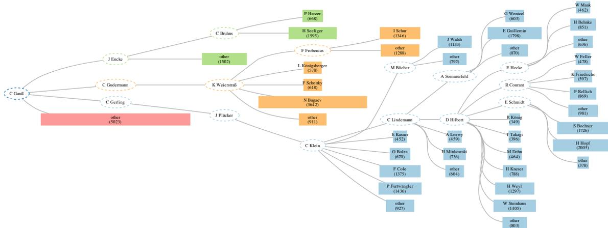
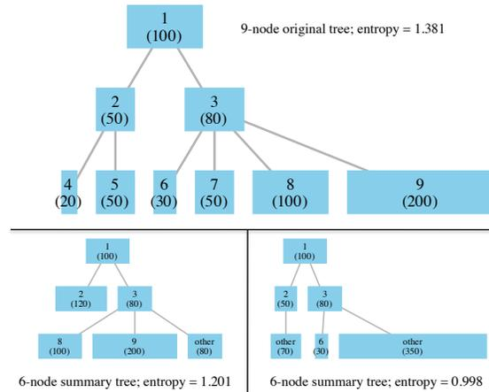
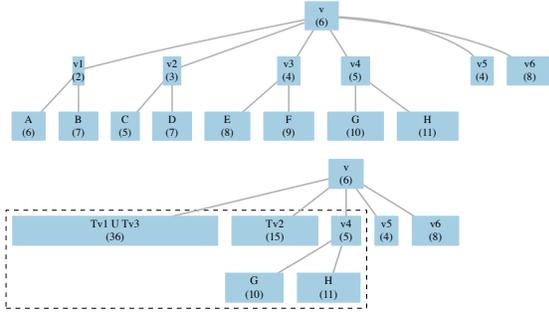
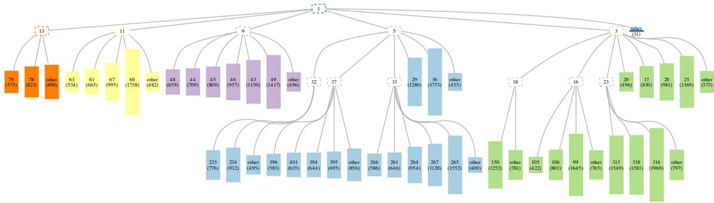
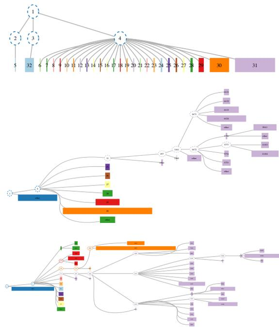
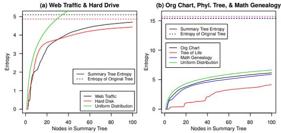

# Maximum Entropy Summary Trees

Howard Karloff1 and Kenneth E. Shirley1

1AT&T Labs Research, Florham Park, NJ, USA

## --- Abstract

*Given a very large, node-weighted, rooted tree on, say,  $n$  nodes, if one has only enough space to display a  $k$ -node summary of the tree, what is the most informative way to draw the tree? We define a type of weighted tree that we call a summary tree of the original tree that results from aggregating nodes of the original tree subject to certain constraints. We suggest that the best choice of which summary tree to use (among those with a fixed number of nodes) is the one that maximizes the information-theoretic entropy of a natural probability distribution associated with the summary tree, and we provide a (pseudopolynomial-time) dynamic-programming algorithm to compute this maximum entropy summary tree, when the weights are integral. The result is an automated way to summarize large trees and retain as much information about them as possible, while using (and displaying) only a fraction of the original node set. We illustrate the computation and use of maximum entropy summary trees on five real data sets whose weighted tree representations vary widely in structure. We also provide an additive approximation algorithm and a greedy heuristic that are faster than the optimal algorithm, and generalize to trees with real-valued weights.*

Categories and Subject Descriptors (according to ACM CCS): I.2.8 [Problem Solving, Control Methods, and Search]: Dynamic Programming—G.2.2 [Graph Theory]: Trees—I.4.10 [Image Representation]: Hierarchical—G.2.1 [Combinatorics]: Combinatorial Algorithms—

---

## 1. Introduction

Many data sets can be represented by a rooted, node-weighted tree, including employee organizational charts, web traffic logs, hard disk file structures, and phylogenetic trees, for example. The node weights can correspond to some node attribute of interest, or, in the absence of attributes, all the node weights can be set to one. Modern data sets represented by such trees can contain hundreds of thousands, or even millions, of nodes, so that visualizing them is challenging, and has received a great deal of interest in the research community (see [vLKS\*11] for a thorough recent survey).

A natural goal of visualizing node-weighted trees is to be able to compare node weights across different nodes and branches of the tree while preserving a sense of the hierarchy, or structure, of the tree. Treemaps [Shn92] succeed in making comparisons of node weights easy, and they have been used for trees with as many as a million nodes [FP02], but they generally do a poor job of representing the visual hierarchy of the tree. On the other hand, traditional layered layouts succeed in displaying the tree's hierarchy, but

require some additional visual encoding of node attributes (such as color, shape, or size) to allow for attribute comparisons. Most importantly, they are not scalable, and typically become impossible to fit onto a single page or screen if the tree of interest has more than a few hundred nodes.

In this paper we propose a method for visualizing large, node-weighted (unordered) rooted trees that allows comparisons of node attributes *and* preserves the visual hierarchy of the tree. We do this in three steps:

1. *Aggregation:* First, we define a novel way to aggregate nodes of a node-weighted tree that results in a new, smaller node-weighted tree that we call a *summary tree* of the original tree, whose number of nodes can be chosen to be any integer between one and the number of nodes in the original tree.
2. *Optimization:* Second, we provide an algorithm to compute the optimal summary tree out of all possible summary trees with a given number of nodes, where optimality is defined in terms of maximizing the information-

**Figure 1:** The maximum entropy 56-node summary tree of the math genealogy tree rooted at Carl Friedrich Gauss, which has 43,527 equal-weighted nodes (where the original advisor-student graph was forced to be a tree by choosing the primary advisor for each student who had multiple advisors). Node colors are determined by their depth-1 ancestor, and node areas are proportional to their weights in the summary tree. This tree is best viewed on a computer screen.

theoretic entropy of a natural distribution associated with the tree.

3. *Layout:* Last, we recommend that the optimal summary tree with a given number of nodes be visualized using a layered layout, where the node sizes are drawn in proportion to their weights. This type of layout is not required, but we feel it maximizes the utility of our methodology.

The resulting visualization is a *maximum entropy summary tree* of any order (i.e., number of nodes) between one and a user-specified bound  $K \leq n$  that automatically provides the most informative summary of the original  $n$ -node tree among all summary trees of the chosen order. From our experiments on real-world data, we find that we can often compute a summary tree that is nearly as informative as the original tree (in terms of entropy) and which contains only a small fraction of the number of nodes of the original tree (often less than 100), thus easily fitting onto a single screen or page using a layered layout. In other words, our algorithm to compute maximum entropy summary trees is essentially a data reduction method that yields good visualizations, from both an aesthetic point of view and an information-theoretic point of view. See Figure 1 for an example applied to a mathematical genealogy tree [Mat], which is discussed in more detail later.

## 2. Background and contributions

The recent survey on techniques for drawing large graphs by von Landesberger et al. [vLKS\*11] notes that the two basic types of tree visualization methods are space-filling layouts and node-link layouts. It is well-known that treemaps [Shn92], which are space-filling layouts, allow users to vi-

sually compare attribute values across nodes, and are scalable to trees with at least approximately one million nodes [FP02]. In the absence of attribute values, treemaps still allow users to compare the sizes of different branches of a tree by setting all node weights to one. The main weakness of treemaps, though, as pointed out by multiple authors, is that they do a poor job of showing the hierarchy, or structure, of a tree [vWvdW99, HMM00, BMH05, ZMC05].

Node-link diagrams, on the other hand, typically do a better job of displaying a tree's hierarchy, but are not necessarily scalable to trees with hundreds or thousands of nodes. Layered layouts, in which nodes on the same level of a tree are drawn along parallel lines, are especially conducive to showing the hierarchy of a tree, and are, unfortunately, especially difficult to scale to large trees, because the number of nodes at a given depth increases exponentially with the depth of most real-world trees [ZMC05].

A solution to the lack of scalability of node-link diagrams that many researchers have built on is the Focus+Context paradigm, in which a user interactively selects a region of a visualization to focus on, and the rest of the visualization is transformed, but still pictured, to provide context to the focus region. Hyperbolic browsers [LRP95] apply this paradigm to trees using hyperbolic geometry and a circular layout. A layered approach is the *accordion drawing technique* [MGT\*03, BMH05], which uses "stretch-and-squish" navigation to allow users to browse large trees.

Another way to interactively apply Focus+Context techniques to large trees is to aggregate nodes. SpaceTree [GPB02], and Degree-of-Interest trees [CN02, HC04] com-

bine node aggregation with a layered layout, where a degree-of-interest function determines which nodes are displayed or aggregated based on how “interesting” they are relative to the focal node. TreeWiz [RBB02] and Expand-Ahead methods [MDB04] also use aggregation and interaction to summarize and visualize large trees. Finally, *elastic hierarchies* [ZMC05] use a Focus+Context approach to allow users to manipulate hybrid visualizations that combine node-link diagrams and treemaps.

Our position is that (1) data reduction is an important first step in visualizing large trees and (2) theoretical principles should dictate which nodes are chosen for display. This second principle differs from much previous work, in which users interactively influence which nodes are displayed.

Regarding data reduction, we follow Herman et al., who write [HMM00] “... beyond a certain limit, no algorithm will guarantee a proper layout of large graphs. There is simply not enough space on the screen. In fact, from a cognitive perspective, it does not even make sense to display a very large amount of data. Consequently, a first step in the visualization process is often to reduce the size of the graph to display. As a result, classical layout algorithms remain usable tools for visualization, but only when combined with these techniques.” We view summary trees as precisely this kind of data reduction technique. Our first main contribution is the definition of a summary tree, which is a novel way to aggregate nodes so that a very large node-weighted tree can be summarized by a potentially much smaller node-weighted tree *of any order that the user chooses*. The freedom to choose the order of a summary tree is an important property, because it is analogous to flexible zooming, and is a consequence of the specific constraints we impose on the node aggregation process.

Our second main contribution is introducing the notion of entropy to node-weighted trees. We define the entropy of a node-weighted tree as the information-theoretic entropy of a discrete probability distribution whose probabilities are defined by the normalized node weights. This is a natural way to think about the information contained in a node-weighted tree. Given a constraint on the number of nodes to display in a summary tree, we propose that the optimal choice of which fixed-order summary tree to display, among many possible choices, is the one with maximum entropy, because it is theoretically the most informative. We provide an exact algorithm to compute this summary tree for trees with nonnegative integral weights, and an approximation algorithm and a heuristic for the more general case of trees with nonnegative real weights. We recommend (but our algorithm does not require) that the nodes of a maximum entropy summary tree be drawn in a layered node-link diagram (preserving the visual hierarchy), with their sizes proportional to their weights (as in the case of treemaps, allowing for visual comparisons of attributes and tree substructure).

## 3. Summary trees

Given a rooted, node-weighted tree  $T$  with  $n$  nodes, we introduce the concept of a “summary tree”  $T'$  of  $T$ , which is a rooted, node-weighted tree with  $k$  nodes, where  $1 \leq k \leq n$ . Denote the weight of node  $i$  by  $w_i$ , where  $w_i$  is a nonnegative real number. One property of a summary tree is that each node of the summary tree  $T'$  is a nonempty subset of the node set  $V(T)$  of  $T$ , the collection of nodes in  $T'$  being a partition of  $V(T)$ . The weight of a subset of nodes is defined to be the sum of the weights of the nodes in the subset. Also, given a node  $v$  of  $T$ , let  $T_v$  denote the subtree of  $T$  rooted at  $v$ .

**Definition 1.** *Given a rooted, node-weighted  $n$ -node tree  $T$ , a  $k$ -node summary tree  $T'$  of  $T$  is a rooted, weighted,  $k$ -node tree in which each node is a subset of  $V(T)$ , defined recursively as follows:*

1. *If  $T$  has exactly one node,  $v$ , then the unique summary tree of  $T$  is a 1-node tree whose one node is  $\{v\}$  (and hence  $k$  must equal 1).*
2. *Suppose  $T$  has root  $v$  and children  $v_1, v_2, \dots, v_d$ ,  $d \geq 1$ . Then a summary tree  $T'$  of  $T$  is either*
  - a. *one node  $V(T)$ , or*
  - b. *- i. *a root  $\{v\}$ ,*
    - ii. *a subset  $S_v$  of  $v$ 's children, where if  $S_v \neq \emptyset$ ,  $T'$  contains one node labeled “other,” which equals  $\bigcup_{x \in S_v} V(T_x)$ , and*
    - iii. *separate summary trees for  $T_{v_i}$  for all  $v_i \notin S_v$ .**

*In case 2.b, the root  $\{v\}$  is the parent in  $T'$  of the node labeled “other,” if it exists, and of the roots of the summary trees for the  $T_{v_i}$ 's for  $v_i \notin S_v$ .*

It is easy to see that the collection of sets represented by all nodes of  $T'$  is a partition of  $V(T)$ . It follows that the total weight of a summary tree  $T'$  of  $T$  is the same as the total weight of  $T$ . Note that the sets  $S_v$  are part of the definition of the tree. Hence if  $T$  is a 3-node tree on  $\{a, b, c\}$  rooted at  $a$  (i.e., with edges  $\{a, b\}$  and  $\{a, c\}$ ), then there are three distinct 3-node summary trees of  $T$ . All three are isomorphic, but one tree has  $S_a = \emptyset$ , one has  $S_a = \{b\}$ , and one has  $S_a = \{c\}$ . This situation is caused only by the existence of an  $S_u$  of size one for some  $u$ .

The intuition behind summary trees is that they allow nodes to be aggregated in two useful ways, described by parts 2.a. and 2.(b).ii. of Definition 1. One way (part 2.a. of Definition 1) is for a node of a summary tree to represent a whole subtree of the original tree. This is a common method of node aggregation for trees used by others [RBB02, CN02, GPB02, HC04].

The other way to aggregate nodes (part 2.(b).ii. of Definition 1) is slightly more subtle—an “other” node in a summary tree represents a set of siblings from the original tree and all the descendants of those siblings—but a parent in the summary tree can have at most one such node among its

children. There are two important motivating principles behind this type of aggregation. First, when a node has many children whose weights have a skewed distribution, it can be very useful to view the children with large weights individually (and possibly some of their descendants, too), while aggregating all the remaining children and their descendants into one node called “other” to save space. Second, we choose to restrict a node from having two or more “other” children. We argue that if multiple “other” nodes were desired under a single parent, then the attribute that distinguishes them from each other should be encoded into the hierarchy of the tree, defining a new split along the branch. If no such attribute exists, then only one “other” node is required. This restriction may simply be a matter of taste, but we feel it is consistent with the node aggregation theories described in [EF10]. DOITrees [HC04] include the notion of an “other” node, but it is not formally defined, and to our knowledge, it has not been discussed elsewhere.

One useful consequence of allowing “other” nodes in summary trees is that doing so guarantees the existence of a  $k$ -node summary tree of an  $n$ -node tree for each  $k = 1, 2, \dots, n$ , which can be easily proven by induction on  $k$ . This property provides an analogue to flexible zooming, in which a user can view a sequence of  $k$ -node summary trees from  $k = 1$  to a user-determined  $K \leq n$ . We in fact recommend this procedure as a way to explore the structure of a large node-weighted tree.

Last, Figure 2 illustrates the definition of a summary tree by showing a 9-node weighted tree and two 6-node summary trees of it. These trees, and all other trees we visualize in this paper, were drawn using the DOT algorithm in Graphviz [GKNpV93]. We draw them with a layered layout, in which the nodes are rectangular, with constant height and width proportional to their weight, or vice versa, so that their areas are proportional to their weights.

## 4. The entropy of a tree

Here we formally define the entropy of a sequence and of a node-weighted tree, and we introduce an important equation and a new definition that are used in our algorithm for computing maximum entropy summary trees.

We define the entropy of a sequence of nonnegative reals:

$$H(w_1, w_2, \dots, w_n) = - \sum_{i=1}^n \left( \frac{w_i}{W} \right) \log_2 \left( \frac{w_i}{W} \right), \quad (1)$$

where  $W$  denotes the sum of the reals, if  $W > 0$ , and 0 otherwise. We take  $0 \log_2(0)$  to be 0 in this computation. (Also, from here onward, we denote “ $\log_2$ ” by “ $\lg$ .”) We define the entropy of a node-weighted,  $n$ -node tree  $T$  with node weights  $w_1, w_2, \dots, w_n$ , to be  $H(w_1, w_2, \dots, w_n)$ . We will also use the shorthand notation  $H(T)$  to denote  $H(w_1, \dots, w_n)$ .

The justification for maximizing entropy is simple: given

**Figure 2:** In the upper panel, a 9-node tree (with node weights in parentheses), and below it, two different 6-node summary trees of the original 9-node tree, with their entropies (to be defined in Section 5) included.

a fixed number of nodes to display, we wish to display the set of nodes that provides the most information about the distribution of node weights to the viewer. It would not be very informative, for example, to summarize a 10,000-node tree with a 50-node summary tree in which 99% of the weight of the tree is aggregated into one supernode, and the other 49 nodes only share 1% of the original tree’s weight, if another more balanced aggregation were possible. Given such a “lopsided” summary, a user would naturally want to disaggregate the large supernode to learn its substructure, at the expense of aggregating some of the 49 small nodes. This intuition agrees with maximizing entropy, since entropy is maximized when all the weights are identical. Maximizing other objective functions besides entropy (e.g.,  $-\sum p_i^2$ ) is a potential direction for future work.

Next, we need to establish a fact about entropy. Suppose we have two discrete probability distributions (on nonoverlapping sets), with associated probabilities  $p_1, \dots, p_{k_1}$  and  $p'_1, \dots, p'_{k_2}$ , and entropies  $h_1$  and  $h_2$ . If we randomly choose an outcome from the first distribution with probability  $q$  or an outcome from the second distribution with probability  $1-q$ , then the resulting probability distribution (with  $k_1 + k_2$  possible discrete outcomes) has entropy

$$h = qh_1 + (1-q)h_2 - q \lg(q) - (1-q) \lg(1-q). \quad (2)$$

The important part of this result related to the dynamic-programming algorithm is that to compute entropy of the “combined” distribution, one does not need to know the specific probabilities associated with the two original distributions—one only needs the entropies of those two distributions, and the probability of choosing from one distribu-

tion versus the other. We use this result to define a function,  $\text{combine}()$ , that we will use in the algorithm.

**Definition 2.** Where  $w_1, w_2$  are nonnegative reals, not both zero, and  $h_1, h_2 \geq 0$ , let  $q = w_1/(w_1 + w_2)$ , and  $\text{combine}(h_1, w_1; h_2, w_2) = qh_1 + (1 - q)h_2 - q\lg(q) - (1 - q)\lg(1 - q)$ . Define  $\text{combine}(h_1, 0; h_2, 0) = 0$ .

Last, we introduce the idea of a “summary forest.” Suppose a node  $v$  of  $T$  has children  $v_1, v_2, \dots, v_d$ , where  $d \geq 1$ . Define a  $k$ -node summary forest for  $T_{v_1} \cup T_{v_2} \cup \dots \cup T_{v_l}$ , for  $1 \leq l \leq d$ , as the forest that remains after removing  $\{v\}$  from a  $(k + 1)$ -node summary tree for the subtree of  $T$  consisting of  $v$ , its first  $l$  children, and their descendants. This collection of  $k$  nodes that we define as a summary forest is, in fact, a summary tree according to Definition 1 if  $l = 1$ , and is not a summary tree (because it’s not connected) if  $l > 1$ . Further, if the  $(k + 1)$ -node summary tree for the subtree of  $T$  consisting of  $v$ , its first  $l$  children, and their descendants contains an “other” child of  $v$  (i.e.  $S_v \neq \emptyset$  from Definition 2.(b).ii.), then we still refer to this node as an “other” child of  $v$  in the summary forest. Last, if the weights of the nodes in the  $k$ -node summary forest are denoted  $w_1, \dots, w_k$ , define the entropy of the summary forest as  $H(w_1, \dots, w_k)$ .

## 5. An algorithm for finding maximum entropy summary trees

Given an  $n$ -node tree  $T$  and a target  $K \leq n$ , we introduce a pseudopolynomial-time dynamic-programming algorithm that computes the maximum entropy  $k$ -node summary trees for  $k = 1, 2, \dots, K$ , provided that the node weights are integral. In Sections 6 and 8 we describe an approximation algorithm and a greedy heuristic that work for nonnegative real weights. The exact algorithm of this section runs in (truly) polynomial time when the sum  $W$  of the weights is small, e.g., when all node weights are 1, but not when  $W$  is large. (The fact that there are  $2^d - 1$  possibilities for an “other” child of a parent with  $d$  children makes finding a polynomial-time algorithm difficult. Indeed, we leave existence of a truly polynomial-time algorithm for large  $W$  as an open problem.)

### 5.1. The recurrence

Our algorithm depends on one main idea. For a node  $v$  with  $d$  children  $v_1, v_2, \dots, v_d$ , if we have the entropies of the  $k$ -node maximum entropy summary trees for the tree rooted at each child, for  $k = 1, \dots, K$ , then we will compute the maximum entropy  $k$ -node summary tree for  $T_v$  for all  $k$ . To compute this via a recurrence, though, we must parameterize by the weight  $w$  of the “other” child of  $v$ .

**Definition 3.** Let  $v$  be a node of  $T$ . We define  $f_v(k, w)$  for  $1 \leq k \leq K$ ,  $-1 \leq w \leq W$  and  $F_v(k)$  for  $1 \leq k \leq K$ .

1. For  $w = 0, 1, 2, \dots, W$ , for  $1 \leq k \leq K$ ,  $f_v(k, w)$  is the maximum entropy of a  $k$ -node summary tree for  $T_v$  in which there is an “other” child of the node  $\{v\}$  with weight  $w$ .

2. For  $1 \leq k \leq K$ ,  $f_v(k, -1)$  denotes the maximum entropy of a  $k$ -node summary tree for  $T_v$  in which there is no “other” child of the node  $\{v\}$ .

3. For  $1 \leq k \leq K$ , let  $F_v(k) = \max_{w=-1}^W f_v(k, w)$ , the maximum entropy of any  $k$ -node summary tree for  $T_v$ .

**Definition 4.** Fix  $1 \leq l \leq d$ ,  $1 \leq k \leq K - 1$ , and  $-1 \leq w \leq W$ . Let  $g_v(l, k, w)$  be the maximum entropy of a  $k$ -node summary forest for  $T_{v_1} \cup T_{v_2} \cup \dots \cup T_{v_l}$  which contains an “other” child of  $v$  of weight  $w$ , if  $w \geq 0$ , or has no “other” child of  $v$ , if  $w = -1$ .

To illustrate this definition, we compute  $g_v(l, k, w)$  for the tree drawn in Figure 3 for  $l = 4$ ,  $k = 5$ , and  $w = 36$  (and  $d = 6$ ). The only way to get an “other” child of  $v$  of weight 36 in the summary forest for  $T_{v_1} \cup T_{v_2} \cup T_{v_3} \cup T_{v_4}$  is for the set  $S_v$  of children forming the “other” child to equal  $\{1, 3\}$  or  $\{2, 3\}$ .

- If the “other” child consists of  $S_v = \{1, 3\}$ : We need  $k = 5$  nodes from the proper descendants of  $v$ , one of which is the “other” child, so we need four non-“other” nodes. We can get four nodes from  $V(T_{v_2})$  and  $V(T_{v_4})$  by getting:
  - one from  $V(T_{v_2})$  and three from  $V(T_{v_4})$ : entropy is  $H(15 + 21, 3 + 5 + 7, 5, 10, 11) = 2.012198$ ; or
  - two from  $V(T_{v_2})$  and two from  $V(T_{v_4})$ : entropy is  $H(15 + 21, 3, 5 + 7, 5, 10 + 11) = 1.880552$ ; or
  - three from  $V(T_{v_2})$  and one from  $V(T_{v_4})$ : entropy is  $H(15 + 21, 3, 5, 7, 5 + 10 + 11) = 1.794777$ .
- If the “other” child consists of  $S_v = \{2, 3\}$ : Again we need four non-“other” nodes. We can get four nodes from  $V(T_{v_1})$  and  $V(T_{v_4})$  by getting:
  - one from  $V(T_{v_1})$  and three from  $V(T_{v_4})$ : entropy is  $H(15 + 21, 2 + 6 + 7, 5, 10, 11) = 2.012198$ ; or
  - two from  $V(T_{v_1})$  and two from  $V(T_{v_4})$ : entropy is  $H(15 + 21, 2, 6 + 7, 5, 10 + 11) = 1.850276$ ; or
  - three from  $V(T_{v_1})$  and one from  $V(T_{v_4})$ : entropy is  $H(15 + 21, 2, 6, 7, 5 + 10 + 11) = 1.77990$ .

Hence  $g_v(4, 5, 36)$  is the maximum of these six quantities and is equal to 2.012198, achieved in two ways.

Let the size  $s_v$  of  $v$  denote the sum of the weights of all the descendants of node  $v$ .

**Lemma 1. (Basis)** Let  $v_1$  denote the first child in an arbitrary ordering of  $v$ ’s children.

1.  $g_v(1, 1, -1) = 0$  (i.e., there is a 1-node summary forest, having entropy 0 and having no “other” child of  $v$ , for the subtree rooted at the first child of  $v$ ).
2. If  $w \geq 0$ , then  $g_v(1, 1, w) = -\infty$ , except that  $g_v(1, 1, s_{v_1}) = 0$  (i.e., the only 1-node summary forest for the subtree rooted at  $v_1$  which has an “other” child of  $v$  consists solely of an “other” child representing  $v_1$  and all its descendants).
3. If  $k > 1$ , then  $g_v(1, k, -1) = F_{v_1}(k)$  (i.e., the entropy of the maximum entropy summary forest for  $T_{v_1}$  with  $k > 1$  nodes which has no “other” child of  $v$  has entropy  $F_{v_1}(k)$ , by definition of  $F_{v_1}(k)$ ).

**Figure 3:** The subtree,  $T_v$ , for which we illustrate the definition of  $g_v(l, k, w)$ , for  $l = 4, k = 5, w = 36$  (and  $d = 6$ ). Node weights are listed in parentheses. The upper figure is  $T_v$ , and the lower figure shows the maximum entropy summary forest for  $T_{v_1} \cup \dots \cup T_{v_4}$  for  $k = 5$  with an “other” child of  $v$  of size  $w = 36$  within the dashed box (where we chose the “other” child  $S_v = \{1, 3\}$ ).

4. If  $k > 1$  and  $w \geq 0$ , then  $g_v(1, k, w) = -\infty$  (i.e., any summary forest of  $T_{v_1}$  with two or more nodes cannot be part of an “other” child of  $v$ ).

Now we induct on  $l$ . The following lemma shows how to compute the  $g_v(l, k, w)$  values from the  $g_v(l-1, k, w)$  values. The inductive step applies this recurrence for  $l = 2, 3, 4, \dots, d$ .

**Lemma 2. (Inductive Step)**

1. For  $l \geq 2$ ,  $g_v(l, 1, s_{v_1} + s_{v_2} + \dots + s_{v_l}) = 0$ , and  $g_v(l, 1, w) = -\infty$  for all  $w \neq s_{v_1} + \dots + s_{v_l}$ . (Here, the first  $l$  children form an “other” child of  $v$ .)
2. For  $l \geq 2$ , for all  $k \geq 2$ ,  $g_v(l, k, -1) = \max_{k_1=1}^{k-1} \text{combine}(g_v(l-1, k_1, -1), s_{v_1} + s_{v_2} + \dots + s_{v_{l-1}}; F_{v_l}(k - k_1), s_{v_l})$ . (There is no “other” child of  $v$ , and we combine a  $k_1$ -node summary forest for  $T_{v_1} \cup \dots \cup T_{v_{l-1}}$  containing no “other” child of  $v$  with a  $(k - k_1)$ -node summary tree for  $T_{v_l}$ .)
3. For  $l \geq 2$ , for all  $k \geq 2$ , and  $w \geq 0$ ,  $g_v(l, k, w)$  is the maximum of the following three quantities:
  - a.  $\max_{k_1=1}^{k-1} \text{combine}(g_v(l-1, k_1, w), s_{v_1} + \dots + s_{v_{l-1}}; F_{v_l}(k - k_1), s_{v_l})$ , if  $w \leq s_{v_1} + s_{v_2} + \dots + s_{v_{l-1}}$ , and  $-\infty$  otherwise.
  - b.  $\text{combine}(g_v(l-1, k-1, -1), s_{v_1} + \dots + s_{v_{l-1}}; 0, s_{v_l})$ , if  $s_{v_l} = w$  (and is  $-\infty$  otherwise).
  - c.  $\frac{-1}{M + s_{v_l}} [(-MH + M \lg M - (w - s_{v_l}) \lg(w - s_{v_l})) - (M + s_{v_l}) \lg(M + s_{v_l}) + w \lg w]$ , where  $M = s_{v_1} + \dots + s_{v_{l-1}}$ , and  $H = g_v(l-1, k, w - s_{v_l})$ , if  $w - s_{v_l} \geq 0$  (and  $-\infty$  otherwise).

For lack of space, the proof appears in Section 10 in the appendix. We mention here only that case 3(c) is interesting because we “merge”  $T_{v_l}$  into an existing “other” child of  $v$  in the summary forest for  $T_{v_1} \cup \dots \cup T_{v_{l-1}}$ . The entropy calcu-

lation in equation (2) does not apply; hence there is a need for a new formula.

Recall that  $v$  has  $d$  children. When we finish with this induction on  $l$ , we have all  $g_v(d, k, w)$  values. Given that the  $g_v(d, k, w)$ ’s are defined for the summary forest for  $T_{v_1} \cup \dots \cup T_{v_d}$ , the only node missing from the subtree rooted at  $v$  is  $v$  itself, so to get the  $f_v(k, w)$ ’s, we simply have to “attach the root.” This is easy. The proof is omitted.

**Lemma 3. (“Attaching the root”)**

1.  $f_v(1, -1) = 0$  and  $f_v(1, w) = -\infty$  for all  $w \geq 0$ .
2. If  $k \geq 2$ ,  $-1 \leq w \leq s_{v_1} + s_{v_2} + \dots + s_{v_d}$ , then  $f_v(k, w) = \text{combine}(0, w; g_v(d, k-1, w), s_{v_1} + \dots + s_{v_d})$ . ■

### 5.2. The algorithm

Given the recurrence of the previous section, creating an algorithm for the case of nonnegative integral weights is easy. One can process the nodes in nonincreasing order by depth, computing  $F_u(k)$  for all  $k$  for all children  $u$  of a node  $v$  before computing  $F_v(k)$  for any  $k$ . To compute  $F_v(k)$  for a node  $v$  and all  $k$ ’s, one computes  $f_v(k, w)$  for all  $k$  and  $w$ . One does this by computing  $g_v(l, k, w)$  for all  $k$  and  $w$ , for  $l = 1, 2, \dots, d$  (where  $v$  has  $d$  children), in that order, via Lemma 1 for the basis and Lemma 2 for the recurrence.

Here is pseudocode for computing the optimal entropies. (How to generate the trees is easy and is omitted.)

- For  $v \in \{1, \dots, n\}$  in nonincreasing order by  $\text{depth}(v)$ , do:
  - If  $v$  is a leaf, set  $F_v(1) = 0$  and  $F_v(k) = -\infty$  for  $k = 2, 3, \dots, K$ .
  - Else do
    - Where  $v$  has  $d \geq 1$  children, use Lemma 1 to define  $g_v(1, k, w)$  for all  $k, w$ .
    - For  $l = 2, 3, \dots, d$ , do:
      - ◇ Use Lemma 2 to compute  $g_v(l, k, w)$  for all  $k, w$ .
    - (Attach  $v$ ): Use Lemma 3 to compute  $f_v(k, w)$  for all  $k, w$ .
    - Set  $F_v(k) = \max_{w=-1}^W f_v(k, w)$  for all  $k$ .
- Output  $F_1(k)$  for all  $k$ .

The time needed by the algorithm is  $O(K^2 n W)$ , which is pseudopolynomial in the input size. (A polynomial-time algorithm would run in time polynomial in  $n$  and  $\lg W$ , since  $W$  can be represented in binary in approximately  $\lg W$  bits.) Unfortunately we do not know if the problem is NP-Complete.

To illustrate the result, Figure 4 displays the maximum entropy 60-node summary tree for a company organizational chart with 43,134 employees. The structure of the organization is clear: there are five main branches, where the blue and green-colored branches are the largest. Some employees at depth 3 (such as employee 265, the second-rightmost blue node) have many more employees under them than employees at depth 2. The summary tree pictured has maximum

**Figure 4:** The maximum entropy 60-node summary tree of a company organizational chart that has 43,134 equal-weighted nodes. Nodes are labeled 1 through  $n = 43,134$ , node colors are determined by their depth-1 ancestor, and node areas are proportional to their weights in the summary tree, which are labeled in parentheses, except summary tree nodes with weight 1, where the node is drawn transparently with a dotted outline.

entropy, and therefore theoretically provides the viewer the most information about the distribution of node weights among all 60-node summary trees.

## 6. A polynomial-time additive approximation algorithm

What can one do if the weights are reals, which are forbidden by the dynamic-programming algorithm which computes an optimal summary tree? Even if the weights are all integral, what can one do if their sum  $W$  is huge? To address these two concerns, we give an additive approximation algorithm, which takes a tree  $T$  weighted with nonnegative real weights ( $w_i$ ), a positive integer  $K$ , and an  $\varepsilon > 0$ , and produces, for each  $k \leq K$ , a  $k$ -node summary tree whose entropy is at most  $\varepsilon$  less than that of the optimal  $k$ -node summary tree.

However, for lack of space the full writeup of the algorithm appears in Section 9 in the appendix. Here we only give a cursory summary.

The idea underlying the algorithm is simple: (1) scale the weights uniformly so that they sum to an integer  $W$ , whose value will be determined later; (2) carefully round real weight  $w_i$  to  $w'_i \in \{\lfloor w_i \rfloor, 1 + \lfloor w_i \rfloor\}$ ; and (3) run the dynamic-programming algorithm of the previous section on the scaled, rounded weights. Doing so, however, in such a way as to guarantee small enough error relative to the maximum entropy of the original weights while simultaneously keeping the running time down is quite nontrivial. The rounding method uses elements of mathematical discrepancy theory [Spe94, Cha00]. Specifically, we round the  $w_i$ 's to  $w'_i$ 's such that for all nodes  $v$  in  $T$ , the sum of  $w_i$  over descendants  $i$  of  $v$  differs from the sum of  $w'_i$  over descendants  $i$  of  $v$  by at most 1 in absolute value. (Naively rounding each  $w_i$  up or down instead of minimizing the discrepancy on subtrees gives an algorithm approximately 1000 times slower on some of our data sets.) In addition, showing that such a

rounding suffices to give entropy within  $\varepsilon$  of the optimal entropy for a suitable  $W$  (Lemma 5 in the appendix) is one of the more interesting results in this paper.

Here is the algorithm. Let us denote by  $T^w$  an  $n$ -node tree on  $\{1, 2, \dots, n\}$  whose  $i$ th node has real weight  $w_i$ .

1. Choose the least integer  $W \geq 3$  such that  $(2/\ln 2)(3K/W)(1 + \ln K - \ln(3K/W)) \leq \varepsilon$  and scale  $\langle w_1, w_2, \dots, w_n \rangle$  to have sum  $W$ .
2. Using our rounding algorithm (Lemma 4 in the appendix), produce a sequence  $\langle w'_1, w'_2, \dots, w'_n \rangle$  with  $w'_i \in \{\lfloor w_i \rfloor, 1 + \lfloor w_i \rfloor\}$  such that for any node  $v$  in  $T$ , the sums of  $w_i$  over descendants  $i$  of  $v$  and of  $w'_i$  over descendants  $i$  of  $v$  differ by at most 1 in absolute value.
3. Run the exact dynamic-programming algorithm of Section 5.2 on tree  $T^{w'}$ , to get an optimal  $k$ -node summary tree  $T'$  for  $T^{w'}$ .
4. Output tree  $Z$ , which is  $T'$  except with weight  $w_i$  on node  $i$  instead.

It is not hard to see that the least  $W$  is  $O((K/\varepsilon) \log(\max\{K, 1/\varepsilon\}))$  and independent of  $n$ .

**Definition 5.** Let  $OPT_k(T^w)$  denote the entropy of a maximum entropy  $k$ -node summary tree of  $T^w$ .

Now we give the main theorem of this section.

**Theorem 1.** The tree  $Z$  produced by the algorithm is a  $k$ -node summary tree for  $T^w$  having (binary) entropy at least  $OPT_k(T^w) - \varepsilon$ . The running time of the algorithm is  $O((K^3/\varepsilon)n \log(\max\{K, 1/\varepsilon\}))$ .

Please see Section 9 in the appendix for details.

## 7. Examples

We illustrate the computation and visualization of maximum entropy summary trees on five real-world data sets that can be represented by large, rooted, node-weighted trees.

First, we consider a set of aggregated webpage visits to a large Internet portal by a sample of a million users on one day in March, 2012. The nodes of this tree are webpages that are organized hierarchically into categories (such as “/home/news/international/russia,” for example, or “/home/sports/baseball”), and the weights are the number of clicks per webpage aggregated across all users. There are 19,335 nodes in this tree, with a depth of 17 levels, a range of zero to 365 children per node, and total weight of over 260 million. The distribution of weights per node is highly skewed, with one webpage receiving over 20% of all clicks, and a long tail in which 45% of webpages received 3 or fewer clicks.

Since the sum of the weights was very large (260 million), the exact algorithm of Section 5 was infeasible. Instead we use the approximate algorithm of Section 6, with  $\epsilon = 0.05$ , to compute summary trees that are nearly optimal. We computed nearly optimal  $k$ -node summary trees for  $k = 1, \dots, 100$ , and we view them in sequence to learn about the distribution of clicks across the taxonomy of the web portal. Figure 5 compares a summary tree computed using a naive aggregation of weights to the maximum entropy summary tree of the same order, and to a larger maximum entropy summary tree. The maximum entropy summary trees naturally aggregate nodes in a way that spreads out their weights as evenly as possible, resulting in informative visualizations.

The other data sets we investigated are:

1. One co-author’s hard drive, which contains 15,671 files and directories, with node weights set to file sizes in kilobytes. This drive has a total of 143,990,819 kilobytes of disk space, where the tree has a depth of 6 levels, and the number of children per node ranges from zero to 5,342.
2. The phylogenetic tree data from the Tree of Life Web Project [MS07]. This tree has 94,080 nodes, 54,121 of which represent a species or subspecies (and were given a weight of 1), and the other 39,959 of which represent a taxonomic categorization (such as “animal” or “plant,” and thus were given a weight of zero).
3. The Mathematics Genealogy Project [Mat] subtree rooted at Carl Friedrich Gauss, which has 43,527 nodes, all given a weight of 1. For students with multiple advisors, we forced the graph to be a tree by assigning the primary advisor as the parent.
4. A section of an employee organizational chart, from a large company, which contains 43,134 employees, all given a weight of one.

For all five data sets (these four plus the web traffic data), we computed four sets of  $k$ -node summary trees (for  $k = 1, \dots, 100$ ): (1) maximum entropy summary trees (when feasible), (2) and (3), approximately maximum entropy summary trees using  $\epsilon = 0.05$  and  $\epsilon = 0.1$ , respectively, and (4) a greedy heuristic (which we describe in Section 8). Table 1 contains the running times for all four procedures for each

**Figure 5:** Three summary trees of the 19,335-node web traffic tree. The upper figure is a naive aggregation to depth 2, where the node weights are heavily skewed. The middle figure is the maximum entropy 32-node summary tree, which displays much more information given the same number of nodes. The bottom figure is the maximum entropy 60-node summary tree, which provides an even finer-grained view of the structure of clicks across the taxonomy of the web portal. We color the nodes according to their depth-2 ancestor, and we draw their sizes proportional to their weights.

data set, except the optimal algorithm for the web traffic and hard drive data sets, whose weights were too large for this algorithm to be feasible. Running times were longer for the approximation algorithm than the optimal algorithm for three data sets because the sum of the scaled weights, which depends only on  $K$  and  $\epsilon$ , was higher than the sum of the original weights. In these cases, running the optimal algorithm is obviously preferable. We strongly encourage the reader to view the visualizations of these sets of summary trees in the supplementary materials, or on the author’s website [Shi]. For each data set, it is very instructive to view the summary trees in sequence on a computer screen, from  $k = 1, \dots, 100$ , to see the structure of the tree in increasing detail.

Another way to view the effectiveness of maximum entropy summary trees is to plot their entropies for successive values of  $k$  and compare them to the entropy of the original tree. Figure 6 illustrates this curve for each of the five examples.

**Table 1:** Running times (on a 2.67 GHz machine with 48 GB of memory) in minutes and seconds for different algorithms on five real-world data sets, where columns labeled “ $\epsilon =$ ” refer to the approximation algorithm with the given values of  $\epsilon$ , and  $K = 100$  for each run. A hyphen indicates an instance which did not terminate.

| Data Set     | $n$   | $W$   | Opt. | $\epsilon = 0.05$ | $\epsilon = 0.1$ | Greedy |
|--------------|-------|-------|------|-------------------|------------------|--------|
| Web Traffic  | 19335 | 260M  | —    | 4:44              | 2:17             | 0:01   |
| Hard Drive   | 15671 | 143M  | —    | 3:49              | 2:13             | 0:01   |
| Tree of Life | 94080 | 54121 | 8:31 | 33:38             | 16:16            | 0:06   |
| Math Gen.    | 43527 | 43527 | 2:23 | 10:47             | 5:24             | 0:02   |
| Org Chart    | 43134 | 43134 | 2:39 | 11:45             | 6:12             | 0:03   |

We call this curve the *entropy profile* for a given weighted, rooted tree. In the case of the web traffic data (Figure 6(a), black line), the entropy profile shows that we can draw a summary tree with about 92.2% as much entropy as the original 19,335-node tree using only 100 nodes, which represents a great reduction in the size of the display for a small cost in terms of information loss. For the hard drive data, we achieve 91.1% of the entropy of the 15,671-node original tree with only 100 nodes. The other three data sets have much higher entropy in their original form, since all their weights are one (or zero, in the case of some of the Tree of Life nodes), and they naturally have high entropies. In these cases, it is instructive to compare the entropy profiles to the entropy of a uniform distribution with  $k$  categories, for  $k = 1, \dots, 100$ . This curve is illustrated by the green line in Figure 6(a) and (b). Even though the  $k$ -node maximum entropy summary trees for  $k \leq 100$  aren't obtaining a high fraction of the entropy of the original tree, they are—especially in the case of the organizational chart—achieving nearly as high an entropy (namely,  $\lg k$ ) as possible for a discrete distribution with  $k \leq 100$  possible outcomes.

**Figure 6:** Entropy profiles for  $k = 1, \dots, 100$  for all 5 data sets. For the web traffic and hard drive data sets, the (approximate) maximum entropy summary trees have nearly as high entropy as the original trees using many fewer nodes.

## 8. A (faster) heuristic

In this section we give a fast greedy heuristic allowing one to compute  $K$ -node summary trees in time  $O(K^2n)$ , inde-

pendently of  $W$ . While these summary trees are not optimal, in all real data sets we have tested, the heuristic always returned at least 94% of the optimal entropy, and never took more than six seconds.

Our greedy heuristic is motivated by a fact about depth-1 trees: if a maximum entropy summary tree of a depth-1 tree has an “other” node with, say,  $m$  leaves in it, then this “other” node must be comprised of the  $m$  leaves with least weight. Replacing one of the smallest  $m$  leaves in the “other” node with a larger leaf always yields a lower-entropy summary tree. This means for a depth-1 tree where the root has  $d$  children, the maximum entropy  $k$ -node summary tree will always have an “other” node comprised of the  $d - k + 2$  smallest leaves, for  $2 \leq k \leq d$ .

Our greedy heuristic extends this idea to the whole tree by considering only those “other” nodes comprised of the least-size children among siblings. (If a different set of “other” nodes uniquely produces the optimal summary tree, the greedy heuristic will return a suboptimal summary tree.) The greedy heuristic processes the nodes of a tree so that a node is processed after all its children and so that the children of a node are processed in nondecreasing order by size. We maintain an *entropylist* or *elist* for each node  $v$ . The *elist* for  $v$  is a sequence of  $K$  reals, the  $k$ th being the entropy of some  $k$ -node summary tree (ideally an optimal one, but not necessarily) of  $T_v$  (or  $-\infty$  to correspond to no summary tree).

To explain the greedy algorithm, first we define a function  $\text{combine\_lists}(\text{vec}, \alpha; \text{vec}', \alpha')$ , which takes two  $K$ -vectors  $\text{vec}, \text{vec}'$  and their respective weights  $\alpha, \alpha' \geq 0$  and returns one  $K$ -vector  $\text{vec\_out}$ :

- $\text{vec\_out}_1 = 0$ .
- For  $k = 2$  to  $K$ ,  $\text{vec\_out}_k = \max_{k_1=1}^{k-1} \text{combine}(\text{vec}_{k_1}, \alpha; \text{vec}'_{k-k_1}, \alpha')$ .

Let  $z$  be a  $K$ -dimensional vector which is all  $-\infty$ 's, except with  $z_1 = 0$ . To process  $v$ :

- If  $v$  is a leaf, set  $\text{elist}_v = z$  and return.
- Let  $v$  have children  $v_1, v_2, \dots, v_d$ , sorted into nondecreasing order by size.
- Generate a sequence  $\langle L_v^1, L_v^2, \dots, L_v^d \rangle$  of vectors in  $\mathbb{R}^K$ , as follows:  $L_v^1 = \text{elist}_{v_1}$ , and for  $l = 2, 3, \dots, d$ ,  $L_v^l = \text{combine\_lists}(L_v^{l-1}, s_{v_1} + s_{v_2} + \dots + s_{v_{l-1}}; \text{elist}_{v_l}, s_{v_l})$ .
- (Now attach  $v$ ):  $\text{elist}_v = \text{combine\_lists}(L_v^d, s_{v_1} + s_{v_2} + \dots + s_{v_d}; z, w_v)$ .

It is not hard to see that  $\text{elist}_v[k]$ , if nonnegative, is the entropy of a  $k$ -node summary tree for  $T_v$ . It is easy to prove that for binary trees, the greedy algorithm is optimal, since it can never miss an “other” node. The reader can find an instance for which the greedy algorithm generates a 4-node summary tree with only 2/3 of the optimal entropy in Section 11 in the appendix. An interesting open question is whether there is a  $c > 0$  such that the entropy returned by the greedy algorithm is always at least  $c$  times optimal.

## References

- [BMH05] BEERMANN D., MUNZNER T., HUMPHREYS G.: Scalable, robust visualization of very large trees. *Proc. EuroVis* (2005), 37–44. 2
- [Cha00] CHAZELLE B.: *The Discrepancy Method: Randomness and Complexity*. Cambridge University Press, New York, NY, USA, 2000. 7
- [CN02] CARD S. K., NATION D.: Degree-of-interest trees: a component of an attention-reactive user interface. *Proceedings of the Working Conference on Advanced Visual Interfaces* (2002), 231–245. 2, 3
- [EF10] ELMQVIST N., FEKETE J.: Hierarchical aggregation for information visualization: Overview, techniques and design guidelines. *IEEE Transactions on Visualization and Computer Graphics* 16, 3 (2010), 439–454. 4
- [FP02] FEKETE J.-D., PLAISANT C.: Interactive information visualization of a million items. *Proceedings of IEEE Symposium on Information Visualization* (2002), 117–124. 1, 2
- [GKNpV93] GANSNER E., KOUTSOFOIOS E., NORTH S. C., PHONG VO K.: A technique for drawing directed graphs. *IEEE Transactions on Software Engineering* 19 (1993), 214–230. 4
- [GPB02] GROSJEAN J., PLAISANT C., BEDERSON B.: Space-tree: Supporting exploration in large node link tree, design evolution and empirical evaluation. *Proceedings of IEEE Symposium on Information Visualization* (2002), 57–64. 2, 3
- [HC04] HEER J., CARD S. K.: Doitrees revisited: Scalable, space-constrained visualization of hierarchical data. In *Advanced Visual Interfaces* (2004), pp. 421–424. URL: <http://vis.stanford.edu/papers/doitrees-revisited>. 2, 3, 4
- [HMM00] HERMAN I., MELANCON G., MARSHALL M. S.: Graph visualization and navigation in information visualization: A survey. *IEEE Transactions on Visualization and Computer Graphics* 6, 1 (2000), 24–43. 2, 3
- [LRP95] LAMPING J., RAO R., PIROLLI P.: A focus+context technique based on hyperbolic geometry for visualizing large hierarchies. In *Proceedings of the SIGCHI Conference on Human Factors in Computing Systems* (New York, NY, USA, 1995), CHI '95, ACM Press/Addison-Wesley Publishing Co., pp. 401–408. URL: <http://dx.doi.org/10.1145/223904.223956>, doi:10.1145/223904.223956. 2
- [Mat] The mathematics genealogy project [online]. URL: <http://www.genealogy.ams.org/> [cited June 7, 2012]. 2, 8
- [MDB04] MCGUFFIN M. J., DAVISON G., BALAKRISHNAN R.: Expand ahead: a space-filling strategy for browsing trees. *Proceedings of IEEE Symposium on Information Visualization* (2004), 119–126. 3
- [MGT\*03] MUNZNER T., GUIMBRETIERE R., TASIRAN S., ZHANG L., ZHOU Y.: Treejuxtaposer: Scalable tree comparison using focus+context with guaranteed visibility. *ACM Transactions on Graphics* 22, 3 (2003), 453–462. 2
- [MS07] MADDISON D. R., SCHULZ K. S.: The tree of life web project, 2007. URL: <http://tolweb.org> [cited May 3, 2012]. 8
- [RBB02] ROST U., BORNBERG-BAUER E.: Treewiz: interactive exploration of huge trees. *Bioinformatics* 18, 1 (2002), 109–114. 3
- [Shi] SHIRLEY K. E.: Summary trees webpage [online]. URL: <http://www.research.att.com/~kshirley/summarytrees> [cited April 10, 2013]. 8
- [Shn92] SHNEIDERMAN B.: Tree visualization with tree-maps: 2-d space-filling approach. *ACM Transactions on Graphics* 11, 1 (1992), 92–99. 1, 2
- [Spe94] SPENCER J.: *Ten Lectures on the Probabilistic Method*, 2 ed. Society for Industrial and Applied Mathematics, Philadelphia, PA, USA, 1994. 7
- [vLKS\*11] VON LANDESBERGER T., KUIJPER A., SCHRECK T., KOHLHAMMER J., VAN WIJK J. J., FEKETE J.-D., FELLNER D. W.: Visual analysis of large graphs: State-of-the-art and future research challenges. *Computer Graphics Forum* 30, 6 (2011), 1719–1749. 1, 2
- [vWvdW99] VAN WIJK J. J., VAN DE WETERING H.: Cushion treemaps. *Proceedings of IEEE Symposium on Information Visualization* (1999), 73–78. 2
- [ZMC05] ZHAO S., MCGUFFIN M. J., CHIGNELL M. H.: Elastic hierarchies: Combining treemaps and node-link diagrams. *Proceedings of IEEE Symposium on Information Visualization* (2005), 57–64. 2, 3