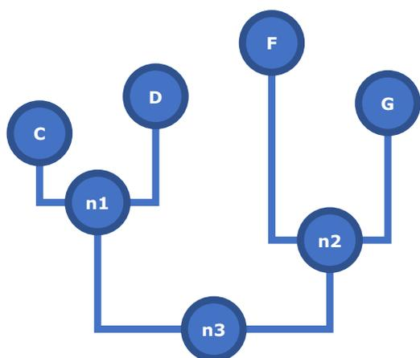
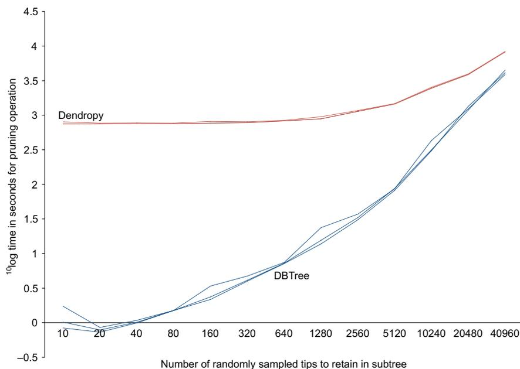

# APPLICATION

# DBTree: Very large phylogenies in portable databases

Rutger A. Vos<sup>1,2</sup> <sup>1</sup>Understanding Evolution, Naturalis Biodiversity Center, Leiden, The Netherlands<sup>2</sup>Institute of Biology Leiden, Leiden University, Leiden, The Netherlands

## **Correspondence**

Rutger A. Vos  
Email: rutger.vos@naturalis.nl**Handling Editor:** Samantha Price

## **Abstract**

1. Growing numbers of large phylogenetic syntheses are being published. Sometimes as part of a hypothesis testing framework, sometimes to present novel methods of phylogenetic inference, and sometimes as a snapshot of the diversity within a database. Commonly used methods to reuse these trees in scripting environments have their limitations.
2. I present a toolkit that transforms data presented in the most commonly used format for such trees into a database schema that facilitates quick topological queries. Specifically, the need for recursive traversal commonly presented by schemata based on adjacency lists is largely obviated. This is accomplished by computing pre- and post-order indexes and node heights on the topology as it is being ingested.
3. The resulting toolkit provides several command line tools to do the transformation and to extract subtrees from the resulting database files. In addition, reusable library code with object-relational mappings for programmatic access is provided. To demonstrate the utility of the general approach I also provide database files for trees published by Open Tree of Life, Greengenes, D-PLACE, PhyloTree, the NCBI taxonomy and a recent estimate of plant phylogeny.
4. The database files that the toolkit produces are highly portable (either as SQLite or tabular text) and can readily be queried, for example, in the R environment. Programming languages with mature frameworks for object-relational mapping and phylogenetic tree analysis, such as Python, can use these facilities to make much larger phylogenies conveniently accessible to researcher programmers.

## **KEYWORDS**

databases, DBTree, object-relational mapping, phylogenetics, portable database, scripting, topological queries

## 1 | INTRODUCTION

Larger and larger phylogenies are being published. Sometimes, this is as a 'one off' estimate needed for testing a comparative hypothesis (e.g. Zanne et al., 2014). In other cases, to demonstrate the capabilities of

initiatives to produce megatrees (e.g. Antonelli et al., 2017; Hinchliff et al., 2015; Mctavish et al., 2015; Redelings & Holder, 2017; Rees & Cranston, 2017; Smith & Brown, 2018). In yet other cases, the trees are provided as snapshots of a database (e.g. DeSantis et al., 2006; Federhen, 2012; Kirby et al., 2016; Piel & Vos, 2018; Van Oven & Kayser, 2009).

This is an open access article under the terms of the Creative Commons Attribution License, which permits use, distribution and reproduction in any medium, provided the original work is properly cited.

© 2019 The Author. *Methods in Ecology and Evolution* published by John Wiley & Sons Ltd on behalf of British Ecological Society.

These trees being published is a wonderful development. However, the format in which they are shared may be inconvenient for reuse. Large phylogenetic trees are usually made available in Newick format (Felsenstein, n.d.), as other formats (e.g. Maddison, Swofford, & Maddison, 1997; Vos et al., 2012) are too verbose. From this perspective of conciseness, Newick is a sensible choice. However, the researcher programmer wanting to reuse data in a scripting environment then needs to parse complex parenthetical tree descriptions and load some kind of graph structure or object into memory every time the script is run. With large trees, this takes a lot of time and consumes a lot of working memory. For example, loading the Open Tree of Life estimate (v10.4, see Hinchliff et al., 2015) into DendroPy (Sukumaran & Holder, 2010) takes ~13 min and consumes over 8 GB of RAM. This might be fine for some use cases (e.g. when subsequent processes run for very long anyway) but it can be a limitation in other situations.

An alternative approach is to ingest large trees into portable, on-disk databases as a one-time operation, and then access them through a database handle. No more recurrent, complex text parsing, and trees do not have to be loaded into memory for topological queries. For example, the NCBI taxonomy (Federhen, 2012) is distributed as database tables with this usage in mind. In most cases where trees with polytomies are represented in databases, the topology is captured using adjacency lists, where each database record for a node (except the root) references its parent using a foreign key (e.g. see Vos, 2017). The downside of this is that tree traversal becomes recursive: to get from a tip to the root, each node along the path has to be visited to look up the foreign key to its parent. This is relatively slow. A solution to this may be to use database engines that compute transitive closures, but not all engines support those, and their computation imposes additional cost on the ones that do.

Pre-computing certain metrics and topological indexes as column values can obviate the need for some recursions, speeding up topological queries significantly. The general idea is illustrated in Figure 1. The topology shown is represented in the table, with one record for each node, by way of the following columns:

- **Name:** the node label as it appears in the tree.
- **Length:** the branch length.
- **Id:** a primary key, generated as an autoincrementing integer.
- **Parent:** a foreign key referencing the primary key of the parent.
- **Left:** an index generated as an autoincrementing integer in pre-order traversal: moving from root to tips, parent nodes are assigned the index before their children.
- **Right:** an index generated as an autoincrementing integer in a post-order traversal: moving from root to tips, child nodes are assigned the index before their parents. That is, “on the way back” in the recursion.
- **Height:** cumulative distance from the root.

In relational database implementations of trees that use adjacency list of this form, the children of *n1* can be selected like so (returning *C* and *D*):

```
select CHILD.* from node as PARENT, node as CHILD
where PARENT.name='n1'
and PARENT.id==CHILD.parent;
```

The opposite, getting the parent of the input, should be readily apparent. Beyond direct adjacency, traversals that are normally recursive can be executed as single queries using the additional indexes. For example, to identify the most recent common ancestor *MRCA* of nodes *C* and *F*, we can formulate:

```
select MRCA.* from node as MRCA, node as C, node as F
where C.name='C' and F.name='F'
and MRCA.left < min(C.left,F.left)
and MRCA.right > max(C.right,F.right)
order by MRCA.left desc limit 1;
```

The query selects all nodes whose **left** index is lower, and whose **right** index is higher than that of either of the input nodes. This limits the results to nodes that are ancestral to both. By ordering these on the **left** index in descending order they are ranked from most recent to



| id | parent | left | right | name | length | height |
|----|--------|------|-------|------|--------|--------|
| 2  | 1      | 1    | 10    | n3   | 0.0    | 0.0    |
| 3  | 2      | 2    | 5     | n1   | 0.9    | 0.9    |
| 4  | 3      | 3    | 3     | C    | 0.6    | 1.5    |
| 5  | 3      | 4    | 4     | D    | 0.8    | 1.7    |
| 6  | 2      | 6    | 9     | n2   | 0.6    | 0.6    |
| 7  | 6      | 7    | 7     | F    | 1.2    | 1.8    |
| 8  | 6      | 8    | 8     | G    | 1.0    | 1.6    |

FIGURE 1 Representation of a tree shape in a relational database, with additional, precomputed indexes and values. See text for details

oldest. Limiting the results to the first record in this list returns *MRCA*. Variations on this query to obtain all ancestors or descendants of input nodes follow similar logic. The precomputed node heights can then be used to compute patristic distances between nodes, such as in the following:

```
select (C.height-MRCA.height)+(F.height-MRCA.height)
  from node as MRCA, node as C, node as F
  where C.name='C' and F.name='F'
  and MRCA.left < min(C.left,F.left)
  and MRCA.right > max(C.right,F.right)
  order by MRCA.left desc limit 1;
```

In this query, the final result is 3.3, that is, the sum of the heights of *C* and *F*, as the root has no height. Other calculations that take advantage of the extra indexes are also possible as single queries. For example, several metrics capturing the tendency of nodes towards the tips (such that the tree is 'stemmy') or towards the root ('branchy') are used to summarize the mode of diversification in a clade (e.g., apparently accelerating or slowing down, respectively). One of these metrics (Fiala & Sokal, 1985) iterates over all internal nodes and for each calculates the ratio of the focal node's branch length over the sum of descendent branch lengths plus the focal length, and then averages over these ratios. This can be expressed in a single query:

```
select avg(ratio) from (
  select INTERNAL.length/(sum(CHILDREN.length)+INTERNAL.length) as ratio
    from node as INTERNAL, node as CHILDREN
   where INTERNAL.left!=INTERNAL.right
    and CHILDREN.left>INTERNAL.left
    and CHILDREN.right<INTERNAL.right
    and INTERNAL.parent!=1
   group by INTERNAL.id
)
```

These examples illustrate that access to large tree topologies indexed in this way is quite powerful, especially when integrated in scripting environments that provide additional functionality. The toolkit presented here provides such access.

## 2 | MATERIALS AND METHODS

### 2.1 | Database schema and object-relational mapping

A database schema that provides the functionality described in the Introduction is shown in Table 1. In addition to the column names and their data types, shown are the indexes for the database engine to compute. To avoid confusion with the usage of 'index' elsewhere in this manuscript, what is referred to here are B-Trees that the database engine computes for internally organizing and

**TABLE 1** Schema for DBTree databases. See text for details

| Name   | Type        | Index                |
|--------|-------------|----------------------|
| id     | int         | primary key not null |
| parent | int         | index                |
| left   | int         | index                |
| right  | int         | index                |
| name   | varchar(20) | index                |
| length | float       |                      |
| height | float       |                      |

searching the data held by a column (or combination of columns) to allow it to find matches more quickly, sort result sets, and enforce certain constraints (such as uniqueness). In other words, this is something else than the topological indexing described at greater length in this paper. Nevertheless, these B-Tree indexes also influence performance greatly so I note them here in the interest of any re-implementations by readers.

As the database consists of a single table, mapping its structure onto an object-oriented class is straightforward. Many programming languages have tools for this. Commonly-used examples are Hibernate for Java, SQLAlchemy for Python, and DBIx::Class for Perl, which I used. I then modified the generated code so that it inherits from a tree node class of Bio::Phylo (Vos, Caravas, Hartmann, Jensen, & Miller, 2011; Vos & Hettling, 2017), providing it with the additional functionality of this package (e.g. export to various flat file formats; tree visualization). Infeasibly large phylogenies can thus be programmed like any other tree object that Bio::Phylo operates on, provided a database is populated with them.

### 2.2 | Populating databases

My approach for processing input parenthetical statements and emitting these as database records of the form discussed in the Introduction is described in the following prose algorithm.

1. Apply an auto-incrementing label to each node, that is, reading the tree statement from left to right, append a unique identifier to each closing parenthesis. Careful tokenization, considering the Newick rules (loosely observed as they are) for single and double quoting, spaces, underscores, and square bracketed comments, must be applied diligently here and throughout the algorithm.
2. Remove the closing semicolon of the parenthetical statement. From here on, every nested taxon—including the entire tree—is syntactically self-same: it has a name, either tagged using the labelling scheme from step 1, or a previously provided one, and it may have a branch length (the last colon symbol followed by a number).
3. Emit the focal taxon to the database handle. In the root case, no parent of the focal taxon is in the tree, and so the default value for **parent** is used, that is, 1. The **length** and **name** are parsed out of the string. An **id** is generated as an auto-incrementing integer

and is stored as the value for **name** in a lookup table (hash table, dictionary). In cases other than the root case, the parent has been processed and so the generated identifier for **parent** can be fetched from the lookup table. What is passed to the database handle is thus a new record with values for the fields **id**, **parent**, **name** and **length**.

4. Strip the outermost set of decorated parentheses (if any) from the tree string, storing the parent label attached to the closing parenthesis. Split the remaining string in the two or more (in case of polytomies) direct children, by scanning for comma symbols that are not nested inside parentheses. This involves keeping track of the nesting levels of opening and closing parentheses while scanning through the string. Pass each of these direct children to step 3. The recursion between 3 and 4 continues until all taxa have been emitted.
5. The Newick string has now been consumed. In a second pass, the **left** and **right** indexes and the node **height** are computed by traversing through the now populated database. Starting with the root (i.e. **parent**==1), a depth-first traversal is performed by recursively fetching the immediate child nodes from the database (as per the first query example from the Introduction). The pre-order processing of the children is to store the value of an auto-incrementing integer as **left**, and the value of **height** as carried over from the parent increased with the value of **length**. After treating any children, the post-order processing then applies the value of the auto-incrementing integer (unchanged in the case of terminal nodes) to the **right**.

I implemented this basic algorithm in a script and applied it to the following, published trees:

- A tree of human societies from the D-PLACE database (Kirby et al., 2016). 1,647 nodes using the release that was current as of 04.02.2017.
- A tree of 16S rRNA gene sequences from the Greengenes database (DeSantis et al., 2006), release gg\_13\_5, current as of 11.10.2017. Contains 406,903 nodes.
- A synthesis of plant phylogeny from (Smith & Brown, 2018), identified as ALLMB.tre, version v1.0, current as of 29.08.2019. Contains 440,712 nodes.
- A release of the Open Tree of Life project (Hinchliff et al., 2015). Identified as v10.4, current as of 24.09.2018. Contains 2,902,755 nodes.

In addition, I implemented two scripts that process tree descriptions in proprietary, tabular formats:

- The tabular dump of the NCBI taxonomy. The database I generated with this is from GenBank release current as of 03.02.2017, and contains 1,554,272 nodes.
- A custom format that captures a tree of Y-chromosome haplotype diversity backing the PhyloTree database (Van Oven & Kayser, 2009), build 17, current as of 11.10.2017. Contains 5,438 nodes.

### 2.3 | Performance benchmarking

To assess the performance of the approach, I compared subtree extraction as enabled by DBTree with a naive implementation based on Newick descriptions. The extraction of a subtree from a large, published phylogeny is a very common operation. This is done, for example, when trait data are only available for a subset of the taxa in the tree and these data need to be analysed in a phylogenetic comparative framework. Such subtree extraction operation is much of the raison d'être for the Phylomatic toolkit (Webb & Donoghue, 2005) and the PhyloTastic project (Stoltzfus et al., 2013); likewise, NCBI provides a web service to extract the 'common tree' from the NCBI taxonomy (Federhen, 2012).

I implemented a DBTree-based implementation of subtree extraction that takes an input list of tip labels, extracts these and their ancestors from the specified database (omitting any non-branching ancestors), and returns their relationships as a Newick-formatted string. I compared this with a script that uses DendroPy's default implementations for Newick parsing (i.e. `dendropy.Tree.get`) subtree extraction (`tree.extract_tree_with_taxa_labels`) and output serialization back to Newick (`tree.as_string`). As benchmark dataset I used the most recent release of the Open Tree of Life topology. From this tree, I extracted sets of randomly sampled tips of size  $2^n \times 10$  where  $n \in \{0, \dots, 12\}$ , that is, sets ranging in size from 10 to 40,960 tips. For each implementation, I ran each sample three times, recording the processing time for each replicate.

## 3 | RESULTS

The substantial results of this study comprise library code and scripts. The library code introduces two namespaces compatible with the standardized class hierarchy for Perl5:

- **Bio::Phylo::Forest::DBTree**: a class containing factory methods for instantiating databases and utility methods for persisting and extracting trees. This subclasses the core tree class in **Bio::Phylo** and inherits its decorations.
- **Bio::Phylo::Forest::DBTree::Result::Node**: the generated object-relational mapping class, modified to inherit from the core tree node class of **Bio::Phylo**. In addition, this class contains several query methods of the sort described in the Introduction.

The scripts are:

- **Megatree-loader**: Newick tree parser/loader
- **Megatree-ncbi-loader**: parser/loader of NCBI taxonomy dump
- **Megatree-phyloTree-loader**: PhyloTree parser/loader
- **Megatree-pruner**: extracts subtrees from a database

All library code and scripts are made available under the same terms as perl itself, that is a combination of the Artistic License and the GPL v3.0. The entire package can be installed from the Comprehensive Perl Archive Network using the standard package manager by



**FIGURE 2** Tree pruning performance comparison. In this example, sets of taxa of varying sizes (as shown on the x-axis) are randomly sampled and extracted as subtrees from the Open Tree of Life topology. The comparison is between an implementation based on DendroPy that reads the published, Newick version of the tree as made available by the OpenTOL consortium, and an implementation that uses the DBTree-indexed version of the same tree. The latter implementation is made available as the *megatree-pruner* program in the software release. The running times for both implementations are recorded as the logarithm to base 10 of the real system time in seconds for the respective processes to complete. Values range from less than one second to about two and a half hours. See text for details

issuing the command `cpamm Bio::Phylo::Forest::DBTree`. Each script has a detailed help message that can be accessed by passing the `--help` (or `-h`) flag to the script, and longer documentation that can be accessed using `--man` (`-m`). The documentation of the library code (i.e. the reusable application programming interface or API) is written using the embedded documentation syntax POD, which can be viewed by issuing the command `perldoc <class name>`, for example, `perldoc Bio::Phylo::Forest::DBTree`.

Applying the loader scripts to the trees listed in the Methods resulted in databases that can be queried in SQL (e.g. in the SQLite shell, a 3rd party database browser, or from a scripting environment via a database handle) or using the object library code presented here. I describe in Data Availability how to obtain these generated databases and the tools to make more. As an example of the time it takes to do the latter: indexing the largest tree in the set (and the largest published phylogeny I am aware of), the Open Tree of Life release, took approximately one hour on a current MacBook Pro. This is thus a somewhat costly operation that, mercifully, needs to be run only once.

The subtree extraction benchmarking (see Figure 2) demonstrates that such indexing is an operation that may be worth it. Tiny subtrees of a few dozen tips took DBTree about a second. For small subtrees ( $\leq 640$  tips), the DBTree implementation returned results in less than 10 s where it took DendroPy over 13 min; for the largest subtree (40,960 tips), DendroPy took over an hour longer to complete than DBTree (~69 min vs. ~138 min). This is not to suggest that there are performance issues with DendroPy per se, which is a very well written, popular, and highly regarded toolkit, but simply to demonstrate the general

problem with processing very large Newick strings and loading entire trees in memory.

## 4 | DISCUSSION

The concepts, tools and data presented here are intended to make life easier for researchers in computational biology. I would therefore reassure the reader that there is no need to dust off any lingering knowledge of SQL or Perl to be able to take advantage of the outcomes of this study. The databases presented here can be navigated in R by accessing them as data frames and processing them with *dbplyr* and related tools. I provide an R Markdown document on the git repository (see Data Availability) that provides a run through of how to operate on the databases, showing how to extract clades, MRCA, and pairwise distances.

For programming languages where object-relational mapping is a common technique, the schema and databases presented here may form the basis for extending the functionality of some popular toolkits. For example, generating a mapping for Python results in a tiny SQLAlchemy class that, thanks to Python's multiple inheritance model, can subclass DendroPy's tree node model, making persistently databased trees accessible through the same programming interface as memory resident trees. I invite authors of libraries that could take advantage of this to consider this possibility.

The performance of the subtree extraction is such that this common operation is much easier supported on DBTree-indexed trees than on Newick tree files. The implication of this is twofold: (a) projects that release very large phylogenies periodically—such as

the Open Tree of Life project—might consider making their products available in DBTree format; (b) because of the quicker return time of the subtree extraction process, the functionality can also be exposed as a synchronous request/response web service, for example, as envisioned by the PhyloTastic project (Stoltzfus et al., 2013).

## ACKNOWLEDGEMENTS

I thank Bill Piel for the numerous conversations we have had over the years on the topic of representing trees in relational databases, from which I learned some of the concepts and ideas presented here. I would also like to thank Mannis van Oven, who kindly provided me with the data dump of the PhyloTree project. Lastly, I am grateful to the two anonymous reviewers and the editor of this journal, who helped to improve this manuscript with their comments.

## DATA AVAILABILITY STATEMENT

The source code of this project is available under the same terms as the Perl5 core itself, i.e. a combination of the GNU General Public License (v.3) and the Artistic License, and is being developed further in a git repository at: <https://github.com/rvosa/bio-phylo-forest-dbtree>

The version of the software presented in this manuscript has been stored permanently under a DOI at: <https://doi.org/10.5281/zenodo.1035856> (Vos, 2017) and is released through the Comprehensive Perl Archive Network at: <https://metacpan.org/release/Bio-Phylo-Forest-DBTree>

The database files discussed in this manuscript are available at the following locations:

| Name              | Citation                | Database DOI                |
|-------------------|-------------------------|-----------------------------|
| PhyloTree         | Oven and Kayser (2009)  | 10.6084/m9.figshare.4620757 |
| D-PLACE           | Kirby et al. (2016)     | 10.6084/m9.figshare.4620217 |
| NCBI Taxonomy     | Federhen (2012)         | 10.6084/m9.figshare.4620733 |
| Green Genes       | DeSantis et al. (2006)  | 10.6084/m9.figshare.4620214 |
| ALLMB             | Smith and Brown (2018)  | 10.6084/m9.figshare.9747638 |
| Open Tree of Life | Hinchliff et al. (2015) | 10.6084/m9.figshare.9750509 |

The benchmarking results, including shell scripts that demonstrate the invocation of the tree pruner are available as a data package under doi: <https://doi.org/10.6084/m9.figshare.10273940>.

## ORCID

Rutger A. Vos  <https://orcid.org/0000-0001-9254-7318>

## REFERENCES

Antonelli, A., Hettling, H., Condamine, F. L., Vos, K., Nilsson, R. H., Sanderson, M. J., ... Vos, R. A. (2017). Toward a self-updating

- platform for estimating rates of speciation and migration, ages, and relationships of Taxa. *Systematic Biology*, 66(2), 153–166. <https://doi.org/10.1093/sysbio/syw066>
- DeSantis, T. Z., Hugenholtz, P., Larsen, N., Rojas, M., Brodie, E. L., Keller, K., ... Andersen, G. L. (2006). Greengenes, a chimera-checked 16S rRNA gene database and workbench compatible with ARB. *Applied and Environmental Microbiology*, 72(7), 5069–5072. <https://doi.org/10.1128/AEM.03006-05>
- Federhen, S. (2012). The NCBI Taxonomy database. *Nucleic Acids Research*, 40(D1), D136–D143. <https://doi.org/10.1093/nar/gkr1178>
- Felsenstein, J. (n.d.). The Newick Tree Format. Retrieved from <http://evolution.genetics.washington.edu/phylip/newicktree.html> (accessed 30 August 2019).
- Fiala, K. L., & Sokal, R. R. (1985). Factors determining the accuracy of cladogram estimation: Evaluation using computer simulation. *Evolution*, 39(3), 609–622. <https://doi.org/10.1111/j.1558-5646.1985.tb00398.x>
- Hinchliff, C. E., Smith, S. A., Allman, J. F., Burleigh, J. G., Chaudhary, R., Coghill, L. M., ... Cranston, K. A. (2015). Synthesis of phylogeny and taxonomy into a comprehensive tree of life. *Proceedings of the National Academy of Sciences of the United States of America*, 112(41), 12764–12769. <https://doi.org/10.1073/pnas.1423041112>
- Kirby, K. R., Gray, R. D., Greenhill, S. J., Jordan, F. M., Gomes-Ng, S., Bibiko, H.-J., ... Gavin, M. C. (2016). D-PLACE: A global database of cultural, linguistic and environmental diversity. *PLoS ONE*, 11(7), e0158391. <https://doi.org/10.1371/journal.pone.0158391>
- Maddison, D. R., Swofford, D. L., & Maddison, W. P. (1997). NEXUS: An extensible file format for systematic information. *Systematic Biology*, 46(4), 590–621. <https://doi.org/10.2307/2413497>
- McTavish, E. J., Hinchliff, C. E., Allman, J. F., Brown, J. W., Cranston, K. A., Holder, M. T., ... Smith, S. A. (2015). Phylesystem: A git-based data store for community-curated phylogenetic estimates. *Bioinformatics*, 31(17), 2794–2800. <https://doi.org/10.1093/bioinformatics/btv276>
- Piel, W. H., & Vos, R. A. (2018). TreeBASEdmp: A toolkit for phyloinformatic research. *bioRxiv*, 399030. <https://doi.org/10.1101/399030>
- Redelings, B. D., & Holder, M. T. (2017). A supertree pipeline for summarizing phylogenetic and taxonomic information for millions of species. *PeerJ*, 5, e3058. <https://doi.org/10.7717/peerj.3058>
- Rees, J. A., & Cranston, K. A. (2017). Automated assembly of a reference taxonomy for phylogenetic data synthesis. *Biodiversity Data Journal*, 5, e12581. <https://doi.org/10.3897/BDJ.5.e12581>
- Smith, S. A., & Brown, J. W. (2018). Constructing a broadly inclusive seed plant phylogeny. *American Journal of Botany*, 105(3), 302–314. <https://doi.org/10.1002/ajb2.1019>
- Stoltzfus, A., Lapp, H., Matasci, N., Deus, H., Sidlauskas, B., Zmasek, C. M., ... Jordan, G. (2013). Phylotastic! Making tree-of-life knowledge accessible, reusable and convenient. *BMC Bioinformatics*, 14(1), 158. <https://doi.org/10.1186/1471-2105-14-158>
- Sukumaran, J., & Holder, M. T. (2010). DendroPy: A Python library for phylogenetic computing. *Bioinformatics*, 26(12), 1569–1571. <https://doi.org/10.1093/bioinformatics/btq228>
- Van Oven, M., & Kayser, M. (2009). Updated comprehensive phylogenetic tree of global human mitochondrial DNA variation. *Human Mutation*, 30(2), E386–E394. <https://doi.org/10.1002/humu.20921>
- Vos, R. A. (2017). Design patterns in phylogenetics: Practical tree data structures and objects for serialization. *FigShare* preprint, <https://doi.org/10.6084/m9.figshare.4524569.v1>
- Vos, R. (2017). rvosa/bio-phylo-forest-dbtree: CPAN/Zenodo release v0.1.2 (Version v0.1.2). Zenodo. <http://doi.org/10.5281/zenodo.1035856>
- Vos, R. A., Balhoff, J. P., Caravas, J. A., Holder, M. T., Lapp, H., Maddison, W. P., ... Stoltzfus, A. (2012). NeXML: Rich, extensible, and verifiable representation of comparative data and metadata. *Systematic Biology*, 61(4), 675–689. <https://doi.org/10.1093/sysbio/sys025>

- Vos, R. A., Caravas, J., Hartmann, K., Jensen, M., & Miller, C. (2011). Bio::Phylo-phyloinformatic analysis using perl. *BMC Bioinformatics*, 12(1), 63. <https://doi.org/10.1186/1471-2105-12-63>
- Vos, R. A., & Hettling, H. (2017). The Bio::Phylo libraries for phylogenetic data analysis, version 2.0. *bioRxiv*, 211334. <https://doi.org/10.1101/211334>
- Webb, C. O., & Donoghue, M. J. (2005). Phylomatic: Tree assembly for applied phylogenetics. *Molecular Ecology Notes*, 5(1), 181–183. <https://doi.org/10.1111/j.1471-8286.2004.00829.x>
- Zanne, A. E., Tank, D. C., Cornwell, W. K., Eastman, J. M., Smith, S. A., FitzJohn, R. G., ... Beaulieu, J. M. (2014). Three keys to the radiation

of angiosperms into freezing environments. *Nature*, 506(7486), 89–92. <https://doi.org/10.1038/nature12872>

**How to cite this article:** Vos RA. DBTree: Very large phylogenies in portable databases. *Methods Ecol Evol.* 2020;11:457–463. <https://doi.org/10.1111/2041-210X.13337>