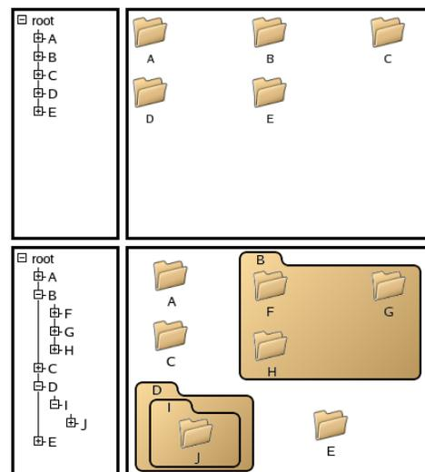
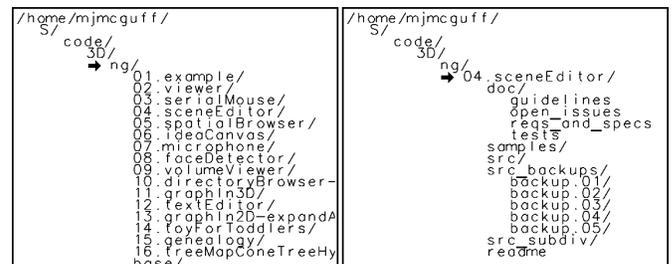
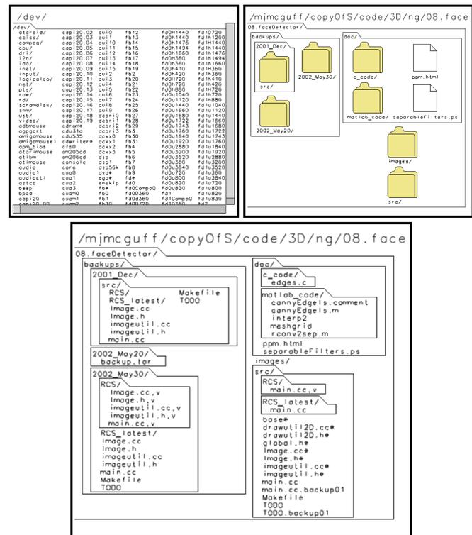
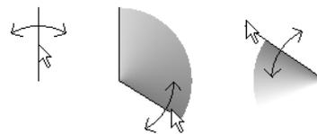
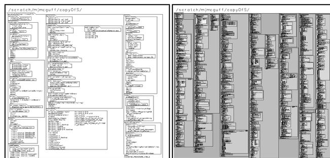
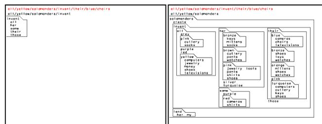
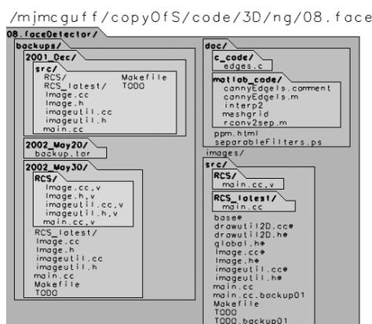

# Expand-Ahead: A Space-Filling Strategy for Browsing Trees

Michael J. McGuffin\*  
Department of Computer Science  
University of Toronto  
<http://www.dgp.toronto.edu>

Gord Davison†  
IBM Toronto Laboratory

Ravin Balakrishnan‡  
Department of Computer Science  
University of Toronto  
<http://www.dgp.toronto.edu>

## ABSTRACT

Many tree browsers allow subtrees under a node to be collapsed or expanded, enabling the user to control screen space usage and selectively drill-down. However, explicit expansion of nodes can be tedious. Expand-ahead is a space-filling strategy by which some nodes are automatically expanded to fill available screen space, without expanding so far that nodes are shown at a reduced size or outside the viewport. This often allows a user exploring the tree to see further down the tree without the effort required in a traditional browser. It also means the user can sometimes drill-down a path faster, by skipping over levels of the tree that are automatically expanded for them. Expand-ahead differs from many detail-in-context techniques in that there is no scaling or distortion involved. We present 1D and 2D prototype implementations of expand-ahead, and identify various design issues and possible enhancements to our designs. Our prototypes support smooth, animated transitions between different views of a tree. We also present the results of a controlled experiment which show that, under certain conditions, users are able to drill-down faster with expand-ahead than without.

**CR Categories:** I.3.6 [Computer Graphics]: Methodology and Techniques—interaction techniques; H.5.2 [Information Interfaces and Presentation]: User Interfaces—interaction styles

**Keywords:** tree browsing and navigation, focus+context, expand-ahead, automatic expansion, space filling, adaptive user interfaces

## 1 INTRODUCTION

Large tree structures can be difficult to view, navigate, and manage. To help mitigate this, users are often given the ability to view only a subset of a tree at a time. The subset might be specified through selective hiding (collapsing) and revealing (expansion) of subtrees (e.g. Figure 1(top left,bottom left)) or might be limited to the “contents” (i.e. children) of one node at a time (Figure 1(top right)). Small subsets are more likely to fit on the user’s available screen space, and thus have less need for scrolling- or zooming-based navigation.

At the same time, working with subsets of a tree can be inconvenient. Many subsets will only partially fill screen space. Although the user may move from subset to subset during browsing and exploration, showing the user small subsets can leave their visual system’s capacity underutilized and prolong navigation tasks. For example, in the specific task of travelling down a path to a leaf, the user is often required to explicitly expand, or “click through”, each node along the way. If the user does not know or forgets what is located under a node, they must explicitly expand, or travel into, the node to find out, and then backtrack if they discover they took a



Figure 1: Top left and top right: an outline view, and 2D view, respectively, of a node’s children, with much space left unused in both cases. Bottom left and bottom right: concept sketches showing that much of the available space can be filled by expanding some children.

wrong turn. Some interfaces show previews of node contents in the form of summaries or thumbnails; however, these only help direct the user’s navigation — the user must still explicitly expand each node along a desired path.

Often, during navigation, a user may be momentarily viewing a relatively small or narrow portion of the tree, with unused screen space left over (Figure 1(top left,top right)). In these cases, we suspect it might often be beneficial for the system to *automatically* expand some nodes, to fill up the available screen space (perhaps resulting in something like Figure 1(bottom left,bottom right)). If the space consumed by such expansion does not exceed the limits of the user’s viewport, then no scrolling or zooming will be required as a result of the automatic expansion. The intention is that, of the nodes revealed by such expansion, those that are *not* of interest to the user can be safely ignored, and those that *are* of interest are now visible to the user for free, with no extra input from the user.

We call this scheme *expand-ahead*, because the system automatically expands pathways downward and *in advance* of explicit expansion by the user. Expand-ahead allows the user to see the contents of more than one folder at a time. It is only performed when there is unused screen space, and is only done to the extent allowed by such space. The automatic expansion never proceeds so far that it would exceed the available screen space, because this would impose a penalty on the user due to the scrolling or zooming necessary to see the resulting information. To make the fullest possible use of screen space, expand-ahead is not, generally, carried out to the same depth along all possible pathways. Instead, usually some nodes are chosen for expansion over others at the same depth. To determine which of the alternative nodes to expand, a heuristic or policy is required, which is given as a parameter to the expand-ahead algo-

\*e-mail: [mjmcguff@cs.toronto.edu](mailto:mjmcguff@cs.toronto.edu)

†e-mail: [davisong@ca.ibm.com](mailto:davisong@ca.ibm.com)

‡e-mail: [ravin@cs.toronto.edu](mailto:ravin@cs.toronto.edu)

rithm. The heuristic can be designed to give preference to nodes that are more likely to interest the user.

Because expand-ahead reveals more information without requiring additional input, we suspect it may benefit general browsing and navigation tasks. In particular, it may allow users to drill-down a path faster, by allowing them to skip over nodes that are automatically expanded. Users may also tend to take fewer wrong turns down paths, because they can see further ahead. On the other hand, in a more free-form browsing scenario, expand-ahead may benefit users by allowing them to incidentally notice interesting nodes that they had no intention of drilling down toward, and that would have otherwise remained undiscovered without expand-ahead.

There are also potential drawbacks to using expand-ahead. Like other adaptive user interface techniques, automatic reconfiguration of interface elements can sometimes confuse users, or give them an impression of not being in control. Inappropriately designed adaptation can even hinder rather than help the user. In light of this, we conducted an experiment to evaluate the performance of users with expand-ahead under controlled conditions.

In the following sections, we review related background work, present the expand-ahead algorithm, describe our prototype implementations, give experimental evidence that expand-ahead can afford faster drill-down under certain conditions, and identify various design issues and possible enhancements to our designs.

## 2 BACKGROUND

Many schemes exist for browsing large spaces in which a tree, or other information, is embedded. Carpendale [4, chapter 2] surveys these techniques, including scrolling, zooming, fisheye views, and various other detail-in-context views. Conceptually, these schemes can be thought of as changing the *presentation* [4, chapter 1] of the space (e.g. by smoothly deforming it), without changing the information's *representation* or embedding in the space. The collapsing and expanding of tree nodes, however, is probably more naturally thought of as a change in the tree's representation or embedding. Despite this, the effect of expand-ahead is somewhat similar to that of focus+context techniques, in that the automatic expansion of descendants under a node of interest can be thought of as revealing more of the neighbourhood around the user's focus.

Some tree representations, like Treemaps [14], Pad++'s directory browser [3], or Nguyen and Huang's space-optimized trees [10], pack nodes into the available screen space by scaling down the size of nodes, allotting progressively less space for nodes further down on the tree. Although this allows a large number of nodes to be fit on the screen, any labels or information displayed with the nodes becomes increasingly illegible in the lower levels of the tree. Depending on the user's goals, it may be preferable to see fewer nodes, but have labels and other information all equally legible. For example, in the context of their work, Plaisant et al. [11] quote one user saying "Make it readable or don't bother showing the nodes".

In expand-ahead, the size of text labels is held constant, so that automatic expansion never reduces the legibility of text. Furthermore, and unlike Treemaps for example, the space allocated to a given subtree is not based on the "size" of the subtree, but rather is a function of whatever expansion heuristic has been chosen.

SpaceTrees [11] show preview icons of collapsed subtrees, and also perform a form of intelligent, automatic expansion for the user. From our perspective, SpaceTrees implement a special case of expand-ahead which we will later call *uniform expand-ahead* (see Section 7). When users select a focal node in a SpaceTree, the number of levels opened under that node is maximized, as allowed by available screen space. Each level, however, is only expanded if all the descendants on that level can be revealed. Our more general notion of expand-ahead allows certain nodes on a given level to be expanded, while their siblings may not be. This yields representa-

tions that are not as orderly and regular as SpaceTrees, but allows us to fill space more aggressively than SpaceTrees do. Another difference is that SpaceTrees expand nodes based solely on available space, whereas in expand-ahead, the decision of which nodes to expand is influenced by the expansion heuristic, making it somewhat more flexible. A final, less critical difference, is that SpaceTrees use a traditional node-link representation for the tree, whereas we have explored automatic expansion within outline (Figure 2) and nested containment (Figure 3(bottom,top right)) representations.

Many adaptive interfaces automatically reconfigure or rearrange interface elements to try and help the user by reducing the effort or amount of input required (see [12] for discussion of this in the context of menus). Unfortunately, such adaptation can also confuse and frustrate the user, especially if the actions taken automatically are inappropriate and/or the user does not understand how the system determines which actions to take. There is a danger that expand-ahead could cause related problems, particularly if the expansion heuristic is poorly chosen. Expanding nodes that don't interest the user would only increase the amount of noise on the display that must be filtered out by the user, making it harder to find nodes that do interest the user. To try and alleviate this problem, expand-ahead never changes the *ordering* of nodes, as some adaptive menus do. Although automatic expansion may introduce irregular spacing between siblings, the user may still be able to employ a subdivision strategy when searching for a node, since the ordering of neighbouring nodes does not change. Furthermore, when a node is expanded, *all* its children are displayed, rather than, for example, just the most frequently accessed subset, as is done in Microsoft Office's adaptive menus.

In partial support of our design, browsers that display a 2D row-column arrangement of icons, such as in Figure 1(top right), typically reflow the icons when the browser window is resized, changing the number of columns and rows. This behaviour is familiar to users, and seems to be far less disturbing than a re-ordering of icons would be.

In Section 7, we speculate on ways to make expand-ahead more consistent in the way it presents information, to further reduce the drawbacks of its adaptive behaviour.

## 3 THE EXPAND-AHEAD ALGORITHM

Let  $F$  be a node in the tree  $T$  that the user has selected as the node of interest, or *focal node*. Our current implementation of expand-ahead works as follows: (1) expand  $F$ , and allocate space on the screen for  $F$  and its children; if there is any space left over, then (2) try expanding each of the children of  $F$  in turn, such that the available screen space is never exceeded; if any of them were successfully expanded, and there is still space left over, then (3) try expanding each of the children of the children of  $F$  that were successfully expanded, such that the available screen space is never exceeded; etc. Stop when there is no longer enough screen space to allow any more expansion, or when we have reached the leaf nodes.

Notice that the order in which the algorithm attempts to expand nodes is breadth first, or level-by-level.

Often, there may be sufficient space to expand one or another child, but not both. In this case, some means is necessary to determine which child to expand, or in which order to attempt expansion of children. Let  $w(n)$  be a weight associated with node  $n$ . The expand-ahead algorithm prefers expansion of nodes with a greater weight over those with less weight. Thus, the  $w(n)$  function can encode various heuristics for node expansion, which may be based, for example, on the likelihood that a given node will interest the user.

More formally, the expand-ahead algorithm is given as Algorithm 1. In the pseudocode, curly braces enclose comments.

### **Algorithm 1** ExpandAhead( $T, F$ )

```

{initialize all nodes to be collapsed}
CollapseAllNodesInTree( $T$ )
{expand  $F$  and all its ancestors}
 $n \leftarrow F$ 
while  $n \neq \text{NIL}$  do
   $n.\text{isExpanded} \leftarrow \text{true}$ 
   $n \leftarrow n.\text{parent}$ 
{check if there's screen space left over}
ComputeLayout( $T, F$ )
if there is unused screen space then
  {expand as many nodes under  $F$  as possible}
   $d \leftarrow 1$ 
  repeat
    noNodesSuccessfullyExpanded  $\leftarrow \text{true}$ 
     $S \leftarrow$  set of all visible nodes at depth  $d$  under  $F$ 
    sort  $S$  by weighting function  $w$ 
    {try expanding each node in  $S$ }
    for all  $n$  in  $S$ , in decreasing order of  $w(n)$ , do
      if  $n$  has children then
         $n.\text{isExpanded} \leftarrow \text{true}$ 
        ComputeLayout( $T, F$ )
        if available screen space is exceeded then
          {backtrack}
           $n.\text{isExpanded} \leftarrow \text{false}$ 
        else
          noNodesSuccessfullyExpanded  $\leftarrow \text{false}$ 
     $d \leftarrow d + 1$ 
  until noNodesSuccessfullyExpanded
  ComputeLayout( $T, F$ )

```

The ComputeLayout subroutine called in the pseudocode is responsible for computing the embedding of the tree  $T$ , i.e. allocating space for all visible nodes and positioning them on the screen with respect to the focal node  $F$ . ComputeLayout can be chosen to generate any tree layout style that is desired, be it of a node-link style, a nested containment layout, or otherwise.

The  $w(n)$  weighting function encodes the heuristic for choosing which nodes to expand. For example, setting  $w(n) = 1/n.\text{numChildren}$  causes nodes with a small number of children to be preferred over nodes with more children. Such a weighting tends to maximize the number of nodes that are expanded automatically, since more nodes can be expanded if each has few children. Another possible weighting is  $w(n) = n.\text{frequency}$ , i.e. nodes that were visited more frequently by the user in the past are given a greater weight, since they are more likely to be visited again by the user.

The ExpandAhead algorithm described by the pseudocode is invoked every time the user selects a new focal node  $F$ , which might be done by simply clicking on a visible node, or travelling upward to the current focal node's parent, or selecting a previously visited node from the browser's history.

The foregoing description assumes the user is only interested in one focal node at a time, as is supported by our current implementation. In Section 7, however, we describe how expand-ahead might be extended to support multiple focal nodes.

## 4 1D PROTOTYPE

Our prototype expand-ahead browsers were implemented in C++ using the OpenGL and GLUT libraries, and run under Linux and Microsoft Windows.

The tree browsed by our prototypes can be either read in lazily from the file system, allowing the user to browse their directories

and files; or can be extracted as a breadth-first tree (BFT) of a digraph described in an input file. In the future, we plan to modify our prototypes to allow dynamically changing the root of the BFT, and investigate the use of our browsers for exploring graph structures.

The 1D prototype displays nodes in the form of an outline view — it is 1-dimensional in the sense that nodes are arranged as a list, with horizontal indentation showing the tree structure. Unlike many other outline browsers, our 1D browser does not allow the user to independently toggle the expansion of individual nodes as can be done with the “+” and “-” icons in Figure 1(top left,bottom left). Support for this might be added eventually (see Section 7), but we chose a simpler design for our first prototype. Instead, expansion is controlled only by selecting the focal node  $F$ . Clicking on a node makes it the new focal node, which is moved to the top of the viewport, with its descendants displayed below it, and expanded according to the expand-ahead algorithm.

Figure 2 shows the 1D browser with two different focal nodes. The expansion heuristic used here, as well as in our later prototype, is  $w(n) = 1/n.\text{numChildren}$ .



Figure 2: Left: The user has selected “ng” as the focal node (indicated with the arrow). This node contains too many children to fit in the viewport — viewing all the children requires scrolling. Because of this, the expand-ahead algorithm has not expanded any of the children. Right: The user has selected “04.sceneEditor”, a child of “ng”, as the new focal node. Since the children (“doc”, “samples”, “src”, etc.) of the focal node consume only some of the vertical space, the expand-ahead algorithm has filled the rest of this space by expanding two of the children, namely “doc” and “src\_backups”.

### 4.1 A Rough Model of User Performance

One of the potential advantages of expand-ahead is that it may allow a user to drill-down a path faster, by skipping over levels that are expanded automatically. If the tree is thought of as a hierarchical menu, then expand-ahead is one way of making the tree, or menu, broader and more shallow: fewer levels need be explicitly traversed by the user, and at each step, the user has more nodes to choose from than without expand-ahead. The question of breadth vs depth in menus has been studied before [13, chapter 3] [6] and it has generally been found that reducing depth by increasing breadth allows selection of leaf items to be made faster overall.

A quantitative estimate of the advantage, if any, of expand-ahead would be valuable. In the particular case of a 1D outline tree view, we can model the task of drilling down in terms of another well understood model: Fitts' law [5, 9]. Fitts' law predicts that the average time  $T$  to acquire, or click, an on-screen target of size  $W$  at a distance  $D$  from the cursor is

$$T = a + b \log_2(D/W + 1) \quad (1)$$

where  $W$  is the target width measured along the direction of motion, and  $a$  and  $b$  are experimentally determined constants that depend on factors such as the particular input device used for pointing. From equation 1, we see Fitts' law predicts that decreasing the size  $W$  of

a target, or increasing the distance  $D$  to a target, both increase the time required to acquire the target.

If drilling down a path involves clicking on each of a sequence of nodes, this can be modelled as a sequence of Fitts' target acquisitions.

Consider an approximately balanced tree with  $N$  leaf nodes and a constant branching factor  $B$ . Assume that the tree is displayed as a 1D outline, such as in Figure 1(top left), and that the height of each node in the outline view is  $W$ . If the user only sees one expanded node at a time, the total height of the outline view is  $BW$ . Furthermore, if the user's cursor starts at a random vertical position, and must travel to a random node, the average distance  $D_{average}$  to travel will be  $BW/3$  (since the mean distance between two points randomly selected on a unit segment is  $1/3$ ).

Without expand-ahead, travelling down a path from the root to a leaf requires one click per level in the tree, or  $C = \log_B N = \log_2 N / \log_2 B$  clicks. The time required for each click can be broken down into a sum of the time  $T_F$  to find the desired node to click on (including any time to visually process information on the screen), and the time  $T$  to acquire the target, as given by Fitts' law. The total time to drill-down is then

$$\begin{aligned} C(T_F + T) &= C(T_F + a + b \log_2(D_{average}/W + 1)) \\ &= (\log_B N)(T_F + a + b \log_2(BW/3W + 1)) \\ &\approx (\log_B N)(T_F + a + b \log_2(B/3)) \\ &= (\log_B N)(b \log_2 B + a - b \log_2 3 + T_F) \\ &= b \log_2 N + (\log_B N)(a - b \log_2 3) + \frac{\log_2 N}{\log_2 B} T_F \end{aligned} \quad (2)$$

As stated earlier, the effect of expand-ahead in a 1D outline is to visually flatten and broaden the tree being navigated. Although the tree's topological structure does not change, expand-ahead reveals more nodes to the user, increasing the number of nodes the user may click on at each step, and decreasing the number of levels the user must explicitly click through. Thus, expand-ahead can be thought of as increasing the "visual" branching factor  $B$  of the tree, which reduces the necessary number  $C = \log_B N$  of clicks. However, because  $B$  is increased, so is the average distance  $D_{average} = BW/3$  the user must travel for each click, and so therefore is the time  $T$  required for each click.

Interpreting  $B$  as the visual, or effective, branching factor allows expression 2 to describe both the cases with and without expand-ahead. Keeping in mind that our goal is to minimize the total time to drill-down, we examine each of the terms in expression 2. The first term  $b \log_2 N$  is the time required for the user to "express" (via their pointing device) the  $\log_2 N$  bits of information associated with the leaf node. This does not depend on  $B$ , and hence is not affected by use of expand-ahead. The second term  $(\log_B N)(a - b \log_2 3)$  is the number of clicks multiplied by a constant time penalty associated with each click. Assuming this term is positive ( $a$  has been found to be considerably larger than  $b$  in many Fitts' tasks), the term is minimized when  $B$  is maximized, which favours expand-ahead. It is unclear how the last term  $(\log_2 N / \log_2 B) T_F$  may change as  $B$  changes. This depends critically on the nature of the time  $T_F$  to find the next node to click on.  $T_F$  most likely increases with  $B$ , because an increased  $B$  means the user will have more nodes to visually scan. If  $T_F$  increases linearly with  $B$ , as would be expected in a scan-and-match visual search, then the last term of expression 2 will also increase with  $B$ , which would argue against using expand-ahead. However, if  $T_F$  only increases logarithmically with  $B$ , as may be expected if the nodes are ordered alphabetically and the user employs a subdividing visual search strategy (see [6] for discussion of this with respect to the Hick-Hyman law), then the last term of expression 2 should remain approximately constant.

In summary, if  $T_F$  is at most a logarithmic function of  $B$ , then expand-ahead should decrease the total time to drill-down a path. However, if  $T_F$  increases faster than logarithmically, it is unclear whether expand-ahead would yield a net increase or decrease of the total time.

The above is only a first attempt to model performance with expand-ahead. Although it suggests that a net advantage may be possible with expand-ahead, experimental investigation is needed to measure actual performance, and would also be required to eventually test and refine this or other models.

## 5 2D PROTOTYPE

As with all 1D outline tree browsers, our 1D prototype arranges nodes along one direction (the vertical), and only uses the 2nd direction for indentation, rather than for showing additional nodes of the tree. Our 2D prototype<sup>1</sup> attempts to make full use of both directions by tiling nodes along rows and columns (Figure 3). Expanded nodes are represented using nested containment, and drawn as folders with a tab for their label. Unexpanded nodes can be optionally shown as either simple text labels (Figure 3(top left,bottom)), or with icons (Figure 3(top right)).



Figure 3: Top left: the children of the focal node are arranged in rows and columns, but are too numerous to fit in the viewport. Hence, scrollbars are provided to pan the view, and no automatic expansion of nodes is performed. Bottom: a different focal node, with fewer children, allows expand-ahead to be performed. Top Right: viewing the same focal node as bottom, with icons enabled.

Recall the `ComputeLayout` subroutine, called in the `Expand-Ahead` algorithm, which computes the layout or embedding of the tree. In our 1D prototype, `ComputeLayout` is a simple and fast subroutine, because the layout of nodes is very regular. However, in our

<sup>1</sup>A video, and executable version, of which are available at <http://www.dgp.toronto.edu/~jmcmcuff/research/>

2D prototype, the `ComputeLayout` subroutine involves a recursive, bottom-up computation of the layout of the nodes, performed by some 400 lines of C++ code, and done once for each node that the `ExpandAhead` algorithm tries to expand. Thus, while the `ExpandAhead` algorithm proceeds *down* from the focal node in a breadth-first manner, each invocation of the `ComputeLayout` subroutine traverses the visible nodes from the deepest nodes *upward*, computing the space required by each node as a function of the space required by its children. Fortunately, on a 1.7 GHz laptop, all these computations only create a noticeable delay if the user is looking at over 500 nodes simultaneously. In addition, we have identified some possible optimizations that could be made to our particular `ComputeLayout` subroutine which remain to be implemented.

The layout done by the 2D `ComputeLayout` subroutine arranges each set of children within rows and/or columns. The flow of the layout can be optionally changed between either (a) filling each column, from top-to-bottom, in an inner loop, and creating whole columns left-to-right in an outer loop (this flow is used in Figure 3), or (b) filling each row, from left-to-right, in an inner loop, and creating whole rows top-to-bottom in an outer loop (as per Figure 1(top right)). A second independent option controls whether nodes are centred within cells of a “grid” with rows and columns that cut across the entire grid; or whether nodes are packed along one direction in the manner of a greedy line-breaking algorithm [1], resulting in the brick-like arrangement of Figure 3(bottom,top right).

When computing the layout of children within an expanded node, a choice must be made as to the number of rows or columns to use. For example, 12 equally sized children could be arranged in a grid of 3x4, or 4x3, or 2x6, etc. We use an approximate rule of thumb that tries to arrange children such that the parent node has an aspect ratio close to 1.

As with our 1D prototype, the focal node in the 2D prototype is selected by clicking on the desired node. A change in the focal node can cause a large change in the arrangement of nodes, which is especially noticeable in our 2D prototype because it can display many more nodes than the 1D prototype. Early testing of our initial 2D prototype quickly convinced us that some kind of animated transition [2, 15] was critically needed, to help the user maintain their mental model of the tree’s layout, and see which nodes are hidden, revealed, or repositioned/resized during a change of focus.

Inspired by the design of the 3-stage animations in `SpaceTrees` [11], we implemented animated transitions consisting of 5 distinct phases: (1) fading out visible nodes that will be hidden after the transition, (2) collapsing the outline of expanded nodes that must be collapsed by the end of the transition, (3) moving and resizing nodes using linear interpolation, (4) expanding the outline of nodes that were initially collapsed but that must be expanded by the end of the transition, (5) fading in nodes that are newly visible. We adjusted the animation to last a maximum of 1 second in total, and to skip over a stage if it does not involve any nodes in the given transition.

Our prototype maintains a history of focal nodes visited. As in a web browser, this history can be navigated using *Back* and *Forward* buttons. Hitting either button invokes a reverse (or forward) animation to the previous (or next) focal node in the history. In addition, the user may hold down the right mouse button to pop up a dial widget (Figure 4) that can be rotated to scrub over the animations. Rotating the widget clockwise or anticlockwise moves forward or backward through the history, at a rate of one focal node per cycle. The user may scrub at any speed, or stop and linger, allowing for careful examination of complicated transitions if desired.

In addition to showing changes in focal nodes, animated transitions are also used to show changes in layout resulting from user-requested changes to the font size used for text labels. A decreased font size means each unexpanded node requires less space, allowing more nodes to be expanded, which sometimes changes the lay-



Figure 4: A popup dial widget. Dragging rotates the dial, which is used to scrub back or forward over animated transitions.

out significantly. The user can incrementally decrease the font size one pixel at a time, by hitting a hotkey repeatedly, invoking a sequence of animations showing the successive changes in layout. Visually, this is comparable to zooming in, in that gradually more detail (i.e. lower levels of the tree) is revealed. However, unlike literal zooming, the focal node, and hence the surrounding context, never changes. Decreasing the font size in effect allows the user to drill-down everywhere in the tree simultaneously, yielding an increasingly detailed “birds-eye” view of the tree (Figure 5). We call this *zooming down*. Of course, sufficient reduction of the font size eventually makes the text labels illegible. The reverse action, of incrementally increasing the font size, is similarly a variation on zooming out and rolling up, which we call *zooming up*.



Figure 5: *Zooming down*: a variation on zooming in and drilling down. Left: the font size has been reduced so that 250 nodes are visible. Right: the font size has been further reduced, so that now 2400 nodes are revealed. To make the tree structure more apparent, nodes are filled with a shade of grey dependant on each node’s depth (see Section 7).

### Pros and Cons of Expand-Ahead

The intended benefits of expand-ahead include revealing more information to the user by exploiting available screen space, and enabling faster drill-down due to fewer clicks being required of the user.

At the same time, there are various potential drawbacks to using expand-ahead. Having more targets on the screen implies a higher average distance to travel to acquire a target, which, by Fitts’ law (equation 1), increases acquisition time. Having more information on the screen also means the user will probably spend more time visually scanning and parsing the information, and may be distracted by irrelevant information. These factors were modelled in Section 4.1, without coming to a definite conclusion on their cost. Other potential drawbacks of expand-ahead are that, by not expanding nodes to the same depth uniformly, expand-ahead can give the user a lopsided view of the tree, since nodes on the same level can be treated differently — this can be either good or bad. Finally, the arrangement and expansion of nodes shown to the user can change not only when the focal node changes, but also if the font size or

window size changes, or if the tree's structure changes (e.g. due to insertion or deletion of nodes). Such rearrangement can cause confusion, and if frequent enough, would inhibit habituation and make it impossible for the user to memorize the spatial location of nodes.

Despite this, rearrangement may not be a severe problem in many practical cases. Expand-ahead never changes the ordering of nodes, so users may still learn to find nodes quickly by using their neighbours as relative landmarks. The relocation and reflowing of nodes in our 2D prototype is comparable to the reflow of rows and columns in interfaces such as in Figure 1(top right), which are already familiar to many users. Changes in font size might be infrequent for many users, and changes in tree structure may not be disturbing to the user if it is the *user* who performs, and is thus aware of, any change to the tree. Animated transitions can also help the user keep their mental map of nodes intact during changes.

Since it is unclear how the potential benefits and drawbacks of expand-ahead compare, we performed a controlled experiment involving a drill-down task, and measured user performance under various conditions. Although we suspect expand-ahead may benefit browsing and exploration of trees in general, we focused on the task of drill-down for a first experiment, because we consider this a fundamental task, and because an experiment involving a highly constrained task yields more reliable results.

## 6 EXPERIMENT

**Goals:** To measure the net effect of expand-ahead on user performance, a controlled experiment was performed in which users completed a task using expand-ahead and without using expand-ahead. In particular, we wanted to determine if users are able to drill-down (i.e. travel down from the root to a leaf) faster with expand-ahead than with purely manual expansion.

**Apparatus:** The experiment was run on 3 computers (enabling us to run 3 users in parallel), each located in an isolated, sound-proofed room, and each running Microsoft Windows. The screens were 15" in size, set to a resolution of 1024x768 pixels. The experiment program was run in full screen mode, with a 16 pixel high font used for text. The input device was a mouse held in the user's dominant hand, with the keyboard used only to start each trial by hitting a key with the user's non-dominant hand.

**Participants:** Users were solicited from a pool of external users through the User Centred Design Department of the IBM Toronto Software Development Lab. 12 users participated in our study, 8 women and 4 men, all right handed, whose usual computer use ranges between 1 and 12 hours per day, 5 to 7 days per week. The users were aged 23-57 years (mean 38.25, standard deviation 11.4).

**Task:** Users completed a number of trials, within each of which the user had to drill-down a target path and select a leaf node of a tree. Before the beginning of each trial, the screen first showed the user the path of the target leaf for the next trial, as a slash-delimited string of nodes, e.g. "abc/def/...". To start the trial, the user had to place the mouse cursor in a 10x10 pixel start box at the upper left corner of the screen, and hit the spacebar with their non-dominant hand. The screen then displayed the target path at the top of the screen in red, the path of the user's current focal node (initially set to the root node at the start of each trial) immediately below in black, and the tree representation in the remaining screen space, using either expand-ahead or not (Figure 6). Users then clicked on nodes to travel down the desired path until they reached the target leaf, which ended the trial.

The reason the target path was shown to users before the start of each trial was to give users a chance to read the path and better retain it in short-term memory during the trial. This should reduce whatever variance there might be in the recorded times due to re-reading the target path during the trial. Forcing users to place their cursor in the start box also reduced variance, ensuring that users



Figure 6: The information displayed during a trial, without expand-ahead (Left) and with 2D expand-ahead (Right). The target path is shown in red at the top of the screen, with the current path shown immediately below.

always started in the same initial position.

Errors were not allowed during trials. If the user clicked on a node not along the target path, the computer emitted an audible beep without changing the focal node, and the user was forced to continue the trial until successful completion. Thus, in some sense, the total time for the trial incorporates the cost of errors. Forcing the user to successfully complete each trial, even after an error, has the advantage that there is no incentive (even subconsciously) for the user to go faster by committing errors and terminating trials early.

**Conditions:** Trials were performed under 3 main conditions: no expand-ahead, 1D expand-ahead, and 2D expand-ahead. Within each main condition, two different trees were used during trials, to test two different ranges of branching factors. Finally, within each main condition, and within each of the two trees, users performed 3 different kinds of drill-down tasks. These were: traversing a different, random path for each trial; traversing the same path repeatedly over many trials; and traversing the same path repeatedly over many trials, but perturbing the tree slightly before each trial. These 3 drill-down tasks were chosen to test performance with unpracticed paths, practiced paths, and practiced paths with perturbation, respectively.

The order of presentation of the 3 main conditions was counter-balanced with a latin square design, and the order of presentation of the two trees was also balanced over the 12 users.

Both trees were of depth 7, and were structured such that the path of a leaf would spell out a coherent 7-word sentence of the form *quantifier colour animal verb possessive-pronoun colour noun*, such as "all yellow salamanders invent their blue chairs". Structuring the levels of the trees this way made it easy to generate the trees offline, programmatically, with a given desired branching factor, and also with some random variety in the children of each node. Although many of the paths form fanciful sounding sentences, these are easier for users to remember during trials than a random string of characters would be. Note that the children of each node were always ordered alphabetically, to better enable users to use a subdividing visual search strategy during trials.

The first tree had internal nodes whose branching factor varied uniformly between 2 and 5. The second tree was bushier, with a branching factor varying uniformly between 8 and 11. These values were chosen because they are close to the two extreme branching factors for our conditions, without being too extreme. A constant branching factor of just 1 would give too great an advantage to expand-ahead (which would be able to expand the tree all the way to its single leaf), and a branching factor much greater than 10 would mean that, for the font and screen size used, expand-ahead would usually revert back to the status quo of no automatic expansion.

In the first drill-down task, users were given a different random path for each of 10 trials. In the second drill-down task, users were given the same path for 5 trials, and then a second path for another 5 trials. In the third drill-down task, users were again given 2

paths for 5 trials each, however in this case the tree was perturbed slightly before each trial, by swapping random subtrees at various levels, causing a corresponding change in the computed layout of the tree, and a change in which nodes would be expanded by the ExpandAhead algorithm.

In summary, the whole experiment involved

12 participants  $\times$   
 3 main conditions (no expand-ahead, 1D expand-ahead, 2D expand-ahead)  $\times$   
 2 trees  $\times$   
 3 drill-down tasks  $\times$   
 10 trials  
 = 2160 trials in total

## Results and Discussion

We broke down the measured data into 3 subsets, corresponding to each of the 3 drill-down tasks, and examined the effect of various factors on the recorded times in each subset.

Analysis of variance (ANOVA) showed that the participant had a significant ( $F > 30$ ,  $p < 0.0001$  for each of the 3 tasks) effect on the time to complete each trial. The average time for each participant varied roughly evenly between 10.1 seconds for the fastest user, and 19.8 seconds for the slowest user. This large variance could have been in part due to the range of ages of users, and the apparently different levels of fatigue under which each user performed the experiment. For example, the slowest user reported feeling sleepy during the experiment.

The two trees used also had an effect on performance. Within each of the 3 tasks, the relatively skinny tree, with branching factor 2-5, afforded significantly ( $F > 70$ ,  $p < 0.0001$ ) faster performance than did the bushier tree with branching factor 8-11. This makes sense for the non-expand-ahead condition, since a larger branching factor requires the user to travel farther on average for each click, and also makes sense in the expand-ahead conditions, since expand-ahead can expand skinny trees more deeply, on average.

Within each task, the main condition had a significant effect on time ( $F = 7.5$ ,  $p < 0.0006$ ;  $F = 14.7$ ,  $p < 0.0001$ ; and  $F = 3.3$ ,  $p < 0.0362$  for the 3 tasks, respectively). Following are the average times for each of the tasks, broken down by main condition. Stars appear beside times significantly different from the other times in the same task, as determined by a multiple means comparison.

For unpracticed, random paths:

| Main Condition  | Time (seconds)                 |
|-----------------|--------------------------------|
| no expand-ahead | 14.541                         |
| 1D expand-ahead | 15.930 * (significantly worse) |
| 2D expand-ahead | 14.912                         |

For practiced, repeated paths:

| Main Condition  | Time (seconds)                  |
|-----------------|---------------------------------|
| no expand-ahead | 13.006                          |
| 1D expand-ahead | 13.085                          |
| 2D expand-ahead | 11.361 * (significantly better) |

For practiced, repeated paths, with perturbation:

| Main Condition  | Time (seconds)                  |
|-----------------|---------------------------------|
| no expand-ahead | 13.149 * (significantly better) |
| 1D expand-ahead | 13.883                          |
| 2D expand-ahead | 14.005                          |

As seen by the above tables, in the 1st task, with unpracticed, random paths, performance with 2D expand-ahead was not significantly different from that with no expand-ahead. In the 2nd task, with practiced paths and no perturbation, 2D expand-ahead was significantly faster than having no expand-ahead, by approximately 12.7%. In the 3rd task, with perturbation, 2D expand-ahead

was significantly slower than having no expand-ahead, by approximately 6.5%.

These results suggest that, for practiced paths in absence of perturbation or rearrangement of nodes, users are able to quickly target the desired nodes along the path, probably by memorizing their location, and reach the leaf node faster with expand-ahead than without, by skipping over the levels expanded for them. With perturbation, however, users were slower in the 2D expand-ahead case than without expand-ahead, implying that the time  $T_F$  to find each next node increased enough to outweigh the benefit of having fewer clicks to perform.

These results are not so surprising in light of the expected trade-offs that usually accompany adaptive user interfaces: they can help performance in some situations, but also hinder it if the user does not find items in their expected place. It is encouraging to note, however, that although 2D expand-ahead was 6.5% slower than no expand-ahead in the perturbed tree case, it was faster by 12.7%, or about twice as much, in the un-perturbed case.

Furthermore, a few aspects of our experiment may have artificially biased the results against expand-ahead. In real situations, changes made to the tree's structure are often made by the user themselves, e.g. adding or deleting portions of their own file structure, rather than imposed by the system through a randomized perturbation. At least one user remarked after the experiment that she felt expand-ahead would have been easier to use if she had built up the tree herself and been familiar with its contents, rather than browsing a tree never seen before. Also, in practice, changes to a tree such as a user's file system are not as frequent as the perturbations in our experiment were. Infrequent changes to the tree's structure would be more conducive to habituation by the user.

Finally, our experiment only tested performance at drilling-down a path, and leaves open the question of whether expand-ahead benefits more general browsing tasks. For example, expand-ahead not only allows a user to skip over levels that have been automatically expanded, it also allows the user to see deeper down a tree. This means the user may notice more information and discover nodes that they would not have otherwise travelled down to.

## 7 DESIGN ISSUES AND POTENTIAL ENHANCEMENTS

This section describes various enhancements that could be explored in future design work.

**Sticky or Hard Expansion, vs Soft Expansion:** In our prototypes, the user only selects the current focal node  $F$ , and the ExpandAhead algorithm determines which nodes to expand under  $F$ . This behaviour could be made more general by instead allowing for two types of expansion: sticky, or hard expansion, that is controlled by the user; and soft expansion, that is set by the ExpandAhead algorithm. The user would be able to explicitly expand one or more nodes, leaving them in a forced expanded state. The ExpandAhead algorithm would then allocate screen space for these nodes, and only expand other nodes if there remains more screen space. Such behaviour would allow the user to effectively create multiple points of focus, by hard-expanding each node of interest, after which the ExpandAhead algorithm would fill up any remaining screen space with automatic, soft expansion.

**Locking Node Positions for Persistent Layout:** One of the participants in our experiment said she would like the ability to customize which levels of the tree she sees expanded together, and to always see the levels that way. Features that allow the user to manually position or "lock down" the relative placement of nodes would help alleviate the detrimental effects of rearrangement and allow for better landmarking and more consistent displays, thus reducing the time necessary to visually scan for nodes. The system could, for example, allow the user to lock down certain nodes of particular interest, while other nodes are free to flow around them.

**Uniform Expand-Ahead and Partial Expansion:** As mentioned in Section 2, SpaceTrees [11] implement a kind of expand-ahead, but where levels are only expanded if they can be expanded completely. This has the disadvantage that screen space cannot be filled as completely, but also means that node expansion occurs in a much more regular and uniform way. Such *uniform expand-ahead*, which only expands entire levels under the focal node, reveals each possible path down from the focal node to the same depth. This may result in displays that are easier for the user to understand.

Another possibility not yet explored in our prototypes is that of partial expansion of nodes, whereby a node might be expanded to show some of its children, giving the user a partial preview of its contents, but also show some indication of elision (perhaps similar to Lee and Bederson's ellipsis nodes [8, 7]) if there are other children not shown. If  $f$  is the fraction of children that are shown in a partial expansion,  $f$  could be chosen to be proportional to  $w(n)$ , again allowing for heuristics to guide the expansion.

Combining uniform expand-ahead with partial expansion (i.e. whereby all nodes on a level would be each partially expanded) might enable more efficient filling of screen space without sacrificing the regular and uniform treatment of nodes on the same level.

**Improvements in Graphic Design:** We are also currently experimenting with various changes to the graphic design of our tree representations, in an attempt to make them easier to visually interpret (Figure 7).



Figure 7: Experimental enhancements to the graphic design of our 2D browser. To make information easier to parse quickly, nodes are filled with a shade of grey indicating depth, and labels of expanded nodes are shown in bold.

## 8 CONCLUSION AND FUTURE DIRECTIONS

We have presented a general model for automatically expanding nodes to fill screen space. The expand-ahead model can be applied to many different representations of trees, including node-link representations and nested containment representations. A pseudocode algorithm for implementing this model was given, which takes a heuristic weighting function  $w(n)$  as a parameter to guide the expansion according to a client-chosen policy. We have also given an approximate model of user performance with expand-ahead, presented two prototype implementations, and reported experimental evidence that expand-ahead can improve performance during a drill-down task under appropriate conditions.

The ideas described in Section 7 would be interesting to explore further. In addition, more controlled experiments could be conducted to confirm and/or refine our model of user performance.

Tasks other than drill-down could also be tested, to see if expand-ahead can facilitate more general navigation and browsing tasks. It would also be interesting to apply expand-ahead to other tree representations, such as various node-link style layouts.

## 9 ACKNOWLEDGEMENTS

Many thanks to Paul W. Smith, Rebecca Wong, David Budreau, Susan Hamilton, Shengdong Zhao, Bowen Hui, Joe Laszlo, Ronald M. Baecker, Gord Kurtenbach, Aaron Hertzmann, Wilmot Li, Gonzalo Ramos, Daniel Vogel, Maciej Kalisiak, Derrick Moser, Eugene Kim, and Alicia Servera, for valuable support, suggestions, and help during this research. Thanks also to the participants in our experiment for their time. This research was funded by IBM CAS Toronto and CITO.

## REFERENCES

- [1] James O. Achugbue. On the line breaking problem in text formatting. In *Proceedings of ACM SIGPLAN SIGOA Symposium on Text Manipulation*, pages 117–122, 1981.
- [2] Lyn Bartram. Can motion increase user interface bandwidth? In *Proceedings of IEEE Conference on Systems, Man and Cybernetics*, pages 1686–1692, 1997.
- [3] Benjamin B. Bederson and James D. Hollan. Pad++: A zooming graphical interface for exploring alternate interface physics. In *Proceedings of ACM Symposium on User Interface Software and Technology (UIST)*, pages 17–26, 1994.
- [4] Marianne Sheelagh Therese Carpendale. *A Framework for Elastic Presentation Space*. PhD thesis, School of Computing Science, Simon Fraser University, Burnaby, Canada, March 1999.
- [5] Paul M. Fitts. The information capacity of the human motor system in controlling the amplitude of movement. *Journal of Experimental Psychology*, 47(6):381–391, June 1954. (Reprinted in *Journal of Experimental Psychology: General*, 121(3):262–269, 1992).
- [6] T. K. Landauer and D. W. Nachbar. Selection from alphabetic and numeric menu trees using a touch screen: Breadth, depth, and width. In *Proceedings of ACM CHI 1985 Conference on Human Factors in Computing Systems*, pages 73–78, 1985.
- [7] Bongshin Lee and Benjamin B. Bederson. Favorite folders: A configurable, scalable file browser. Technical Report HCIL-2003-12, CS-TR-4468, UMIACS-TR-2003-38, University of Maryland, Computer Science Department, College Park, MD, 2003. 10 pages.
- [8] Bongshin Lee and Benjamin B. Bederson. Favorite folders: A configurable, scalable file browser (demo paper). In *ACM Symposium on User Interface Software and Technology (UIST) Conference Supplement*, pages 45–46, 2003.
- [9] I. Scott MacKenzie. Fitts' law as a research and design tool in human-computer interaction. *Human-Computer Interaction*, 7:91–139, 1992.
- [10] Quang Vinh Nguyen and Mao Lin Huang. A space-optimized tree visualization. In *Proceedings of IEEE Symposium on Information Visualization (InfoVis)*, pages 85–92, 2002.
- [11] Catherine Plaisant, Jesse Grosjean, and Benjamin B. Bederson. SpaceTree: Supporting exploration in large node link tree, design evolution and empirical evaluation. In *Proceedings of IEEE Symposium on Information Visualization (InfoVis)*, pages 57–64, 2002.
- [12] Andrew Sears and Ben Shneiderman. Split menus: Effectively using selection frequency to organize menus. *ACM Transactions on Computer-Human Interaction (TOCHI)*, 1(1):27–51, March 1994.
- [13] Ben Shneiderman. *Designing the User Interface: Strategies for Effective Human-Computer Interaction*. Addison-Wesley, 2nd edition, 1992.
- [14] Ben Shneiderman. Tree visualization with tree-maps: 2-d space-filling approach. *ACM Transactions on Graphics (TOG)*, 11(1):92–99, January 1992.
- [15] David D. Woods. Visual momentum: a concept to improve the cognitive coupling of person and computer. *International Journal of Man-Machine Studies*, 21:229–244, 1984.