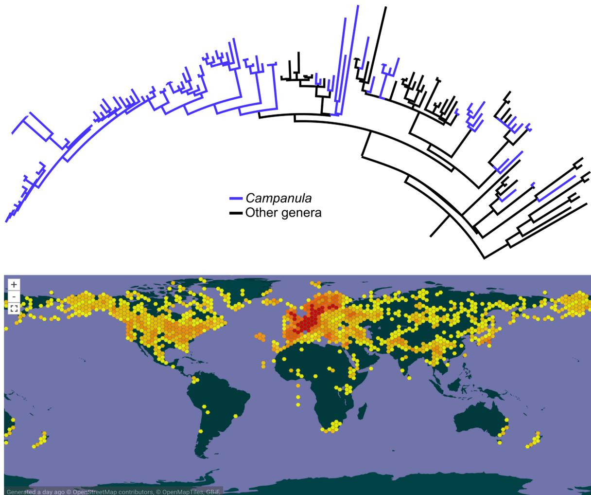
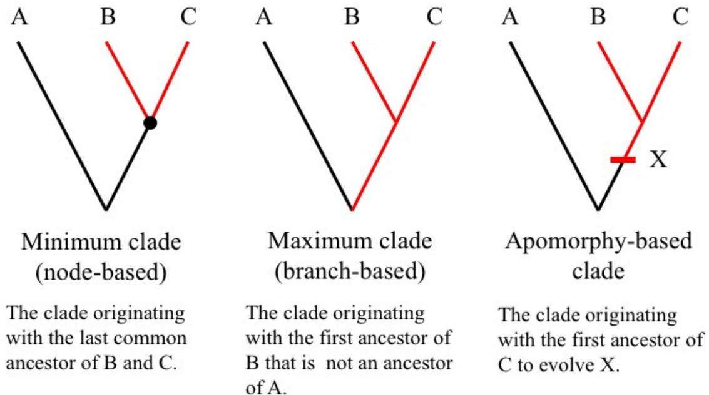
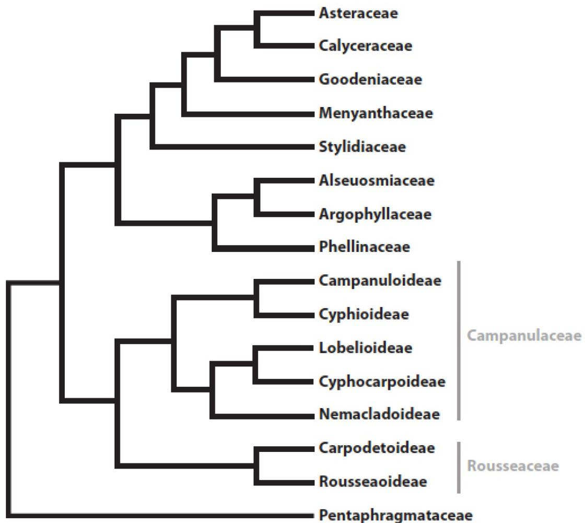

# Phyloreferences: Tree-Native, Reproducible, and Machine-Interpretable Taxon Concepts

Nico Cellinese,\* Stijn Conix,† and Hilmar Lapp\*†

---

Evolutionary and organismal biology have become inundated with data. At the same rate, we are experiencing a surge in broader evolutionary and ecological syntheses for which tree-thinking is the staple for a variety of post-tree analyses. To fully take advantage of this wealth of data to discover and understand large-scale evolutionary and ecological patterns, computational data integration, i.e., the use of machines to link data at large scale, is crucial. The most common shared entity by which evolutionary and ecological data need to be linked is the taxon to which they belong. We propose a set of requirements that a system for defining such taxa should meet for computational data science: taxon definitions should maintain conceptual consistency, be reproducible via a known algorithm, be computationally automatable, and be applicable across the Tree of Life. We argue that Linnean names, the most prevalent means of linking data to taxa, fail to meet these requirements due to fundamental theoretical and practical shortfalls. We argue that for the purposes of data-integration we should instead use phylogenetic definitions transformed into formal logic expressions. We call such expressions *phyloreferences*, and argue that, unlike Linnean names, they meet all requirements for effective data-integration.

---

## Keywords

computational semantics • data integration • Linnean names • phylogenetic definitions • phyloreferences • taxon concepts • Tree of Life

## 1 Introduction

The last two decades have witnessed a vast increase of available digital biodiversity data. This richness in data has been fostered, in part, by a call to mass-digitize museum repositories (Beaman and Cellinese 2012; Page et al. 2015), and is fueled by the emergence of new applications

---

\*Florida Museum of Natural History, University of Florida, Gainesville, Florida 32611, USA,  
ncellinese@fmnh.ufl.edu

†Center for Logic and Philosophy of Science, Katholieke Universiteit, Leuven, Belgium, stijn.conix@kuleuven.be

‡Duke Center for Genomic and Computational Biology, Duke University, Durham, NC, USA  
hilmar.lapp@duke.edu

Received 11 March 2020; Revised 30 November 2020; Accepted 26 July 2021  
doi:10.3998/ptpbio.2101

and data sources, analytical methods, faster algorithms, and improved environmental sensors, among others (Philippe et al. 2005; Porter et al. 2009; Michener and Jones 2012; Chan and Ragan, 2013; Hampton et al. 2017; Kozlov et al. 2019). Additionally, it has led to a corresponding, increasing need for digital access, sharing, and re-purposing of data, and, consequently, to a need of using machines to link data from different sources to shared entities. The natural framework for such synthesis of biodiversity data is the Tree of Life. Tree-thinking has seized a prominent role in systematics since the advent of phylogenetics (Zimmermann 1931, 1934, 1943; Hennig 1950, 1966). The rapidly increasing knowledge across the Tree of Life has now enabled a synthesis of phylogenetic hypotheses on a Tree of Life scale, to produce an encompassing—and digitally fully reusable—view of Life’s evolution, the Open Tree of Life (Hinchliff et al. 2015; McTavish et al. 2017). As a comprehensive and repeatable phylogenetic synthesis, it provides unprecedented opportunities for studying evolutionary patterns across all clades, at large as well as small scales. These clades are the perfect loci at which to integrate the suite of different data types resulting from evolutionary and biodiversity research (e.g., Allen et al. 2018; Eliason et al. 2019; Folk et al. 2019; Howard et al. 2019).

Thus, a system of defining clades is needed to link the vast amount of available biodiversity data in a way that it can be recovered, aggregated, and integrated. However, there is wide disagreement about which system should be used for this purpose. Currently, most biological data and knowledge are directly or indirectly linked to biological taxa via Linnean taxon names. As we will discuss below, it is well known that in its current shape the Linnean system leads to numerous problems when applied to data-intensive science that depends on computation. Therefore, an alternative is needed. Broadly speaking, there are two main candidates for such an alternative: to modify the current Linnean system such that it can fulfill certain requirements (see list below), or, more radically, to abandon the Linnean system in this context and implement a purely phylogenetic system for clade definitions. The former of these involves repurposing Linnean names to refer to clades, and using these names as labels for taxon concepts.1 In that sense, this option is a hybrid between the Linnean and a phylogenetic system. The latter of these, instead, consists in generating purely phylogenetic definitions of clades.

To arbitrate between these alternatives, we propose the following four requirements that any system suitable for data-integration should meet: (i) The mapping maintains conceptual consistency, meaning that when mapped to different phylogenies, the semantics of the retrieved clades are consistent.2 (ii) The mapping of a given clade concept to a given phylogenetic hypothesis is exactly reproducible via a known algorithm. (iii) The algorithm to (re)produce the mapping is computationally automatable, which is necessary for processing the very large phylogenies and datasets characteristic of modern biology. This means consulting expert opinion cannot be part of the algorithm. (iv) The system is applicable to all lineages in the Tree of Life, including in particular those where Linnean names are not available (e.g., Archaea, fungi, etc.).

In this paper, we show that it is in principle impossible for the Linnean system to meet these requirements, and present a purely phylogenetic alternative that does meet them. In section 2 we elaborate on the problems of the Linnean system, and show that it is beyond repair. In section 3 we introduce the purely phylogenetic approach, and show how it can address the shortcomings of the Linnean system. In section 4 then we introduce one way in which such

1A taxon concept is the underlying meaning of a group (taxon), whether the group is defined by traits (Linnean taxonomy) or diagnosed by traits (phylogenetic taxonomy).

2By semantics we mean the study, processing, and representation of meaning. The term is used in distinct disciplines, including linguistics and philosophy. In this paper, we use semantics in the sense of computational semantics, which concerns itself with the construction of and automated reasoning with representations of meaning (such as ontologies and logic expressions using ontologies) of natural language expressions.

a phylogenetic alternative could be implemented, namely, *phyloreferences*, and in section 5 we argue that this implementation is preferable over other existing implementations. Finally, in section 6 we address various objections to our proposal, and section 7 concludes the paper.

First of all, it is important to emphasize that the issue at stake in this paper is not that of nomenclature. The question of how to define taxon concepts for data integration is independent from the question of whether these taxon concepts also are named, and even whether these names are Linnean names. While the approach we propose in this paper fits more naturally with a form of phylogenetic nomenclature, it is also compatible with retaining Linnean names. Related to this, the issue at stake is not that of whether we should recognize certain taxa as species (Mishler and Wilkins 2018). While a phylogenetic approach like the one proposed here denies that there is an ontological difference between taxa at different levels, it is compatible with recognizing some of these taxa as species. Thus, what is at stake is the best way of defining taxa for data integration, and not the names of these taxa or whether they can be listed as species.

## 2 The Poverty of Linnean Names

Many authors before us have pointed to problems caused by Linnean nomenclature and classification. This section instead discusses two problems of the Linnean system that make it unsuitable for data integration, and argues that it is not possible to eliminate these problems simply by making small changes to the system.

### 2.1 *The Linnean shortfall limits data discovery*

A first problem of the Linnean system is often referred to as the ‘Linnean shortfall.’ This is the significant gap in our current knowledge of described vs. unknown biological diversity (Brown and Lomolino 1998; Hortal et al. 2015), and it highlights our limited ability to first discover and then describe taxa according to the rules of nomenclatural codes. In view of the sixth mass extinction we are currently experiencing (Brook et al. 2008), this represents a true plague in biodiversity science because it implies that we are also losing unknown diversity, and the diversity we do discover is not described (in a Linnean framework) fast enough. From a computational perspective, the latter point represents a true obstacle to addressing the computable taxon concept challenge because taxa need to be described before they can serve as loci to link data.

Two causes of the Linnean shortfall are particularly relevant in this context. First, the process of describing diversity is very time consuming and relies on detailed comparative studies of specimens in museum’s repositories and field observations. Second, there are far more levels of clades in the Tree of Life than there are ranks to name them. As a result, we continue to discover lineages that persist between revisions of the Tree of Life, yet do not have, and may never receive, the kind of names required to facilitate discovery and reuse in a name-based system, let alone formal Linnean names. Adopted placeholders such as ‘phylotype *X*’ or ‘clade *A*’ may serve their purpose within a publication, but they are not discoverable and reusable terms beyond it (also, see appendix in de Queiroz and Donoghue 2013). This predicament applies across the Tree of Life, but is particularly prevalent in Archaea and other prokaryotes, and very common even in many eukaryotes. Consequently, such lineages have often been referred to as ‘dark taxa’ (Parr et al. 2012).

The result is that there are a lot of data about taxa that cannot yet, and may never be, linked to Linnean names. This way, the Linnean system fails to meet requirement (iv), i.e., to provide the tools to define, communicate and query these unnamed taxa.

### 2.2 *Linnaean names make data discovery difficult to reproduce*

One might argue that the rate of species descriptions and formal names could, in principle, increase dramatically and thus alleviate the problem described in the previous subsection. This subsection argues that even if that were the case, Linnaean names would not be suitable for integrating data from different sources. This is because it falls short of the three other requirements as well: (i) it fails to maintain conceptual consistency, (ii) the mapping of a Linnaean name to a phylogeny is not reproducible by a known algorithm, and (iii) the algorithm to do this mapping is not automatable.

To see why the Linnaean system falls short of these requirements, it is helpful to briefly consider its design and history. Prior to Linnaeus, biological knowledge was organized in large, poorly defined categories, and nomenclature was completely unstructured. Linnaeus was a revolutionary for his time, not so much for the system he created (other botanists before him experimented with the ranking system), but for what he enabled. He brought order by formalizing criteria to define logical relationships among abstract classes (categorical ranks) and restructuring the nomenclatural system by enforcing a binomen to every organism at the species level and a single name to every higher rank. Outside of the—yet to be established—unifying context of evolution, taxa were assumed to be static entities, with character similarity providing the best approach to defining groups of organisms. In this context, Linnaean nomenclature served the need of linking names to taxon groups.

Darwinian theory then revolutionized the perspective on biological relationships and taxon group membership, with the notion that it is natural processes that give rise to taxa, while characters can only diagnose, but not define categories (Darwin 1859). Zimmermann (1931, 1934, 1943) and Hennig (1950, 1966) formalized these theories and provided the criteria to construct phylogenetic trees. In this theoretical framework, in which taxa are no longer seen as static entities, it quickly became clear that the phylogeny-governed hierarchy of Hennig's framework is better suited for defining taxa than the logical relatedness of groups in Linnaeus' hierarchical framework (see also Ereshefsky 2001). Consequently, as common practice Linnaean nomenclature has been repurposed to link names to clades. In this hybrid system, Linnaean names are used to label taxon concepts, which are clades rather than fixed entities defined by a set of characters.

However, the Linnaean elements that this hybrid system retains make it impossible for it to be used for effective data-integration. There are three reasons for this.

First, repurposed Linnaean names define taxon concepts by means of a type specimen and description (Brzozowski 2020). However, whenever the type is missing from the phylogeny—which is typically the case—there are no agreed rules for mapping type specimens to clades. Instead, this mapping relies on expert judgement. As different experts tend to do this in different ways (see our example of *Campanula* below), this means that the Linnaean system does not meet requirement (ii) of reproducibility by a single algorithm. In addition, the necessity of expert judgement means that the mapping of names to clades cannot be automated. This means that the Linnaean system also fails to meet requirement (iii).

Second, the lack of reproducibility in the Linnaean system leads, over time, to confusion over the taxon concept to which a name is linked. Through time, different experts often apply the same name in different ways due to different interpretations of the original taxon protologue,3 and consequently, the meaning of this name becomes difficult to track. This problem is further

3A taxon protologue is the collection of material associated with the publication of a taxon name and concept and therefore, includes all the evidence that support the establishment of a new named entity (e.g., diagnosis, specimens, phylogeny, etc.).

exacerbated by purely nomenclatural issues that notoriously plague taxonomy, such as synonymy, homonymy, misapplication, etc. And even though these can often be reconciled (albeit not always easily) by taxonomic name resolution services (Boyle et al. 2013; Chamberlain and Szöcs 2013), this provides little relief to the long-standing informatics challenge of reconciling names with taxon concepts. This problem is particularly heightened in names with a long history and legacy of taxonomic literature. Because repurposed Linnean names still point to traditionally circumscribed groups that are not generated in an evolutionary framework, they inherit these problems. In that sense, repurposed Linnean names approximate to clades, but never exactly match them. This is because traditional groups and the clades we discover are fundamentally two different entities, created by very different criteria (Cellinese et al. 2012). Furthermore, even if the extension of a Linnean name were to coincide with that of a particular clade, over time this would quickly fall prey to the same problems of interpretation and taxonomic as well as phylogenetic revision. Due to the above points, the Linnean system fails requirement (i), i.e., it cannot maintain conceptual consistency.

Third, the hybrid system still links data to a Linnean *name*. These names are text strings without computational meaning. Thus, even if we repurpose a Linnean name to refer to a clade, this name can never express the semantics of that clade. Instead of defining the taxon in a way that would allow machines to identify the taxon, these names link to type specimens and descriptions that, as described above, have been used and interpreted in different ways by different researchers. Thus, as long as Linnean names are used to point to taxon concepts, it will be impossible for machines to reliably integrate data. This means, again, that the hybrid Linnean system inevitably fails to meet the requirement of making taxon definitions computationally automatable (iii).

The failure of the Linnean system to meet these three requirements is easiest to explain by drawing an analogy with geolocation-linked data: like taxa, such location data is incredibly useful for integrating data. Imagine that for geolocation-linked data only place names, not standard latitude/longitude geo-coordinates, were available for computation. Data could not be aggregated by region, users could not draw a bounding box on a map to query a database, species occurrence data could not be queried for “all species within 50 miles of my location”, and users querying by place would have to know country, state, and possibly city to make the query less ambiguous. Yet, this is the current situation in computing with taxon-linked data.

Consider, as an example to illustrate the problems of the Linnean system, the genus *Campanula* formalized by Linnaeus in 1753, for which *Campanula latifolia* L. was later selected as a lectotype (Britton and Brown 1913). When discussing *Campanula* L., Lammers (2007) states that “there is no modern classification which accounts for this large genus in its entirety” and therefore, the exact number of species is unknown, but the current count is at more than 400. The original description applied to *Campanula* has been so stretched through time that, unsurprisingly, *Campanula* as a Linnean taxon concept is highly polyphyletic, scattered across the entire Campanuloideae tree with other polyphyletic genera (Crowl et al. 2016; Fig. 1). The clade including the type specimen (*Campanula latifolia*) would have to retain the original name, which would imply a cascade of name changes across the tree, not an uncommon repercussion in taxonomic revisions. Even ignoring the nuisance of name changes, all phylogenetic studies to date have analyzed a significantly incomplete taxon sample, which had stalled any formal update in the taxonomy and classification because it would be premature. The most challenging bottleneck is the inability to retrieve taxonomic concepts unambiguously. Aside from its type specimen, what constitutes the traditional taxon *Campanula*, in view of how the name has been applied across time, is not even easy to verbalize, given an author’s subjective taxon description and the lack of informative synapomorphies. Figure 1 illustrates some of the practical conse-

quences of this complex issue, by requesting occurrence data from GBIF (gbif.org) using a query for *Campanula* as a genus. Integrating data obtained in this way with the known phylogeny will necessarily be very challenging at best, given that *Campanula* as a clade does not exist.

Figure 1: Upper half: phylogeny of Campanuloideae redrawn from Crowl et al. (2016) showing the polyphyly of *Campanula* (lineages in blue). Lower half: distribution of *Campanula* as retrieved from a GBIF query.

Examples like *Campanula* are very common across all domains at any taxonomic level, and the harmonization between traditional ideas about life and the phylogenetic approaches we employ to discover natural entities has become a true impediment to progress in querying, communicating, and ‘decorating’ all of the parts of the Tree of Life in a consistent and reproducible way. In the next section, we discuss an alternative way of defining taxon concepts for data integration that does not suffer from the problems of the Linnean system.

## 3 The Richness of Phylogenetic Definitions

Starting in the mid 1980s a number of authors suggested that taxon names could be defined by reference to a part of a phylogenetic tree, prompting an extensive theoretical discussion, as well as the first attempts to generate phylogenetic definitions (Ghiselin 1984; Gauthier and Padian 1985; Gauthier 1986; Rowe 1987; de Queiroz 1987, 1988; Gauthier et al. 1988; Estes

et al. 1988). A phylogenetic definition represents a formal statement that describes a clade in a phylogeny. This body of work laid the foundation for phylogenetic taxonomy, later renamed phylogenetic nomenclature, which takes a strictly tree-thinking approach to biological nomenclature (de Queiroz and Gauthier 1990, 1992, 1994). Soon thereafter, the *PhyloCode* ([www.phylocode.org](http://www.phylocode.org)) was drafted as an application of phylogenetic nomenclature's principles.

Many systematics papers (e.g., de Queiroz 1992, 1994, 1997; Rowe and Gauthier 1992; Judd et al. 1993, 1994; Bryant 1996, 1997; Sundberg and Pleijel 1994; Christoffersen 1995; Schander and Tholleson 1995; Lee 1996, 1998, 2001; Wyss and Meng 1996; Brochu 1997; Cantino et al. 1997, 2007; Kron 1997; Baum et al. 1998; Eriksson et al. 1998; Härlin and Sundberg 1998; Hibbett and Donoghue 1998; Alverson et al. 1999; Pleijel 1999; Sereno 1999; Bremer 2000; Brochu and Sumrall 2001) clearly articulated the need to communicate parts of the Tree of Life and demonstrated that Life could be described by using three basic clade types and their associated phylogenetic definitions. These are (1) minimum clade definitions, denoting the smallest clade that includes the most recent common ancestor, and all its descendants, of two or more internal specifiers; (2) maximum clade definitions, denoting the largest clade that includes the first ancestor, and all its descendants, of one or more internal specifiers but excludes one or more external specifiers; and (3) apomorphy-based definitions, denoting the clade that arises from the first ancestor, and includes all its descendants, that possesses a specified character that is synapomorphic with an internal specifier (Fig. 2). Specifiers are reference points in the phylogeny that serve as anchors for the clade definition and these can be species, specimens, or apomorphies, which would include molecular sequences. Ideally, when using species as specifiers, these would already have a phylogenetic definition available or the Linnean type present in the phylogeny; likewise, when using apomorphies, ideally every trait used as specifier should be semantically defined.

While there has been extensive debate in the literature (Benton 2000; Blackwell 2002; Schuh 2003; Polaszek and Wilson 2005; Rieppel 2006; Stevens 2006; de Queiroz and Donoghue 2011; among many others) about possible advantages and disadvantages of the *PhyloCode* as a nomenclatural system, the *PhyloCode* is simply one application of phylogenetic nomenclature, in the realm of nomenclatural codes. Our concern here is not arguing the merits of, or issues with the *PhyloCode*, or, for that matter, any nomenclatural code. Instead, we posit that phylogenetic definitions have unquestionable benefits as a means to unambiguously label all clades in the Tree of Life, and use these for data integration.

Compared to traditional taxon descriptions, phylogenetic definitions have clear advantages for computing with taxon concepts in a phylogenetic context. They draw unambiguous reference to any part of the Tree of Life and can be expressed in a formal and standardized format. Although when published they refer to a taxon concept (clade) originating from a specific phylogenetic topology, a formal clade concept established by an author is an unambiguous statement and approach to communicate taxa, and thus data for those taxa, regardless of future changes in phylogenetic knowledge. That is, as long as the specifiers used in a clade definition have been matched to a given phylogenetic tree, there is no arguing about the clade identified by the definition.4 Obviously, this cannot prevent or resolve disagreements about the actual taxon concept, but it does enable clearly articulating which element(s) of a phylogenetic definition is(are) the point(s) of contention. In other words, disagreement over a concept does not imply ambiguity over what the concept represents. Additionally, a change in phylogenetic knowledge after the original publication of a phylogenetically defined clade concept may result in taxa now included in the clade that the original author did not intend to be included, or for which the community is divided about the merits of their inclusion. Definitions constructed in some ways

4We come back to the problem of matching specifiers in section 6.1.

### Phylogenetic Definitions

Figure 2: The three basic clade definitions.

will prove more robust, in the judgement of the community, than those built in other ways. However, whether judged “robust” and agreed upon or not, phylogenetic definitions will always unambiguously point to the same clade on any tree containing all its specifiers. For example, our definition of Campanulaceae is “the clade originating with the most recent common ancestor of *Campanula latifolia* Linnaeus and all extant organisms or species that share a more recent common ancestor with *Campanula latifolia* than with *Roussea simplex* (Rousseaceae) J. E. Smith, *Pentaphragma ellipticum* (Pentaphragmataceae) Poulsen, or *Stylidium graminifolium* (Stylidiaceae) Swartz ex Willdenow” (Fig. 3; Cellinese 2020).

Others may disagree with this definition, however, there is no ambiguity about the concept being referred to, and the clade it would identify on a given phylogeny.

Phylogenetic definitions are not only beneficial at higher (above species), but also at shallow (species or below-species) taxonomic levels. For example, reconciling Linnean names with polyphyletic taxa, which are very common across all domains of life, is clearly non-trivial. Often, clades can be diagnosed by interesting morphological or genetic synapomorphies. Traditional taxon names offer little help in referring to such clades, especially if, as is very common, type specimens are missing from the analyses. For example, Crowl et al. (2015) found that *Campanula erinus*, a widespread taxon in the Mediterranean basin, nested in a clade of narrow Aegean archipelago endemics, is polyphyletic and polyploid. In a more in-depth study, Crowl et al. (2017) discovered cryptic diversity within this species due to hybridization with *C. creutzburgii*, which revealed a hybrid lineage that is morphologically identical to *C. erinus*, but differs by having a different ploidy (8× vs. the parental 4×). An apomorphy-based clade defini-

Figure 3: The phylogeny of Asterales showing the clade Campanulaceae with its five lineages, the sister group Rousseaceae, and other related lineages (adapted from Steven 2017).

tion using the trait octoploidy now allows the semantically unambiguous taxonomic recognition of this otherwise cryptic group (Crowl and Cellinese 2017).

Likewise, in other domains, in particular fungi and bacteria, taxa are often so poorly known that only unnamed “phylotypes” can be identified (e.g., Massana et al. 2000; Kim et al. 2012; Lin et al. 2014; Hibbett 2016). Phylogenetic definitions can address these cases, because specifiers can use any uniquely identifiable object suitable for matching the taxonomic unit represented by nodes in a tree. To illustrate this point, in the above Campanulaceae example, the taxonomic unit identified by having scientific name *Campanula latifolia* could also be identified by molecular sequence(s) (e.g., “GenBank: EF141027”), or, as in Crowl and Cellinese (2017), using a specific herbarium specimen with a globally unique identifier.

This potential extends below the species level, for example, to label and query monophyletic entities corresponding to subsets of populations or polyploid derivatives that show interesting evolutionary and/or biogeographic patterns, but are currently unnamed. These entities are not considered ‘species’ and a clear mechanism to name them is lacking from all of the formal

nomenclature codes. For data publishing, aggregation, and retrieval systems built around names instead of meaning, data for such entities cannot be recovered, certainly not computationally.

These advantages of phylogenetic definitions are widely acknowledged, and phylogenetic definitions have been applied across multiple biological domains in numerous recent phylogenetic studies, resulting in the publication of many clade names, some of which were subsequently repurposed in other analyses (Borchiellini et al. 2004; Joyce et al. 2004; Cantino et al. 2007; Conrad et al. 2011; Soltis et al. 2011; Adl et al. 2012; Cárdenas et al. 2012; Hill et al. 2013; Mannion et al. 2013; Schoch 2013; Sterli et al. 2013; Torres-Carvajal and Mafia-Endara 2013; Wojciechowski 2013; Clemens et al. 2014; Hundt et al. 2014; Rabi et al. 2014; Sferco et al. 2015; Madzia and Cau 2015; Spatafora et al. 2016; Crowl and Cellinese 2017; Wright et al. 2017; Hibbett et al. 2018; de Queiroz et al. 2020; among numerous others). Arguably, this constitutes ample evidence that generating and using taxon concepts defined by patterns of ancestry constitutes an increasing need by the community, and that there is a growing consensus on how to define and use names for such concepts.

## 4 What Is a Phylreference?

In the form commonly published by authors, phylogenetic definitions—whether following strict rules of a nomenclatural code (such as the PhyloCode) or not—are natural language text expressions. In this form, the ability to compute with the semantics expressed in the text, as requirement (iii) demands, is severely limited. However, unlike definitions in the Linnaean system, it is possible to transform phylogenetic definitions in natural language text into computable representations and thereby make their semantics accessible to machines. We develop a system for such transformations here, and refer to these computable representations as *phylreferences*. Specifically, a phylreference is a representation of a phylogenetic definition as a formal, logic expression that makes its semantics explicit and machine-accessible through the use of terms drawn from ontologies. In this way, phylreferences are an informatics tool for communicating taxon concepts to machines, as opposed to, for example, a stand-in for Linnaean (or other) nomenclature. As an informatics tool, phylreferences harness the theoretical, as well as applied, results from a wealth of earlier work in phylogenetic nomenclature to enable machines to integrate and navigate organism-linked data by concepts not afforded by Linnaean taxonomies.

Our proposed approach is based on the Web Ontology Language (OWL 2) (W3C OWL Working Group 2012) Description Logic (DL) framework. OWL has been widely adopted across the life sciences for representing domain knowledge in machine-processable form as ontologies (Mungall et al. 2010, 2011, 2012; Vogt 2009; Jensen and Bork 2010; Deans et al. 2011, 2015; Dahdul et al. 2014; Haendel et al. 2014; Thessen et al. 2015; Senderov et al. 2018). In the context of information science, in which our approach is based, an ontology is a representational model of a knowledge domain, specifically the concepts (represented as classes) comprising the domain, and the relationships that hold between them (represented as relationships between class members). Ontologies have revolutionized our ability to compute with the semantics of natural language expressions. For example, if terms in free-text phenotype descriptions are linked to formal concepts in community ontologies for the relevant knowledge domains, machine reasoners and statistical algorithms can be used to compute quantitative metrics for the semantic similarity of different phenotype descriptions (Pesquita et al. 2009; Washington et al. 2009; Vision et al. 2011; Bauer et al. 20012; Mabee et al. 2012; Manda et al. 2015; Mabee et al. 2018). Enabling machines to understand the semantics of clade definitions for the purposes of computational data integration is a much less complex task. Nevertheless, clades used by researchers to aggregate or communicate data arguably form part of our body of knowledge

about the evolution of the Tree of Life, and it would thus seem prudent to render it as much computable as other life science knowledge domains.

To afford such capabilities to clade definitions, we propose a model of phyloreferences as defined OWL classes.5 In this model, the semantics of a phyloreference, and thus the clade concept it represents, are declared by a so-called OWL class expression, which essentially gives the necessary and sufficient conditions for class membership. For a class defined in this way, software tools called reasoners can (among other things) infer for any individual that all individuals that fulfill all conditions necessarily must be instances of the class. We then model the topology of a given phylogeny by declaring its nodes as individuals, and asserting relationships between those that reflect the topological relationships between nodes. This allows a reasoner to infer which nodes in the phylogeny, if any, match a given phyloreference. This class expression-based model also enables other inferences through computational reasoning. For example, aside from inferring class membership of individuals, OWL reasoners can use these to infer which phyloreferences are equivalent, and which are subclasses of another. Where found, such relationships would be implied solely by the semantics of the clade as represented in the OWL class definition, and as such would hold universally. This is in contrast to approaches that attempt to map Linnaean names to clades in a tree by comparing the clade on the tree and the Linnaean taxon concept based on the relationship (inclusion, overlap, etc.) between their respective sets of members (see Section 5, “Other Efforts” below).

As argued in the large body of work on phylogenetic nomenclature on which we have based our approach, our proposed models for phyloreference expressions represent patterns of shared and divergent descent, as included and excluded lineages. To illustrate this, a phyloreference for the clade Campanuloideae might be expressed in OWL like this (OWL Manchester Syntax (Horridge and Patel-Schneider 2012); properties are in italics, and, for readability, ontologies of constituent terms are omitted, and term labels are used in place of identifiers):

<Campanuloideae> EquivalentTo *includes\_TU* some <Campanula\_latifolia> and  
*excludes\_TU* some <Lobelia\_cardinalis>.

This expression6 models a maximum clade definition and asserts that the class Campanuloideae is logically equivalent to the set of nodes that include the taxon concept (TU, for Taxonomic Unit) ‘Campanula\_latifolia’, and exclude the taxon concept ‘Lobelia\_cardinalis’, two necessary and sufficient conditions (called property restrictions in OWL). The properties “*includes\_TU*” and “*excludes\_TU*” are drawn from an ontology, specifically, the Phylreferencing Ontology, an application ontology that we are developing on top of the Comparative Data Analysis Ontology (CDAO) (Prosdocimi et al. 2009) for defining the semantics of clade definition com-

5By “class” we mean a concept in an ontology, and thus an abstract object (in contrast to individuals or instances, which are concrete objects). Unless stated otherwise, in our use classes have intensional rather than extensional definitions, meaning their descriptions state constraints that must be true for an individual object to be a member of the class. The constraints can be stated in natural language, or as a set of logic conditions. In the latter case, a reasoner can infer class membership. Similarly, we use the term individual in the sense of an individual member of a group. The usage of this term should not be confused with the question of whether taxa are, in a metaphysical sense, classes or individuals. We hold that, depending on the epistemic context, taxa can be construed as both individuals and kinds (see also Brigandt 2009). Hence, the approach we take here is compatible with the view that taxa are, in a metaphysical sense, individuals.

6The token “some” in the phyloreference example is from OWL Manchester Syntax and signifies existential quantification. Existential quantification (as opposed to universal quantification) properly represents the semantics of the clade definition: for a taxon concept to be included, *some* instance of it needs to be included, not every possibly existing one (observed or not). Likewise for exclusion. TU here is the class of entities that are instances of a given taxon concept. <Campanula\_latifolia> refers to the TU class, “some <Campanula\_latifolia>” is some instance of that class.

ponents. For example, `includes_TU` as a property is defined such that in the above definition “`includes_TU some <Campanula_latifolia>`” is true for all nodes that represent an instance of the taxon concept *Campanula latifolia*, or from which such a node descends. In contrast, in the above definition “`excludes_TU some <Lobelia_cardinalis>`” is true for nodes that have a sibling node representing an instance of the taxon concept *Lobelia cardinalis*, or from which such a node descends. The semantics of a definition with these properties are transparent, unambiguous, and readable by machines. As an ontology class, the definition does not pinpoint one particular node in one particular taxonomy or phylogeny, but the set of all nodes that satisfy the definition. Because the definition is a formal logic expression, class membership can be inferred computationally by a reasoner.

Defining phyloreferences as ontology classes makes possible promoting their adoption, reuse, unambiguous reference, and even community vetting using the same mechanisms as for other widely used community ontologies in the life sciences. Specifically, they can be given a label, allowing reference to them by name; assigned globally unique identifiers, making them unambiguously referenceable; and assembled into an ontology maintained in an infrastructure, such as a GitHub repository that facilitates version control, releases, and community collaboration.

Ultimately, a phyloreference in our approach bears the following important properties. Foremost, it meets our four requirements. Its semantics are unambiguous and machine interpretable because they are expressed in formal logics with uniquely identified ontology terms. This enables reproducing their mapping to a given phylogeny with a fully computational algorithm (requirements (ii) and (iii)), and enables maintaining semantic consistency when mapped to different (such as updated) phylogenies (requirement (i)). When a phyloreference is applied to a particular phylogeny that lacks a clade with consistent semantics, there will not be a node that “matches” (i.e., can be inferred as an instance). As a logically defined ontology class, a phyloreference can but need not be named. If it is named, the name is only a label to aid human communication, and this label does not carry semantics a machine is expected to recognize. Phyloreferencing can thus be applied to any branch of the Tree of Life, whether useful names exist or not (requirement (iv)). A phyloreference class can be given a globally unique identifier by which to unambiguously reference it for machines, independent of whether it has a label.

Furthermore, in this way phyloreferences are quite similar to terms in other community ontologies, and our system therefore interoperates naturally with the communities of practice and tool ecosystems that have developed around collections of ontologies in different domains, in particular in the life sciences (Smith et al. 2007).

## 5 Other Efforts to Improve the Computability of Taxon Concepts

Even though there has been much controversy over the application of phylogenetic nomenclature (Benton 2000; Blackwell 2002; Schuh 2003; Polaszek and Wilson 2005; Rieppel 2006; Stevens 2006; de Queiroz and Donoghue 2013; among many others), its potential to define taxon concept semantics in a logical manner with unambiguously expressible meaning has been recognized before. Hibbet et al. (2005), Keesey (2007), and in part Sereno (2005) and Sereno et al. (2005), already envisioned mechanisms and applications that would leverage computable clade definitions to unambiguously retrieve taxa based on shared descent-based specifications. Keesey (2007) includes a notation and formalism for defining clade names based on mathematical set theory and operators, using the Mathematical Markup Language (MathML), an XML derivative, and extensions to it. Keesey’s approach, unlike ours, also supports group concepts that are not monophyletic. However, because MathML is a structured syntax language, not a formal logic, Keesey’s approach requires defining custom, bespoke semantics for his notations.

It also does not lend itself to publishing clade definitions in the form of ontologies that are readily interoperable with the wealth of other community ontologies increasingly widely used in biology, and the software support even for only reading and interpreting MathML is limited. In practice, Keesey's proposal has not been adopted.

Thau and Ludäscher (2007) and Thau et al. (2008) proposed to use Region Connection Calculus (RCC, specifically RCC-5; Randell et al 1992) as a formal logic for computationally reconciling different Linnaean taxonomies (or taxonomic checklists derived from such taxonomies) with each other. RCC-5 defines five basic relationships between two entities: equality, proper inclusion, inverse proper inclusion, overlap, and disjointness. In their approach, human experts assert which relationship(s), called articulations, hold between the concepts from different input taxonomies, such as concepts with identical names, or names that exist in only some of the input taxonomies. Experts also assign or relax a number of so-called global (or latent) taxonomic constraints, such as disjointness of sibling taxa, and parent taxon coverage (every member of a parent taxon is a member of some child taxon). Thau et al. (2008) show that certain machine reasoners can prove the consistency (or inconsistency) of different taxonomies under the asserted articulations and constraints, and can infer minimally informative relationships (a disjunction of one or more of the RCC-5 base relationships) between concepts.

More recently, Franz et al. (2016, 2019) and Cheng et al. (2017) applied this approach to a variety of complex biological use cases, and also extended it to the challenge of reconciling concepts from traditional Linnaean nomenclature with clades in a phylogenetic tree, as well as aligning clade concepts from competing phylogenetic hypotheses. Although evidently useful for the problem of computationally reconciling taxon concepts, for each new input taxonomy or phylogenetic hypothesis to be reconciled, a considerable amount of effort from trained human experts is necessary to create the articulations and constraints, and the resulting assertions still do not disambiguate or make computable the original intensional semantics of a taxon concept. Therefore, it does not make the exercise of repurposing Linnaean names for clades in a phylogenetic tree a less subjective and manual approximation than it necessarily is, because the concepts at hand are fundamentally different in nature.

## 6 Challenges and Limitations

Previous proposals to replace the Linnaean system with a purely phylogenetic alternative have proven to be very controversial. As our proposal does not concern taxonomic nomenclature or classification, many of these controversies are not directly relevant. However, there are various ways in which opponents might object against the arguments in this paper. We respond to these briefly, and point to limitations and challenges for our approach.

### 6.1 Specifiers

One of the greater challenges in applying phyloreferences on a larger scale, and across different phylogenetic trees, is that phylogenetic definitions are “anchored” by the specifiers designating the taxon concepts that are to be included or excluded. Therefore, resolving a phyloreference on a tree necessarily requires that the anchoring taxon concepts of a phyloreference, and the taxon concepts linked to (typically terminal) nodes in a phylogeny, can be “matched” by a reasoner. More specifically, these taxon concepts need to be defined such that the reasoner can infer when a taxon concept used in the phyloreference is congruent with, or includes, a taxon concept linked to a tree node. In some cases such a match will be exact and unambiguous, for example, if the specifier and node-linked taxon concept are referenced to the same globally unique identifier.

In practice, matching specifiers between phylreference and phylogeny is an inherently non-trivial problem, and matches will range from unambiguous to approximate. For example, if taxon concept references are, as will commonly be the case, Linnean taxon names, even an exact match is not necessarily free of ambiguity, such as when the names are not demonstrably drawn from the same taxonomy. Indeed, this is the taxonomic name resolution problem that arises whenever Linnean taxon names must be reconciled, and the confidence in name matches will follow the familiar spectrum. Especially for phylogenies with incomplete taxon sampling, a taxon concept used as specifier in a phylreference may also be altogether absent from a tree. The question is, then, whether or not one of the taxon concepts present on the tree can substitute for the specifier without changing the semantics of the clade definition. Whether this is possible or not will in turn depend on the definition of the clade and the phylogeny at hand on which it is to be recovered, and may require sophisticated algorithms to determine.

Phylreferences by themselves do not obviate the need to match or reconcile Linnean taxon names. However, this is due to the prevailing practice of identifying taxon concepts through names, rather than a specific weakness in the phylreferencing approach; and because phylreferences are in essence uniquely identifiable ontology terms, this problem and the ambiguity it confers are not re-introduced every time data are linked to a taxon. Furthermore, how and why a taxon concept for a specifier matches one for a node in a tree can be expressed through formal axioms in the same logic framework (i.e., OWL2 in our case), and thus be documented in a fully reproducible manner. For example, if a target phylogeny lacks a node for *Campanula latifolia*, but contains a node for *Campanula*, a “mapping” axiom asserting that the concept *Campanula* includes *Campanula latifolia* will allow matching a phylreference for the Campanuloideae clade that references *Campanula latifolia* as a specifier that must be included.

Finally, it is worth emphasizing that the ambiguity inherent in reconciling names by itself does not introduce ambiguity into the semantics of the clade definition, though it does render *recovering* the clade semantics on phylogenies, other than the one used by the original author, prone to the same problems that beset taxon name matching in general. Creating mapping axioms in an effective and scalable manner may be non-trivial, but we are confident that solutions to address this challenge can and will be developed. In the meantime, the Open Tree of Life offers a comprehensive, even if synthetic, phylogeny that is continuously updated with evolving phylogenetic knowledge, and with names for terminal nodes sourced from dozens of taxonomies (Rees and Cranston 2017).

### 6.2 Genealogical discordance

It is well-known that, due to phenomena such as lateral gene transfer, hybridization, introgression, and others, evolution is often not tree-like across all domains of life, including Archaea, bacteria and fungi. One might worry then that the phylreferences proposed here are not suitable for capturing groups whose evolutionary relations are more suitably represented by a network than by a bifurcating pattern. Although phylogenies are hierarchical, with clades that are either nested or mutually exclusive, reticulation due to different biological processes results in partially overlapping clades, with hybrid lineages belonging to both parental clades. Partially overlapping clades can, in fact, be phylogenetically defined, which demonstrates the flexibility of this approach. For example, Crowl and Cellinese (2017) illustrate how phylogenetic definitions apply to lineages derived from hybridization and polyploidy (using ploidy in an apomorphy-based definition), and allow the naming of cryptic diversity.

Phylogenetic reconstructions may generate discordant hypotheses that are best synthesized by networks rather than bifurcating patterns. For considering the question whether phylref-

erences can be meaningfully applied to such networks, note that in principle the key concepts used in our approach for encoding the semantics of a clade definition, namely ancestors and descendants, and taxon concepts included in or excluded from a line of descendents, still fully apply in networks. Hence, there is no theoretical or technical reason that would prevent resolving a phyloreference on a phylogenetic network. Nonetheless, a clade retrieved in this way should be treated with great caution, because at least for now the underlying clade definition will have almost universally been erected based on a phylogenetic tree, not a network. Therefore, the benefit of applying phyloreferences to networks as part of, for example, a data integration project, seems questionable at best.

### 6.3 *Adoption cost*

One could object that even if phyloreferences are in principle preferable over Linnean names for integrating data, the cost of adoption would be very high, or high enough to outweigh the benefits. For a response, we note but set aside the fact that such an argument would attribute limited value to the problems caused by using the Linnean system; we disagree that irreproducible science has only limited costs. Nonetheless, we acknowledge that as for any novel system for indexing data, for a resource such as GBIF, with huge amounts of data that need to be queryable very efficiently by a large user community, to fully support phyloreferencing would likely have a significant engineering cost. This notwithstanding, we find it important to note that phyloreferences can already be taken advantage of right now, including for data integration projects, by tapping into and combining already existing technologies. To sketch out an example, the programming interface (API) to the Open Tree of Life (Rees and Cranston 2017) includes a most recent common ancestor query service that depending on the input parameters returns the common ancestor node semantically fully consistent with minimum clade and maximum clade definitions, respectively, that underlie phyloreferences. Additional Open Tree of Life query services can then be used to obtain the species contained by the clade resolved in the previous step, which then in turn allow querying a database indexed by Linnean names for data associated with the clade. This approach can already be used, for example, to find how phylogenetic vs. Linnean names can result in different inferences, such as geographical distribution.

## 7 Final Remarks

We strongly believe we are at a crossroads where the idiosyncratic applications of Linnean nomenclature and taxonomy to the approach we use to discover and name taxa is simply untenable in the age of computationally-driven science. Linnean names represent an incurable theoretical and practical shortfall (see Sterner and Franz 2017). We suggest that phyloreferencing lays the foundation for an informatics infrastructure that enables using the Tree of Life to organize, query, and navigate our knowledge of biodiversity. Building this foundation now is timely. Large phylogenies encompassing diverse groups across the Tree of Life are published in increasing numbers (e.g., Smith et al. 2011; Hinchliff et al. 2015; Smith and Brown 2018; Howard et al. 2019). Especially for large tree synthesis projects, the need for phyloreferencing has already arisen, because it is the basis for persistently and reproducibly linking data and metadata to internal nodes (i.e., clades) in the tree. There are also parts of the Tree of Life for which a stunning organismal and trait diversity is only just beginning to be characterized, and for which the traditional fallback of Linnean names is hardly available, and perhaps never will be (e.g., microbial diversity, and population-level diversity). Yet, the ability to unambiguously refer to these groups is necessary, not least to organize, query, and retrieve our knowledge about

any group of interest. In contrast to Linnean names, phylogenetic definitions can be created using any identifiable object, including specimens, samples, and sequences. If appropriately labeled and distributed in community-vetted ontologies, phyloreferences can provide names and concepts that allow researchers to communicate data and knowledge about their groups, yet also have fully computable and thus reproducible semantics built-in.

One of the key goals of phyloreferences is to enable computationally querying, navigating, integrating, and visualizing any data linked to groups of organisms, in a way that is driven by evolutionary relatedness. We have argued that merely repurposing Linnean names onto trees cannot achieve this goal. Phyloreferences allow us to compare parts of the Tree of Life about which we would otherwise not be able to communicate. Consequently, the number of phylogenetic taxon definitions being published has already increased rapidly in recent years across multiple domains, signifying that phylogenetic approaches to diagnose taxonomic groups and their names are being increasingly widely adopted and ideally, every clade discovered should bear a definition. When translated into formal phyloreferences, the semantics of these definitions not only become fully accessible to machines, but by curating them into a community ontology, they become much more findable and reusable compared to when buried in the text of publications.

We believe that a phylogenetic data synthesis encompasses far more than a challenging topological synthesis. The approach we propose is native to tree-thinking and completely flexible because phyloreferences adapt seamlessly to changes in phylogenetic knowledge and would therefore apply to small and large topologies and syntheses. In view of the upcoming publication of the PhyloCode and the ever-increasing number of published phylogenetic definitions, now is the time to envision the Tree of Life as a navigable map where clade definitions (taxon concepts) serve as physical addresses and phyloreferences provide the means to achieve a retraceable navigation.

## Acknowledgments

This work was supported by a grant from the National Science Foundation (DBI-1458604 and DBI-1458484 to Nico Cellinese and Hilmar Lapp, respectively) for which we are very grateful. Our thanks go to Michael Donoghue, David Hibbett, Pam Soltis and Doug Soltis for their insightful feedback on an early version of this paper. We also thank Andy Crowl and Gaurav Vaidya for assistance with figure 2. Additionally, we are very grateful to Dr. Ken and Linda McGurn who provided a generous gift to assist with the phyloreferencing project's needs. Finally, we thank Christopher Eliot, Joyce Havstad, and three anonymous reviewers for assistance and constructive comments that greatly improve our paper.

## Literature cited

- Adl, S. M., A. G. B. Simpson, C. E. Lane, J. Lukeš, D. Bass, S. S. Bowser, M. W. Brown, et al. 2012. "The Revised Classification of Eukaryotes." *Journal of Eukaryotic Microbiology* 59: 429–493.
- Allen, J. M., R. A. Folk, P. S. Soltis, D. E. Soltis, and R. P. Guralnick 2018. "Biodiversity Synthesis Across the Green Branches of the Tree of Life." *Nature Plants* 5: 11–13.
- Alverson, W. S., B. A. Whitlock, R. Nyffeler, C. Bayer, and D. A. Baum 1999. "Phylogeny of the Core Malvales: Evidence from ndhF Sequence Data." *American Journal of Botany* 86: 1474–1486.
- Bauer, S., S. Köhler, M. H. Schulz, and P. N. Robinson. 2012. "Bayesian Ontology Querying for Accurate and Noise-Tolerant Semantic Searches." *Bioinformatics* 28: 2502–2508.

- Baum, D. A., W. S. Alverson, and R. Nyffeler. 1998. "A Durian by Any Other Name: Taxonomy and Nomenclature of the Core Malvales." *Harvard Papers in Botany* 3: 315–330.
- Beaman, R. S., and N. Cellinese. 2012. "Mass Digitization of Scientific Collections: New Opportunities to Transform the Use of Biological Specimens and Underwrite Biodiversity Science." *ZooKeys* 209: 7–17.
- Benton, M. J. 2000. "Stems, Nodes, Crown Clades, and Rank-Free Lists: Is Linnaeus Dead?" *Biological Reviews* 75: 633–648.
- Blackwell, J. H. 2002. "One-Hundred-Year Code Déjà Vu?" *Taxon* 51: 151–154.
- Borchiellini, C., C. Chombard, M. Manuel, E. Alivon, J. Vacelet, and N. Boury-Esnault. 2004. "Molecular Phylogeny of Demospongiae: Implications for Classification and Scenarios of Character Evolution." *Molecular Phylogenetics and Evolution* 32: 823–837.
- Boyle, B., N. Hopkins, Z. Lu, J. A. R. Garay, D. Mozzherin, T. Rees, N. Matasci, et al. 2013. "The Taxonomic Name Resolution Service: An Online Tool for Automated Standardization of Plant Names." *BMC Bioinformatics*. 14: 16.
- Bremer, K. 2000. "Phylogenetic nomenclature and the new ordinal system of the angiosperms." In *Plant Systematics for the 21st Century*, edited by B. Nordenstam, G. El Ghazaly, and M. Kassas, 125–133. London, United Kingdom: Portland Press.
- Brigandt, I. 2009. "Natural Kinds in Evolution and Systematics: Metaphysical and Epistemological Considerations." *Acta Biotheoretica* 57: 77–97.
- Britton, C. E., and A. Brown 1913. *An Illustrated Flora of the Northern United States, Canada and the British Possessions*. New York: Charles Scribner's Sons.
- Brochu, C. A. 1997. "Synonymy, Redundancy, and the Name of the Crocodile Stem-Group." *Journal of Vertebrate Paleontology* 17: 448–449.
- Brochu, C. A., and C. D. Sumrall. 2001. "Phylogenetic Nomenclature and Paleontology." *Journal of Vertebrate Paleontology* 75: 754–757.
- Brook, B. W., N. S. Sodhi, and C. J. A. Bradshaw. 2008. "Synergies Among Extinction Drivers Under Global Change." *Trends in Ecology and Evolution* 23: 453–460.
- Brown, J. H., and M. V. Lomolino. 1998. *Biogeography*. Sunderland, MA: Sinauer.
- Bryant, H. N. 1996. "Explicitness, Stability, and Universality in the Phylogenetic Definition and Usage of Taxon Names: A Case Study of the Phylogenetic Taxonomy of the Carnivora (Mammalia)." *Systematic Biology* 45: 174–189.
- Bryant, H. N. 1997. "Cladistic Information in Phylogenetic Definitions and Designated Phylogenetic Contexts for the Use of Taxon Names." *Biological Journal of the Linnean Society* 62: 495–503.
- Brzozowski, J. A. 2020. "Biological Taxon Names Are Descriptive Names." *History and Philosophy of the Life Sciences* 42: 29. <https://doi.org/10.1007/s40656-020-00322-1>.
- Cantino, P. D., R. G. Olmstead, and S. J. Wagstaff. 1997. "A Comparison of Phylogenetic Nomenclature with the Current System: A Botanical Case Study." *Systematic Biology* 46: 313–331.
- Cantino, P. D., J. A. Doyle, S. W. Graham, W. S. Judd, R. G. Olmstead, D. E. Soltis, P. S. Soltis, and M. J. Donoghue. 2007. "Towards a Phylogenetic Nomenclature of Tracheophyta." *Taxon* 56: 822–846.
- Cárdenas, P., T. Pérez, and N. Boury-Esnault. 2012. "Sponge Systematics Facing New Challenges." In *Advances in Sponge Science: Phylogeny, Systematics, Ecology*, edited by M. A. Becerro, M. J. Uriz, M. Maldonado, and X. Turon, 79–209. London, United Kingdom: Academic Press.

- Cellinese, N., D. A. Baum, and B. D. Mishler. 2012. "Species and Phylogenetic Nomenclature." *Systematic Biology* 61: 885–891.
- Cellinese, N. 2020. "Campanulaceae." In *PhyloNyms: A Companion to the PhyloCode*, edited by K. de Queiroz, P. D. Cantino, and J. Gauthier, 381–383. Boca Raton, FL: CRC Press.
- Chamberlain, S. A., and E. Szöcs. 2013. "Taxize: Taxonomic Search and Retrieval in R." *F10000Res* 2: 191.
- Chan, C. X., and M. A. Ragan. 2013. "Next-Generation Phylogenomics." *Biology Direct* 8: 3.
- Cheng, Y. Y., N. Franz, J. Schneider, S. Yu, T. Rodenhausen, and B. Ludäscher. 2017. "Agreeing to Disagree: Reconciling Conflicting Taxonomic Views Using a Logic-based Approach." *Proceedings of the Association for Information Science and Technology* 54: 46–56.
- Christoffersen, M. L. 1995. "Cladistic Taxonomy, Phylogenetic Systematics, and Evolutionary Ranking." *Systematic Biology* 44: 440–454.
- Clemens, W. L., M. Arakaki, P. W. Sweeney, E. J. Edwards, and M. J. Donoghue. 2014. "A Chloroplast Tree for *Viburnum* (Adoxaceae) and Its Implications for Phylogenetic Classification and Character Evolution." *American Journal of Botany* 101: 1029–1049.
- Conrad, J. L., J. C. Ast, S. Montanari, and M. A. Norell. 2011. "A Combined Evidence Phylogenetic Analysis of Anguimorpha (Reptilia: Squamata)." *Cladistics* 27: 230–277.
- Crowl, A. A., C. Visger, G. Mansion, R. Hand, H.-H. Wu, G. Kamari, D. Phitos, and N. Cellinese. 2015. "Evolution and Biogeography of the Endemic *Roucela* complex (Campanulaceae: Campanula) in the Eastern Mediterranean." *Ecology and Evolution* doi:10.1002/ece3.179.
- Crowl, A. A., N. Miles, C. Visger, K. Hansen, T. Ayers, R. Haberle, and N. Cellinese. 2016. "A Global Perspective on Campanulaceae: Biogeographic, Genomic, and Floral Evolution." *American Journal of Botany* 103: 233–245.
- Crowl, A. A., C. Myers, and N. Cellinese. 2017. "Embracing Discordance: Phylogenomic Analyses Provide Evidence for Allopolyploidy Leading to Cryptic Diversity in a Mediterranean *Campanula* (Campanulaceae) Clade." *Evolution* 71: 913–922.
- Crowl A. A., and N. Cellinese. 2017. "Naming Diversity in an Evolutionary Context: Phylogenetic Definitions of the *Roucela* Clade (Campanulaceae/Campanuloideae) and the Cryptic Taxa Within." *Ecology and Evolution*. doi:10.1002/ece3.3442.
- Dahdul, W. M., H. Cui, P. M. Mabee, C. J. Mungall, D. Osumi-Sutherland, R. L. Walls, and M. A. Haendel. 2014. "Nose to Tail, Roots to Shoots: Spatial Descriptors for Phenotypic Diversity in the Biological Spatial Ontology." *Journal of Biomedical Semantics* 5: 34.
- Darwin, C. 1859. *On the Origin of Species*. London, United Kingdom: John Murray.
- de Queiroz, K. 1987. *Phylogenetic Systematics of Iguanine Lizards. a Comparative Osteological Study*. Berkeley, CA: University of California Press.
- de Queiroz, K. 1988. "Systematics and the Darwinian Revolution." *Philosophy of Science* 55: 238–259.
- de Queiroz, K. 1992. "Phylogenetic Definitions and Taxonomic Philosophy." *Biology and Philosophy* 7: 295–313.
- de Queiroz, K. 1994. "Replacement of an Essentialistic Perspective on Taxonomic Definitions as Exemplified by the Definition of 'Mammalia'." *Systematic Biology* 43: 497–510.
- de Queiroz, K. 1997. "The Linnean Hierarchy and the Evolutionization of Taxonomy, With Emphasis on the Problem of Nomenclature." *Aliso* 15: 125–144.
- de Queiroz, K., and J. A. Gauthier. 1990. "Phylogeny as a Central Principle in Taxonomy: Phylogenetic Definitions of Taxon Names." *Systematic Zoology* 39: 307–322.

- de Queiroz, K., and J. A. Gauthier. 1992. "Phylogenetic Taxonomy." *Annual Review of Ecology and Systematics* 23: 449–480.
- de Queiroz K., and Gauthier J. A. 1994. "Toward a Phylogenetic System of Biological Nomenclature." *Trends in Ecology and Evolution* 9: 27–31.
- de Queiroz, K., and M. J. Donoghue. 2011. "Phylogenetic Nomenclature, Three-Taxon Statements, and Unnecessary Name Changes." *Systematic Biology* 60: 887–892.
- de Queiroz, K., and M. J. Donoghue. 2013. "Phylogenetic Nomenclature, Hierarchical Information, and Testability." *Systematic Biology* 62: 167–174.
- de Queiroz, K., P. D. Cantino, and J. A. Gauthier. 2020. *Phylonyms: A Companion to the PhyloCode*. Boca Raton, FL: CRC Press.
- Deans, A. R., M. J. Yoder, and J. P. Balhoff. 2011. "Time to change how we describe biodiversity." *Trends in Ecology and Evolution* 27: 78–84.
- Deans, A. R., S. E. Lewis, E. Huala, S. S. Anzaldo, M. Ashburner, J. P. Balhoff, D. C. Blackburn, et al. 2015. "Finding Our Way through Phenotypes." *PLoS Biology* 13: e1002033.
- Eliason, C. M., M. J. Andersen, S. J. Hackett. 2019. "Using Historical Biogeography Models to Study Color Pattern Evolution." *Systematic Biology* 68: 755–766.
- Ereshefsky, M. 2001. *The Poverty of the Linnaean Hierarchy. A philosophical study of biological taxonomy*. Cambridge (MA): Cambridge University Press.
- Eriksson, T., M. J. Donoghue, and M. S. Hibbs. 1998. "Phylogenetic Analysis of *Potentilla* Using DNA Sequences of Nuclear Ribosomal Internal Transcribed Spacers (ITS), and Implications for the Classification of Rosoideae (Rosaceae)." *Plant Systematics and Evolution* 211: 155–179.
- Estes, R., K. de Queiroz, and J. Gauthier. 1988. "Phylogenetic relationships within Squamata." In *Phylogenetic Relationships of the Lizard Families: Essays Commemorating Charles L. Camp*, edited by R. Estes, and G. K. Pregill, 119–281. Stanford, CA: Stanford University Press.
- Folk, R. A., R. L. Stubbs, M. E. Mort, N. Cellinese, J. M. Allen, P. S. Soltis, D. E. Soltis, and R. P. Guralnick. 2019. "Rates of Niche and Phenotype Evolution Lag Behind Diversification in a Temperate Radiation." *Proceedings of the National Academy of Science* 116: 10874–10882.
- Franz, N. M., M. Chen, P. Kianmajd, S. Yu, S. Bowers, A. S. Weakley, and B. Ludäscher. 2016. "Names Are Not Good Enough: Reasoning over Taxonomic Change in the *Andropogon* Complex 1." *Semantic Web* 7: 645–667.
- Franz, N. M., L. J. Musher, J. W. Brown, S. Yu, and B. Ludäscher. 2019. "Verbalizing Phylogenomic Conflict: Representation of Node Congruence Across Competing Reconstructions of the Neovian Explosion." *PLoS Computational Biology* 15: e1006493.
- Gauthier, J., and K. Padian. 1985. "Phylogenetic, Functional, and Aerodynamic Analyses of the Origin of Birds and Their Flight." In *The Beginnings of Birds*, edited by K. Hecht, G. H. Ostrom, G. Viohl, P. Wellnhofer, 185–197. Eichstatt (Germany): Freude des Jura-Museums.
- Gauthier, J. 1986. "Saurischian Monophyly and the Origin of Birds." In *The Origin of Birds and the Evolution of Flight*, edited by K. Padian, 1–55. San Francisco, CA: California Academy of Sciences.
- Gauthier, J., R. Estes, and K. de Queiroz. 1988. "A Phylogenetic Analysis of Lepidosauromorpha." In *Phylogenetic Relationships of the Lizard Families: Essays Commemorating Charles L. Camp*, edited by R. Estes, and G. K. Pregill, 15–98. Stanford, CA: Stanford University Press.
- Ghiselin, M. T. 1984. "Definition, Character, and Other Equivocal Terms." *Systematic Zoology* 33: 104–110.

- Haendel, M., J. Balhoff, F. Bastian, D. Blackburn, J. Blake, Y. Bradford, A. Comte, et al. 2014. "Unification of Multi-Species Vertebrate Anatomy Ontologies for Comparative Biology in Uberon." *Journal of Biomedical Semantics* 5: 21.
- Hampton, S. E., M. B. Jones, L. W. Wasser, M. P. Schildhauer, S. R. Supp, J. Brun, R. R. Hernandez, et al. 2017. "Skills and Knowledge for Data-Intensive Environmental Research." *BioScience* 67: 546–557.
- Härlin, M., and P. Sundberg. 1998. "Taxonomy and Philosophy of Names." *Biology and Philosophy* 13: 233–244.
- Hennig, W. 1950. *Grundzüge einer Theorie der phylogenetischen Systematik*. Berlin: Deutscher Zentralverlag.
- Hennig, W. 1966. *Phylogenetic Systematics*. Urbana, IL: University of Illinois Press.
- Hibbett, D. S., and M. J. Donoghue. 1998. "Integrating Phylogenetic Analysis and Classification in Fungi." *Mycologia* 90: 347–356.
- Hibbett, D. S., R. H. Nilsson, M. Snyder, M. Fonseca, J. Costanzo, M. Shonfeld. 2005. "Automated Phylogenetic Taxonomy: An Example in the Homobasidiomycetes (Mushroom-Forming Fungi)." *Systematic Biology* 54: 660–668.
- Hibbett, D. S. 2016. "The invisible dimension of fungal diversity." *Science* 351: 1150–1151.
- Hibbett, D. S., M. Blackwell, T. Y. James, J. W. Spatafora, J. W. Taylor, and R. Vilgalys. 2018. "Phylogenetic taxon definitions for Fungi, Dikarya, Ascomycota and Basidiomycota." *IMA Fungus* 9: 291–298.
- Hill M. S., A. L. Hill, J. Lopez, K. J. Peterson, S. Pomponi, M. C. Diaz, R. W. Thacker, et al. 2013. "Reconstruction of Family-Level Phylogenetic Relationships within Demospongiae (Porifera) Using Nuclear Encoded Housekeeping Genes." *PLoS ONE* 8: e50437.
- Hinchliff C. E., S. A. Smith, J. F. Allman, J. G. Burleigh, R. Chaudhary, L. M. Coghill, K. A. Crandall, et al. 2015. "Synthesis of Phylogeny and Taxonomy Into a Comprehensive Tree of Life." *Proceedings of the National Academy of Science* 112: 12764–12769.
- Horridge, M., and P. F. Patel-Schneider. 2012. *OWL 2 Web Ontology Language Manchester Syntax (Second Edition)*. <https://www.w3.org/TR/owl2-manchester-syntax/>.
- Hortal, J., F. de Bello, J. A. F. Diniz-Filho, T. M. Lewinsohn, J. M. Lobo, and R. J. Ladle. 2015. "Seven Shortfalls That Beset Large-Scale Knowledge of Biodiversity." *Annual Review of Ecology, Evolution, and Systematics* 46: 523–549.
- Howard, C. C., R. Folk, J. M. Beaulieu, and N. Cellinese. 2019. "The Monocotyledonous Underground: Global Climatic and Phylogenetic Patterns of Geophyte Diversity." *American Journal of Botany* 106: 850–863.
- Howard, C. C., J. B. Landis, J. M. Beaulieu, and N. Cellinese. 2020. "Geophytism in Monocots Lead to Higher Rates of Diversification." *New Phytologist* 225: 1023–1032.
- Hundt, P. J., S. P. Iglésias, A. S. Hoey, and A. M. Simons. 2014. "A Multilocus Molecular Phylogeny of Combtooth Blennies (Percomorpha: Blennioidei: Blenniidae): Multiple Invasions of Intertidal Habitats." *Molecular Phylogenetics and Evolution* 70: 47–56.
- Jensen, L. J., and P. Bork. 2010. "Ontologies in Quantitative Biology: A Basis for Comparison, Integration, and Discovery." *PLoS Biology* 8: e1000374.
- Joyce, W. G., J. F. Parham, and J. A. Gauthier. 2004. "Developing a Protocol for the Conversion of Rank-Based Taxon Names to Phylogenetically Defined Clade Names, as Exemplified by Turtles." *Journal of Paleontology* 78: 989–1013.

- Judd, W. S., W. Stern, V. I., and Cheadle. 1993. "Phylogenetic Position of *Apostasia* and *Neuwiedia* (Orchidaceae)." *Botanical Journal of the Linnean Society* 113: 87–94.
- Judd, W. S., R. W. Sanders, and M. J. Donoghue. 1994. "Angiosperm Family Pairs: Preliminary Phylogenetic Analyses." *Harvard Papers in Botany* 5: 1–51.
- Keesey, T. M. 2007. "A Mathematical Approach to Defining Clade Names, With Potential Applications to Computer Storage and Processing." *Zoologica Scripta* 36: 607–621.
- Kim, O.-S., Y.-J. Cho, K. Lee, S.-H. Yoon, M. Kim, H. Na, S.-C. Park, et al. 2012. "Introducing EzTaxon-E: A Prokaryotic 16S rRNA Gene Sequence Database With Phylotypes That Represent Uncultured Species." *International Journal of Systematics, Evolution and Microbiology* 62: 716–721.
- Kozlov, A. M., D. Darriba, T. Flouri, B. Morel, and A. Stamatakis. 2019. "RAxML-NG: A Fast, Scalable, and User-Friendly Tool for Maximum Likelihood Phylogenetic Inference." *Bioinformatics* 35: 4453–4455.
- Kron, K. A. 1997. "Exploring Alternative Systems of Classification." *Aliso* 15: 105–111.
- Lammers, T. G. 2007. "Campanulaceae." In *The Families and Genera of Vascular Plants*, edited by J. W. Kadereit, and C. Jeffrey, 8: 26–56. Berlin, Heidelberg: Springer Verlag.
- Lee, M. S. Y. 1996. "Stability in Meaning and Content of Taxon Names: An Evaluation of Crown-Clade Definitions." *Proceedings of the Royal Society of London Series B* 263: 1103–1109.
- Lee, M. S. Y. 1998. "Phylogenetic Uncertainty, Molecular Sequences, and the Definition of Taxon Names." *Systematic Biology* 47: 719–726.
- Lee, M. S. Y. 2001. "On Recent Arguments for Phylogenetic Nomenclature." *Taxon* 50: 175–180.
- Lemmon, E. M., and A. R. Lemmon. 2013. "High-Throughput Genomic Data in Systematics and Phylogenetics." *Annual Review of Ecology, Evolution and Systematics* 44: 99–121.
- Lin, C. H., K. C. Tsai, P. Prior, J. F. and Wang. 2014. "Phylogenetic Relationships and Population Structure of *Ralstonia Solanacearum* Isolated from Diverse Origins in Taiwan." *Plant Pathology* 63: 1395–1403.
- Linnaeus, C. 1753. *Species Plantarum*. Stockholm: Laurentius Salvius.
- Mabee, P., J. P. Balhoff, W. M. Dahdul, H. Lapp, P. E. Midford, T. J. Vision, and M. Westerfield. 2012. "500,000 Fish Phenotypes: The New Informatics Landscape for Evolutionary and Developmental Biology of the Vertebrate Skeleton." *Journal of Applied Ichthyology* 28: 300–305.
- Mabee, P. M., W. M. Dahdul, J. P. Balhoff, H. Lapp, P. Manda, J. Uyeda, T. Vision, and M. Westerfield. 2018. "Phenoscape: Semantic Analysis of Organismal Traits and Genes Yields Insights in Evolutionary Biology." In *Application of Semantic Technology in Biodiversity Science*, edited by A. E. Thessen, 207–224. Berlin: IOS Press.
- Madzia, D., and A. Cau. 2017. "Inferring 'Weak Spots' in Phylogenetic Trees: Application to Mosasauroid Nomenclature." *PeerJ* 5: e3782.
- Manda, P., J. P. Balhoff, H. Lapp, P. Mabee, and T. J. Vision. 2015. "Using the Phenoscape Knowledgebase to Relate Genetic Perturbations to Phenotypic Evolution." *Genesis* 53: 561–571.
- Mannion, P. D., P. Upchurch, R. N. Barnes, and O. Mateus. 2013. "Osteology of the Late Jurassic Portuguese Sauropod Dinosaur *Lusotitan atalaiensis* (Macronaria) and the Evolutionary History of Basal Titanosauriforms." *Zoological Journal of the Linnean Society* 168: 98–206.
- Massana, R., E. F. DeLong, and C. Pedros-Alió. 2000. "A Few Cosmopolitan Phylotypes Dominate Planktonic Archaeal Assemblages in Widely Different Oceanic Provinces." *Applied and Environmental Microbiology* 66: 1777–1787.

- McTavish, E. J., B. T. Drew, B. Redelings, and K. A. Cranston. 2017. "How and Why to Build a Unified Tree of Life." *BioEssays* 39: 1700114.
- Michener, W. K., and M. B. Jones. 2012. "Ecoinformatics: Supporting Ecology as a Data-Intensive Science." *Trends in Ecology and Evolution* 27: 85–93.
- Mishler, B., and J. S. Wilkins. 2018. "The Hunting of the SNaRC: A Snarky Solution to the Species Problem." *Philosophy, Theory, and Practice in Biology* 10(1). doi:10.3998/ptpbio.16039257.0010.001.
- Mungall, C. J., G. V. Gkoutos, C. L. Smith, M. A. Haendel, S. E. Lewis, and M. Ashburner. 2010. "Integrating Phenotype Ontologies Across Multiple Species." *Genome Biology* 11: R2. doi:10.1186/gb-2010-11-1-r2.
- Mungall, C. J., M. Bada, T. Z. Berardini, J. Deegan, A. Ireland, M. A. Harris, D. P. Hill, and J. Lomax. 2011. "Cross-Product Extensions of the Gene Ontology." *Journal of Biomedical Informatics* 44: 80–86.
- Mungall, C. J., C. G. V. Torniai, Gkoutos, S. E. Lewis, and M. A. Haendel. 2012. "Uberon, an Integrative Multi-Species Anatomy Ontology." *Genome Biology* 13: R5. doi:10.1186/gb-2012-13-1-r5.
- Page, L. M., B. J. MacFadden, J. A. Fortes, P. S. Soltis, and G. Riccardi. 2015. "Digitization of Biodiversity Collections Reveals Biggest Data on Biodiversity." *BioScience* 65: 841–842.
- Parr, C. S., R. Guralnick, N. Cellinese, and R. D. M. Page. 2012. "Evolutionary Informatics: Unifying Knowledge About the Diversity of Life." *Trends in Ecology and Evolution* 27: 94–103.
- Pesquita, C., D. Faria, A. O. Falcão, P. Lord, and F. M. Couto. 2009. "Semantic Similarity in Biomedical Ontologies." *PLoS Computational Biology* 5: e1000443.
- Philippe, H., F. Delsuc, H. Brinkmann, and N. Lartillot. 2005. "Phylogenomics." *Annual Review of Ecology, Evolution and Systematics* 36: 541–562.
- Pleijel, F. 1999. "Phylogenetic Taxonomy, a Farewell to Species, and a Revision of Heteropodarke (Hesionidae, Polychaeta, Annelida)." *Systematic Biology* 48: 755–789.
- Polaszek, A., and E. O. Wilson. 2005. "Sense and Stability in Animal Names." *Trends in Ecology and Evolution* 20: 421–422.
- Porter, J. H., E. Nagy, T. K. Kratz, P. Hanson, S. L. Collins, and P. Arzberger. 2009. "New Eyes on the World: Advanced Sensors for Ecology." *BioScience* 59: 385–397.
- Prosdocimi, F., B. Chisham, E. Pontelli, J. D. Thompson, and A. Stoltzfus. 2009. "Initial Implementation of a Comparative Data Analysis Ontology." *Evolutionary Bioinformatics* doi:10.4137/EBO.S2320
- Rabi, M., V. B. Sukhanov, V. N. Egorova, I. Danilov, and W. G. Joyce. 2014. "Osteology, Relationships, and Ecology of *Annemys* (Testudines, Eucryptodira) from the Late Jurassic of Shar Teg, Mongolia, and Phylogenetic Definitions for Xinjiangchelyidae, Sinemydidae, and Macrobaenidae." *Journal of Vertebrate Paleontology* 34: 327–352.
- Randell, D. A., Z. Cui, and A. Cohn. 1992. "A Spatial Logic Based on Regions and Connection." In *Principles of Knowledge Representation and Reasoning: Proceedings of the Third International Conference*, edited by B. Nebel, C. Rich, and W. Swartout, 165–176. San Mateo, CA: Morgan Kaufmann.
- Rees, J. A., and K. Cranston. 2017. "Automated Assembly of a Reference Taxonomy for Phylogenetic Data Synthesis." *Biodiversity Data Journal* e12581 doi:10.3897/BDJ.5.e12581.
- Rieppel, O. 2006. "The PhyloCode: A Critical Discussion of Its Theoretical Foundation." *Cladistics* 22: 186–197.

- Rowe, T. 1987. "Definition and Diagnosis in the Phylogenetic System." *Systematic Zoology* 36: 208–211.
- Rowe, T., and J. Gauthier. 1992. "Ancestry, Paleontology and Definition of the Name Mammalia." *Systematic Biology* 41: 372–378.
- Schander, C., and M. Thollesson. 1995. "Phylogenetic Taxonomy-Some Comments." *Zoologica Scripta* 24: 263–268.
- Senderov, V., K. Simov, N. Franz, P. Stoev, T. Catapano, D. Agosti, G. Sautter, R. A. Morris, and L. Penev. 2018. "OpenBiodiv-O: Ontology of the OpenBiodiv Knowledge Management System." *Journal of Biomedical Semantics* 9: 5. doi:10.1186/s13326-017-0174-5.
- Schoch, R. R. 2013. "The Evolution of Major Temnospondyl Clades: An Inclusive Phylogenetic Analysis." *Journal of Systematic Palaeontology* 11: 673–705.
- Schuh, R. T. 2003. "The Linnaean System and Its 250-Year Persistence." *Botanical Review* 69: 59–78.
- Sereno, P. C. 1999. "Definitions in Phylogenetic Taxonomy: Critique and Rationale." *Systematic Biology* 48: 329–351.
- Sereno, P. C. 2005. "The Logical Basis of Phylogenetic Taxonomy." *Systematic Biology* 54: 595–619.
- Sereno, P. C., S. McAllister, and S. L. Brusatte. 2005. "TaxonSearch: A Relational Database for Suprageneric Taxa and Phylogenetic Definitions." *Phyloinformatics* 8: 1–21.
- Sferco, E., A. López-Arbarello, and A. M. Báez. 2015. "Phylogenetic Relationships of †*Luisiella feruglioi* (Bordas) and the Recognition of a New Clade of Freshwater Teleosts from the Jurassic of Gondwana." *BMC Evolutionary Biology* 15: 268.
- Smith, B., M. Ashburner, C. Rosse, J. Bard, W. Bug, W. Ceusters, L. Goldberg, et al. 2007. "The OBO Foundry: Coordinated Evolution of Ontologies to Support Biomedical Data Integration." *Nature Biotechnology* 25: 1251–1255.
- Smith, S. A., J. M. Beaulieu, A. Stamatakis, and M. J. Donoghue. 2011. "Understanding Angiosperm Diversification Using Small and Large Phylogenetic Trees." *American Journal of Botany* 98: 404–414.
- Smith, S. A. and J. W. Brown 2018. "Constructing a Broadly Inclusive Seed Plant Phylogeny." *American Journal of Botany* 105: 302–314.
- Soltis, D. E., S. A. Smith, N. Cellinese, K. J. Wurdack, D. C. Tank, S. F. Brockington, N. F. Refulio-Rodriguez, et al. 2011. "Angiosperm Phylogeny: 17 Genes, 640 Taxa." *American Journal of Botany* 98: 704–730.
- Spatafora, J. W., Y. Chang, G. L. Benny, K. Lazarus, M. E. Smith, M. L. Berbee, G. Bonito, et al. 2016. "A Phylum-Level Phylogenetic Classification of Zygomycete Fungi Based on Genome-Scale Data." *Myologia* 108: 1028–1046.
- Sterli, J., D. Pol, and M. Laurin. 2013. "Incorporating Phylogenetic Uncertainty on Phylogeny-Based Palaeontological Dating and the Timing of Turtle Diversification." *Cladistics* 29: 233–246.
- Stern, B., and N. M. Franz. 2017. "Taxonomy for Humans or Computers? Cognitive Pragmatics for Big Data." *Biological Theory* 12: 99–111.
- Stevens, P. F. 2006. "An End to All Things?—Plants and Their Names." *Australian Systematic Botany* 19: 115–133.
- Stevens, P. F. 2017. "Angiosperm Phylogeny Website." Version 14, July 2017. <http://www.mobot.org/MOBOT/research/APweb/>.
- Sundberg, P., and F. Pleijel. 1994. "Phylogenetic Classification and the Definition of Taxon Names." *Zoologica Scripta* 23: 19–25.

- Thau, D., and B. Ludäscher 2007. "Reasoning About Taxonomies in First-Order Logic." *Ecological Informatics* 2: 195–209.
- Thau, D., S. Bowers, and B. Ludäscher 2008. "Merging Taxonomies Under RCC-5 Algebraic Articulations." *Proceedings of the 2nd International Workshop on Ontologies and Information Systems for the Semantic Web*. 47–54. doi:10.1145/1458484.1458492.
- Thessen, A. E., D. E. Bunker, P. L. Buttigieg, L. D. Cooper, W. M. Dahdul, S. Domisch, N. M. Franz, et al. 2015. "Emerging Semantics to Link Phenotype and Environment." *PeerJ* 3: e1470 doi: 10.7717/peerj.1470.
- Torres-Carvajal, O., and P. Mafla-Endara. 2013. "Evolutionary History of Andean Pholidobolus and Macropholidus (Squamata: Gymnophthalmidae) lizards." *Molecular Phylogenetics and Evolution* 68: 212–217.
- Vision, T., J. Blake, H. Lapp, P. Mabee, and M. Westerfield. 2011. "Similarity Between Semantic Description Sets: Addressing Needs Beyond Data Integration." In *Proceedings of the First International Workshop on Linked Science (LISC 2011)*, edited by T. Kauppinen, L. C. Pouchard, and C. Keßler. Bonn: CEUR Workshop Proceedings.
- Vogt, L. 2009. "The Future Role of Bio-Ontologies for Developing a General Data Standard in Biology: Chance and Challenge for Zoo-Morphology." *Zoomorphology* 128: 201–217.
- W3C OWL Working Group. 2012. *OWL 2 Web Ontology Language Document Overview (Second Edition)*. <https://www.w3.org/TR/owl2-overview>.
- Washington, N. L., M. A. Haendel, C. J. Mungall, M. Ashburner, M. Westerfield, and S. E. Lewis. 2009. "Linking Human Diseases to Animal Models Using Ontology-Based Phenotype Annotation." *PLoS Biology* 7: e1000247. doi:10.1371/journal.pbio.1000247.
- Wojciechowski, M. F. 2013. "Towards a New Classification of Leguminosae: Naming Clades Using Non-Linnaean Phylogenetic Nomenclature." *South African Journal of Botany* 89: 85–93.
- Wright, D. F., W. I. Ausich, S. R. Cole, M. E. Peter, and E. C. Rhenberg. 2017. "Phylogenetic Taxonomy and Classification of the Crinoidea (Echinodermata)." *Journal of Paleontology* 91: 829–846.
- Wyss, A. R., and J. Meng. 1996. "Application of Phylogenetic Taxonomy to Poorly Resolved Crown Clades: A Stem-Modified Node-Based Definition of Rodentia." *Systematic Biology* 45: 559–568.
- Zimmermann, W. 1931 (1937). "Arbeitsweise der botanischen Phylogenetik und anderer Gruppierungswissenschaften." In *Handbuch der biologischen Arbeitsmethoden*, edited by E. Abderhalden, 941–1053. Berlin: Urban & Schwarzenberg.
- Zimmermann, W. 1934. "Research on Phylogeny of Species and of Single Characters." *American Naturalist* 68: 381–384.
- Zimmermann, W. 1943. "Die Methoden der Phylogenetik." In *Evolution der Organismen*, edited by G. Heberer, 20–56. Jena: Fischer.