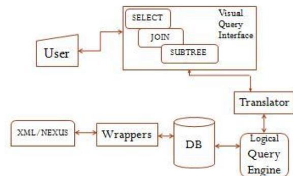
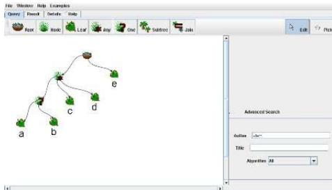

# PhyQL: A Web-Based Phylogenetic Visual Query Engine

Shahriyar Hossain<sup>‡</sup>, Munirul Islam<sup>‡</sup>, Jesmin<sup>¶</sup>, Hasan M Jamil<sup>‡</sup>

<sup>‡</sup>Integration Informatics Laboratory, Department of Computer Science, Wayne State University, Detroit, MI 48201

shah\_h@wayne.edu, munirul@wayne.edu, jamil@cs.wayne.edu

<sup>¶</sup>Department of Genetic Engineering and Biotechnology, University of Dhaka, Bangladesh

mailjesmin@yahoo.com

## Abstract

*Biologists are often interested to query published phylogenetic data for research purposes. PhyQL, a web-based visual phylogenetic query engine, can be quite useful on this regard. In PhyQL, we have implemented a data model and a visual query language to interact with hierarchically classified tree elements. To hide textual query submission, PhyQL provides a design interface to build the query visually. The users can build simple to complex queries using the query operators. PhyQL separates the application layer from the data layer by a logic layer leading to reduced query tools development time. Moreover, PhyQL provides interactive tree views in radial, phylogram and dendrogram layout. It can be accessed online at <http://integra.cs.wayne.edu/softwares/phyql/>.*

## 1 Introduction

Current genomic research is progressing quite rapidly due to advancement in bioinformatics and computation technologies. This is producing a great amount of data and revolutionizing the realm of phylogenetic studies. Most phylogenetic studies until recently have been restricted to 100 taxa or less [10]. Due to high throughput sequencing, large scale phylogenetic studies are now easily executable. As newer genomes are being sequenced, this trend of computing larger trees is going to increase. Hence, the need to store these trees for comparative exploration is greater than before. Thus we see a proliferation of a good number of phylogenetic databases (e.g. TreeBase [4], PhyloFinder [7]). These databases not only store the phylogenetic trees but also store the tree metadata (e.g. author, journal, year etc.). Due to the high volume of each database, advanced database technologies must be deployed in order to manage the storage, curation, retrieval and analysis of these biological data. The data is indexed and efficient algorithms are employed to reduce query execution times. As genomics

and biology press forward to new frontiers, new paradigms must be developed to accommodate future needs. Therefore, we feel a strong need to propose a new technological framework with the ability to handle these data with better efficiency and higher abstraction of its execution.

Hence we propose PhyQL, a phylogenetic database with a visual query engine based on a visual query language [10]. PhyQL aims to overcome the following limitations of the previously developed systems:

- Accessing data through complex web forms limits user query capabilities. Because these interfaces do not allow the user to submit queries outside of its scope. Also, the queries do not consider trees as first class citizens. This seriously reduces the query expressiveness and is often frustrating from users perspective. Declarative queries have been very popular in relational databases based on select-project-join operations. Thus, a suitable phylogenetic query language will allow us to achieve the flexibility and efficiency supported in structured query languages.
- In TreeBASE and PhyloFinder, the structure queries are submitted in a parenthesized notation (newick [3] format). Given high nesting and large number of taxa, writing the structure query can be very hard. We feel that visual query interface is a convenient way to release the burden from the user.
- PhyQL returns a list of trees given a user specified query. Now, many of the trees are quite large and difficult to view in a single frame. So, it calls for interactive interfaces for visual exploration of the trees. Current phylogenetic databases do not offer flexible tree viewers and suffers from illegibility problems given very large trees.

## 2 Overview of PhyQL

PhyQL is a phylogenetic database. Its novel features are its visual query interface and interactive tree viewer interface. Its main function is to query phylogenetic trees. In [10], the user queries on a phylogenetic database were divided into three classes based on searching collections of trees and their internal relations; and searching individual trees. The classifications are Select, Join and SubSet queries.

## 3 Implementation Details

PhyQL is a web tool written in Java since Java is open source and portable. For visualization, we used Java Universal Network/Graph Framework (JUNG) [2] and PREFUSE [9] Library. The database was stored in MySQL 5.0.22. The datalog queries were tested using XSB. Besides we used J2EE to build the client-server platform for web access. The client side was tested using Java Applet so that an user can use database online from any Java-enabled web browser.

### 3.1 System Architecture



Figure 1. PhyQL System Architecture

Initially the user creates the visual query combining query operators. The user query tree is first translated to an xml document. This translated document is then submitted to the Logical Query Engine, which is the heart of the system. Its job is to translate visual queries into logical queries. The Logical Query Engine communicates with the database, fetches the trees from the databases and finally sends the translated trees in GraphML [1] notation to the tree viewer. The export module is responsible for downloading the trees in XML or NEXUS [11] format by the user. For test purposes, we downloaded a 2004 TreeBASE image from TBMap (<http://linnaeus.zoology.gla.ac.uk/~rpage/tbmap/>) [13].

### 3.2 Language

The query operators in the graphical query language can be combined together to create from simple to complex forms of queries. For a full review of the operators, we refer the interested reader to [10]. The operators we implemented are:

- **Root:** The Root operator extends the internal node operator. It specifies an internal node which is also the root of the tree.
- **Leaf:** the Leaf operator is used to specify a LEAF node of the query tree. In [10], Jamil et. al. mentioned applying associated node properties along with the LEAF operator: taxa name, alias, and taxa description.
- **Internal Node:** It is depicted as a ‘?’. It identifies the parent of one or more nodes. For example, in Figure 2 (a) we are looking for trees that have node *a* and *b* spawning from a common parent.
- **Least Common Ancestor (LCA):** It is denoted as a ‘?’ . This operator identifies the LCA of one or more nodes. In Figure 2 (a) node *c*, *d* and the parent of node *a* and *b* have an LCA which is the child of the root of the tree. In the special case of having only one child, this operator reduces to the ancestor.
- **Subtree:** Given a set of labeled nodes, this operator extracts a projected tree from an existing tree. The algorithm for the Subtree operation is very simple. From the set of labeled nodes, it builds a subtree upto their LCA. Each internal node in a phylogenetic tree must have at least three edges connected to it. So, any internal node in the initial projected subtree is skipped that doesn’t meet this criteria.
- **Join:** The join operator is defined as a function that considers two nodes from two trees as join parameters. For node joining, only the equality (=) condition on node labels is considered. If the joining condition fails, an empty tree is returned. For example, two trees can be joined together where the leaf of a tree and the root of another tree have the same label.

### 3.3 Translator

The translator is the heart of the system. It translates the visual query tree to an XML document. Using XML, we can pass additional constraints on the nodes using attributes values. For example, consider Figure 2 (a) is translated to the XML document depicted in 2 (b). For every node in the visual query, we create an element in the XML with the type attribute of the element specifying the visual operator. We

also pass the tree-wide query attributes such as “author” as an attribute of the root element of the XML. We convert this XML into a mixture of relational and logical queries. Let us consider the logical query first. In this stage, we traverse the nodes of the query tree in post order and come up with a logical conjunction which will be



(a) Visual query

```
<tree author="stern">
  <node type="root">
    <node type="*">
      <node type="? ">
        <node>a</node>
        <node>b</node>
      </node>
      <node>c</node>
      <node>d</node>
    </node>
    <node>e</node>
  </node>
</tree>
```

(b) Translated XML

```
node(Y1,'e'), edge(Y0,Y1),
node(Y3,'d'), node(Y5,'b'),
edge(Y4,Y5), node(Y6,'a'),
edge(Y4,Y6), lca(Y3,Y4,Y2),
node(Y7,'c'), lca(Y2,Y7,Y8),
edge(Y0,Y2), isRoot(Y0)
```

(c) Logical Query

**Figure 2. Visually Querying the Database**

true for all the trees that satisfy the query. Let us assume that a number of leaves are joined together with “\*”, “?” or ‘root’ operators. They are translated into one of the following predicates:

*node(X, Y)* is true if table Node has an entry with NodeLabel Y and NodeID X.

*edge(X, Y)* is true if there is an entry in the Edge table with X as the parent of Y.

*ancestor(X, Y)* is true if X is an ancestor of Y.

*lca(I,J,K)* is true if K is the LCA of I and J.

*isRoot(X)* is true if X is the root of a tree.

The first two of the above mentioned predicates are directly mapped to the database facts. The rest are derived from them. We will explain the translation process by following each step for the example in Figure 2. Let us consider the lowest level of nesting which is a leaf node. For example,

```
<node>a</node>
```

is translated into the query predicate *node(Y6, 'a')*. Like in Prolog, the logical variable Y6 is system generated and is bound to ‘a’. The query string is passed to its parent node ‘?’

```
<node type="? ">
  <node>a</node>
  <node>b</node>
</node>
```

This gets translated into *edge(Y4,Y6), edge(Y4,Y5)*. The temporary variables Y4 and Y6 are the logical variables associated with node a and b. Now, we can rewrite the “\*” node in the following manner:

```
<node type="*">
  <node>Y4</node>
  <node>c</node>
  <node>d</node>
</node>
```

Here, we have three nodes combined with an “\*”. The corresponding logical predicate of this operator, *lca(I,J,K)* only works for two descendents. But, we can use this predicate to determine the LCA of the first two nodes and reapply the same predicate for calculating the LCA of the other node and the LCA of the previous two. In this way we can extend this operator to any number of descendents. So, the logical translation for the “\*” in the Figure 2 (a) is *lca(Y3, Y4, Y2), node(Y7, 'c'), lca(Y2, Y7, Y8)*.

Finally, we can rewrite the sub tree of the root replacing the leaf ‘e’ and the “\*” node with their corresponding logical variables.

```
<node type="root">
  <node>Y1</node>
  <node>Y2</node>
</node>
```

And, the translation for the root would be *edge(Y0,Y1), edge(Y0,Y2), isRoot(Y0)*. The entire logical query for this example is stated in the Figure 2 (c). After we have gathered all the trees that return true for this logical query, we apply a simple relational selection on them based on the author name.

### 3.4 Logical Query Engine

The query engine receives logical queries from the translator module described in the previous section. One of our goals was to separate the rule engine from the database engine. We chose XSB [15] as our Logical Query Engine. XSB’s in-memory database queries are an order of magnitude faster than tuProlog [14] and DataLog [6]. Using logic predicates, we could reduce the time complexity for LCA to  $O(h)$ .

## 4 Related Work

We will mainly compare our work with TreeBASE and PhyloFinder. Though TreeBASE maintains a relational database, it stores the trees in newick format. To overcome this limitation, Nakhleh et. al. [12] proposed storing trees in an edge table and use Datalog predicates to recursively query of the relational database. But, they could not devise any logical query engine to execute the predicates directly. They converted the transitive closure and LCA predicates into SELECT statements with the CONNECT BY primitive of ORACLE which is not part of the SQL standard. These theoretical Datalog rules had several limitations. Firstly, they proposed a top-down rule for finding the ancestor of two nodes. This may result into a time complexity of  $O(h^2)$  which is clearly costlier than our  $O(h)$  approach. The Least Common Ancestor (LCA) query proposed in [12] suffers from using the not operator.

To reduce the time complexity in LCA queries, PhyloFinder preprocesses the trees and store additional labeling information along with a node. In [8], Davidson et. al. proposed storing dewey labeling scheme [5] in the nodes. On the other hand, the Crimson [16] system eliminates this problem by storing the labels in nested subtrees to avoid long chains. But these labeling procedures are not suitable for dynamic environments. Because for dynamic trees, the tree nodes must be re-labeled each time the tree structure changes. PhyQL eliminates this problem by recursively computing the LCA for a set of nodes. Thus it can easily handle static and dynamic trees equally.

## 5 Conclusions and Future Research

PhyQL offers a simple web-based visual query interface based on a phylogenetic query language. Thus the user can concentrate on the query semantics rather than its syntax. The tree query operations are fully logic-based in PhyQL. Any modifications to query tools only requires change in logic rules drastically reducing program development time. The proposed architecture for PhyQL can be applied not only to the phylogenetic trees but also to protein-protein interaction networks, metabolic pathways etc.

## References

- [1] *GraphML File Format*. <http://graphml.graphdrawing.org/>.
- [2] *JUNG - Java Universal Network/Graph Framework*. <http://jung.sourceforge.net>.
- [3] *The Newick tree format*. <http://evolution.genetics.washington.edu/phylip/newicktree.html>.
- [4] *TreeBASE*. <http://www.treebase.org>.
- [5] V. Vesper. *Lets do dewey*. <http://www.mtsu.edu/~vvesper/dewey2.htm>.
- [6] S. Abiteboul and R. Hull. Data functions, datalog and negation. In *SIGMOD '88: Proceedings of the 1988 ACM SIGMOD international conference on Management of data*, pages 143–153, New York, NY, USA, 1988. ACM.
- [7] D. Chen, J. G. Burleigh, M. Bansal, and D. Fernandez-Baca. Phylofinder: An intelligent search engine for phylogenetic tree databases. *BMC Evolutionary Biology*, 8(1):90, 2008.
- [8] S. B. Davidson, J. Kim, and Y. Zheng. Efficiently supporting structure queries on phylogenetic trees. In *SSDBM'2005: Proceedings of the 17th international conference on Scientific and statistical database management*, pages 93–102, Berkeley, CA, US, 2005. Lawrence Berkeley Laboratory.
- [9] J. Heer, S. K. Card, and J. A. Landay. prefuse: a toolkit for interactive information visualization. In *CHI '05: Proceedings of the SIGCHI conference on Human factors in computing systems*, pages 421–430, New York, NY, USA, 2005. ACM.
- [10] H. M. Jamil, G. A. Modica, and M. A. Teran. Querying phylogenies visually. In *BIBE '01: Proceedings of the 2nd IEEE International Symposium on Bioinformatics and Bio-engineering*, page 3, Washington, DC, USA, 2001. IEEE Computer Society.
- [11] D. Maddison, D. Swofford, and W. Maddison. Nexus: an extensible file format for systematic information. *Systems Biology*, 46(4):590–621, 1997.
- [12] L. Nakhleh, D. Miranker, F. Barbancon, W. H. Piel, and M. Donoghue. Requirements of phylogenetic databases. In *BIBE '03: Proceedings of the 3rd IEEE Symposium on BioInformatics and BioEngineering*, page 141, Washington, DC, USA, 2003. IEEE Computer Society.
- [13] R. Page. Tbtmap: a taxonomic perspective on the phylogenetic database treebase. *BMC Bioinformatics*, 8(1):158, 2007.
- [14] G. Piancastelli, A. Benini, A. Omicini, and A. Ricci. The architecture and design of a malleable object-oriented prolog engine. In *SAC '08: Proceedings of the 2008 ACM symposium on Applied computing*, pages 191–197, New York, NY, USA, 2008. ACM.
- [15] K. Sagonas, T. Swift, and D. S. Warren. XSB as an efficient deductive database engine. *SIGMOD Rec.*, 23(2):442–453, 1994.
- [16] Y. Zheng, S. Fisher, S. Cohen, S. Guo, J. Kim, and S. B. Davidson. Crimson: a data management system to support evaluating phylogenetic tree reconstruction algorithms. In *VLDB '06: Proceedings of the 32nd international conference on Very large data bases*, pages 1231–1234. VLDB Endowment, 2006.