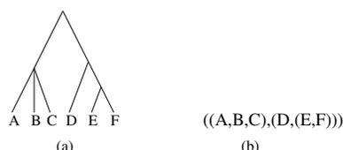

# Requirements of Phylogenetic Databases

Luay Nakhleh   Daniel Miranker   Francois Barbancon

Department of Computer Sciences and Center for Computational Biology and Bioinformatics  
University of Texas at Austin, Austin, TX 78712  
{nakhleh, miranker, francois}@cs.utexas.edu

William H. Piel

Department of Biological Sciences  
University of Buffalo, Buffalo, NY 14260  
wpie1@buffalo.edu

Michael Donoghue

Department of Ecology and Evolutionary Biology  
Yale University, New Haven, CT 06520  
michael.donoghue@yale.edu

## Abstract

*We examine the organizational impact on phylogenetic databases of the increasing sophistication in the need and use of phylogenetic data. A primary issue is the use of the unnormalized representation of phylogenies in Newick format as a primitive data type in existing phylogenetic databases.*

*In particular, we identify and enumerate a list of potential applications of such databases and queries (use-cases) that biologists may wish to see integrated into a phylogenetic database management system. We show there are many queries that would best be supported by a normalized data model where phylogenies are stored as lists of edges. Since many of the queries require transitive traversals of the phylogenies we demonstrate, constructively, that complex phylogenetic queries can be conveniently constructed as Datalog programs. We address concerns with respect to the cost and performance of the normalized representation by developing and empirically evaluating a feasibility prototype.*

## 1. Introduction

Phylogenies, i.e., evolutionary histories of groups of organisms, play a major role in representing the interrelationships among biological entities. A phylogeny is a rooted, leaf-labeled tree, whose leaves represent a set of operational taxa, and whose internal nodes represent the (hypothetical) ancestral taxa. A phylogeny on a set  $S$  of taxa represents the evolutionary history of the taxa in  $S$  from their most recent ancestor (at the root of the tree).

Reconstructing the evolutionary history of a set of taxa is of great significance in many areas, including molecular biology, population genetics, historical linguistics, to name

a few. Using phylogenetic knowledge is important in studying protein-protein interactions and gene functions, predicting nucleic acid structure and function, discovering the origin of emerging viruses, understanding co-evolution and the adaptive nature of morphological and behavioral traits, and studying the history of families of languages (for example, see [4]).

The growth of phylogenetic information and the need for on-line archival storage and retrieval led to the establishment of TreeBASE [13, 6, 10, 11]. As Genbank [1] serves as a searchable, archival repository of sequence data with little or no built-in analytic services, TreeBASE serves as a place to store phylogenies, and search for scientific results. In both Genbank and TreeBASE a primary service is to connect esoteric structural information to individual scientific articles which detail the investigation that leads to the deposited result.

TreeBASE is built using an underlying relational database platform and thus embodies flexible and scalable query facilities for many needs. However, the phylogenies themselves are stored as a text field storing strings structured in the Newick format [8].

One drawback of using the Newick format is that the database can not directly support queries concerning the relationships between the taxa and the structure of the phylogeny. In TreeBASE, queries specific to the structure of the individual phylogenies are done outside the database [16]. An initial query may derive a subset of the phylogenies, but then each of those phylogenies is exported and handled outside the database. This is not too unlike the coupling of GenBANK with BLAST.

Rapid growth in the publication of new phylogenies, and integration of sequence data and various evolutionary models are leading to much broader implication and application of phylogenies [13]. A proliferation of methods for recon-

structuring phylogenies further underscores the need to index and qualify individual phylogenies within a database and not merely as an external post-processing utility.

The application with the current highest profile in the systematics community is to reconstruct the *Tree of Life*, i.e., a phylogenetic tree that represents the evolutionary history of all species in the world. It is expected that when finished, the Tree of Life will contain millions of species, and since most of the phylogenetic reconstruction criteria are NP-hard, phylogeneticists use approximation methods. On the whole, the accuracy and speed of current phylogenetic reconstruction methods decrease as the number of taxa in the reconstructed phylogeny grows, while the memory requirements of the methods grows with the number of taxa. Also, usually there are trade-offs among these three factors when designing new methods. Obtaining a method that can reconstruct the entire Tree of Life in one pass seems far-fetched – at least at this stage. One alternative would be to reconstruct phylogenies of various groups of species, and eventually “assemble” those subphylogenies into one big phylogeny – the Tree of Life. Those subphylogenies need to be stored in an appropriate database and available for methods that will assemble them into the Tree of Life. Once a phylogenetic database is available, then finding those subphylogenies and assembling them into a bigger one can be achieved by a series of database queries, such as the ones we will detail in Section 4.

These efforts further suggest that individual phylogenies stored in a database are becoming larger and subsume larger subsets of the known taxa. Thus, one can anticipate that simple queries that divide the database into a candidate set for additional processing will not scale.

In this paper, we analyze the requirements of a phylogenetic database management system. In Section 2 we briefly describe the TreeBASE phylogenetic database and its limitations due to the fact that it uses the Newick format for storing phylogenies. In Section 3, we identify the users of phylogenetic databases and categorize them based on the applications they may use the database for. In Section 4 we list the potential queries that a phylogenetic DBMS needs to be able to handle. In Section 5 we describe a basic data model of storing the phylogenies as lists of their edges as an alternative to the Newick format that is currently used in TreeBASE. In Subsection 5.2 we demonstrate the recursive nature of handling phylogenies when they are stored in the proposed basic data model by describing some of the queries of Section 4 in Datalog. In Subsection 5.3 we assess the empirical performance of phylogenetic databases assuming our basic data model by running a few SQL queries on the database. We conclude in Section 6 with final remarks and directions for future research. A full version of this paper is available at [7].

## 2 TreeBASE

TreeBASE [3, 6, 10, 11] is a database that provides free, web-based access to phylogenetic data from published articles. TreeBASE stores three types of data: bibliographic information of published phylogenetic studies, their corresponding datasets, and their resulting phylogenetic trees, population trees, or gene trees.

Started in 1993 by Michael Donoghue and Michael Sanderson, TreeBASE has a variety of research and educational purposes that include (1) locating information on phylogenies of specific groups of interest, (2) obtaining datasets for studies of character evolution, (3) retrieving trees with representatives in particular geographic areas, (4) studying co-evolution, (5) studying congruence and combination of data, (6) studying phylogenetic methods, (7) discovering understudied groups, and (8) retrieving phylogenetic information for use in conservation biology and the management of natural resources.

While most current users of TreeBASE find it convenient in terms of obtaining descriptions of trees, this database is also crucial for those who seek to download the data matrices associated with the trees. TreeBASE is the only database that reliably stores alignments – GenBANK’s PopSet and EMBL-align have their own problems and so fall short of the task. Data matrices are usually not straight DNA alignments – they involve deletions of unalignable sections, recoding and gap-coding, concatenation of different genes, and inclusion of non-DNA/protein data (e.g., restriction fragments, morphology, etc.) – which are all anathema to the mission of Genbank and EMBL, and so such data are refused. Consequently, TreeBASE fills an important gap in bioinformatic resources.

The TreeBASE database can be searched in six ways: (1) by taxon: search is based on the taxonomic name; those names can be of taxa at the leaves of the phylogeny or of internal nodes, (2) by author: search is based on the last name of authors of phylogenetic studies, (3) by citation: search is based on words that appear in the full reference, such as the title or journal name, (4) by study accession number: search is based on a unique code that is assigned to a phylogenetic study, (5) by matrix accession number: search is based on a unique code that is assigned to a particular matrix, or (6) by structure: search is based on the topology and names of taxa; the query retrieves all trees in which either all or parts of these trees match the query tree for both the taxa and the pattern of relationships among them (wildcards can be used here as part of the query tree: “\*” denotes zero or more branches, and “?” denotes zero or one branches).

In TreeBASE, names can also be applied to individual internal nodes, which then allow searches on these internal names.

**Figure 1. (a) A tree and (b) its representation in the Newick format.**

### 2.1 The Newick format and its drawbacks in phylogenetic databases

The Newick format [8] for representing trees makes use of the correspondence between trees and nested parentheses. The leaves of the tree are represented by their names, whereas the interior nodes of the tree are represented by a pair of matched parentheses. Commas are used to separate siblings, and real numbers preceded by colons (those are optional) are used to denote branch lengths (See Fig. 1 for an example of a tree and its representation in the Newick format; the tree does not have branch lengths).

The Newick format representation of trees is not unique since the order of the descendants of a node affects the representation. Furthermore, the Newick format represents a rooted tree; however, for many biological purposes we may not be able to infer the position of the root.

There are two major drawbacks to using the Newick format in phylogenetic databases. First, in Newick format, the database can not directly support queries concerning the relationships between the taxa and the structure of the phylogeny. Second, when processes such as hybridization and horizontal gene transfer occur during the evolutionary history of a set of species, that history can not be modeled as a tree, but rather as a *network*, which is a rooted, directed, acyclic graph. Phylogenetic networks can not be represented using the Newick format. These drawbacks, coupled with the growing need for more sophisticated queries that relate the taxa and structure of the phylogeny, make it imperative to design alternative data models for phylogenetic databases in order to answer the growing needs of the systematics community. In order to achieve this goal, we first identify the potential users (or, applications) of phylogenetic databases and what queries they may desire.

## 3 Users

Biological applications of phylogenetics include, but are not limited to, predicting nucleic acid structure and function, discovering the origin of emerging viruses, and understanding co-evolution and the adaptive nature of morphological and behavioral traits [4].

Based on the applications they desire of a phylogenetic DBMS, users of phylogenetic databases can be grouped into

at least six categories:

**General Use.** Users in this category include those who periodically seek on-line representations of individual phylogenies for research and educational purposes. Most of the original impetus for developing phylogenetic databases fall into this category [13].

**Visualization.** Using computer data visualization helps explain the biological meaning of analysis results. Users in this category are interested in either obtaining single trees to visualize the relationships of taxa inside those trees, or in retrieving many trees and then clustering them – a method that shows the distribution of trees and the relationships among them. Methods such as Maximum Parsimony usually return many trees on the same dataset, and post-processing of those trees by means of clustering is of much interest to the systematics community.

**Study development.** This is the category of users who contribute to the database by storing phylogenies, updating existing ones (in rare cases), or studying the performance of the database.

**Super-tree algorithms.** With reconstructing the Tree of Life being a major challenge, and with the limitation of current phylogenetic methods, big trees are usually built by “assembling” smaller ones – an application of *super-tree algorithms* [14, 15]. Users of super-tree algorithms are interested in retrieving trees over various sets of taxa.

**Simulation studies and contests.** Although still in its organizational phase, phylogeneticists are setting up contests similar to the ones conducted in the protein structure community [2]. In these contests it is anticipated that large phylogenies will be created through simulation [12], and the simulated extant data given to participants. It is anticipated that contestant results will be posted to a database and the database used to critically compare the results help analyze the relative strengths and weaknesses of their technical approaches.

Simulation studies are commonly used to assess the performance of phylogenetic methods. These studies involve using tree topologies along with their parameters (substitution matrices on the edges); those parameters reflect the evolutionary model under which the sequences have evolved down the tree. Predicting the correct evolutionary model under which a set of sequences had evolved is one of the biggest challenges in systematics. Current simulation studies use simple models, such as the Kimura 2-Parameter and Jukes-Cantor that are not believed to be biologically realistic. Finding realistic evolutionary models, simulating evolution, and carrying out simulation studies under these models are of great significance. Retrieving published phylogenies from the database, along with their parameters, allows scholars to study those parameters and develop more realistic models.

**Comparative genomics.** With the technological advances

that led to the sequencing of whole genomes, understanding the functions of genes and other parts of the genome, as well as relating different genomes are very important. Researchers will be interested in retrieving phylogenies that relate different genes/genomes, constructing bigger ones from them, and analyzing current ones.

## 4 Queries

In this section, we list queries that users of phylogenetic databases would want a DMBS to support. Table 1 illustrates which queries are relevant to each category of users. We now list the eleven queries in Table 1; for a description of each of the queries the reader is referred to the full version of this paper [7].

- Q1:** Given a set  $S$  of taxa, find a minimum spanning clade for it.
- Q2:** Given three sets of taxa,  $S_1$ ,  $S_2$  and  $S_3$ , and based upon all the phylogenies in the database, find the relationships between those three sets.
- Q3:** Given a set  $S$  of taxa, return all phylogenies that contain  $S$ .
- Q4:** Given a phylogenetic method  $M$ , return all phylogenies that were reconstructed using  $M$ .
- Q5:** Given an integer  $n$ , representing a number of taxa, return all phylogenies on a set  $S$  of taxa, where  $|S| \approx f(n)$ .
- Q6:** Given a date/author/tool, return all phylogenies reconstructed on/before/after the given date, by the given author, using the given tool.
- Q7:** Given a certain characteristic  $l$ , return all phylogenies with that characteristic.
- Q8:** Given a type of data, and possibly a set of taxa, return all phylogenies on the set of taxa that were built using the given type of data.
- Q9:** Given a phylogeny  $T$ , a measure  $M$  and a quantity  $c$ , return all phylogenies that are  $c$  units distant from  $T$  using the measure  $M$ .
- Q10:** Given a model of evolution  $G$ , return all the phylogenies that were reconstructed under the  $G$  assumptions.
- Q11:** Given some measures, return statistics about the database that correspond to those measures.

## 5 A basic data model and feasibility prototype

We are not the first to identify that phylogenies may be stored in normalized databases by disassembling each tree into its component nodes [9]. Given the extensive research effort on computing transitive closures and Datalog starting

circa 1980 through the mid 90's, some of which has made it into commercial embodiment in both Oracle and DB2, most database researchers will probably consider this mapping to be obvious [17, 5].

Despite the popularity of transitive closures and Datalog as a topic virtually all prototype Datalog systems were main-memory based. In anticipation of Tree of Life phylogenies of millions of taxa many authors of important phylogenetic software systems are skeptical that relational databases will adequately support a properly normalized model. We now dispel that notion.

In this section we propose a basic data model for storing phylogenetic trees, where we disassemble each phylogeny into its component nodes and edges, and then store those nodes and edges as records in a table. In Subsection 5.2 we show that using this approach, phylogenies can be re-assembled recursively, and we demonstrate that by describing Datalog queries.

We now describe a simple schema of a database assuming this basic model. Then, in Subsection 5.3 we assess the empirical performance of phylogenetic databases when using this data model.

### 5.1 The schema

**(1) The taxa-scheme:**  $Taxa = (TaxonName, \underline{TaxonId})$

The TaxonName is the name of the taxon, and the TaxonId is a unique identification number assigned to each taxon.

**(2) The tree-taxon-scheme:**  $TreeTaxon = (\underline{TaxonId}, \underline{TreeId}, \underline{ChildId})$

Each taxon is associated with the tree nodes in which it appears.

**(3) The tree-scheme:**  $Tree = (AnalysisId, \underline{TreeId}, TreeType)$   
The AnalysisId is a unique identification number assigned to the analysis that resulted in the described tree. TreeId is the unique identification number of the tree, and TreeType is the type of the tree (binary, rooted, etc.).

**(4) The edge-scheme:**  $Edge = (ParentId, \underline{ChildId}, Weight, \underline{TreeId})$

Each edge is identified by EdgeId, and is defined by the parent node, identified by ParentId, and the child node, identified by ChildId. The weight of the edge is given by Weight, and the tree to which the edge belongs is identified by TreeId.

**(5) The author-scheme:**  $Author = (\underline{AuthorId}, LastName, Initials)$

Each author of a study is assigned a unique identification number, that is associated with his/her last name and initials.

**(6) The study-scheme:**  $Study = (\underline{StudyId}, Abstract, MatrixNumber)$

Each study is given a unique identification number, and associated with it are an abstract of the study and the number of data matrices pertaining to the study.

**Table 1. Queries required by users.**

|                       | Q1 | Q2 | Q3 | Q4 | Q5 | Q6 | Q7 | Q8 | Q9 | Q10 | Q11 |
|-----------------------|----|----|----|----|----|----|----|----|----|-----|-----|
| Casual Users          |    |    | ✓  | ✓  | ✓  | ✓  |    |    |    |     | ✓   |
| Visualization         | ✓  | ✓  | ✓  | ✓  | ✓  |    |    |    | ✓  |     |     |
| Study Development     |    |    |    |    |    | ✓  |    |    |    | ✓   |     |
| Super-tree algorithms | ✓  | ✓  | ✓  |    |    |    |    |    | ✓  |     |     |
| Simulation Studies    |    |    | ✓  | ✓  | ✓  | ✓  | ✓  | ✓  |    | ✓   | ✓   |
| Comparative Genomics  | ✓  | ✓  | ✓  |    |    |    |    | ✓  | ✓  |     |     |

(7) The study-author-scheme:  $StudyAuthor = (\underline{StudyId}, \underline{AuthorId})$

Each study is associated with the author(s) who conducted it.

(8) The matrix-scheme:  $Matrix = (\underline{MatrixId}, \underline{DataType}, \underline{Alignment})$

A matrix contains the sequence information that was used to reconstruct a tree. Each matrix is assigned a unique identification number, and associated with it are the data type of the characters and the alignment of the sequences.

(9) The matrix-taxa-scheme:  $MatrixTaxa = (\underline{MatrixId}, \underline{TaxonId}, \underline{Sequence})$

Each taxon is associated with a matrix that contains the sequence that characterizes the taxon.

(10) The study-matrix-scheme:  $StudyMatrix = (\underline{StudyId}, \underline{MatrixId})$

Each study has a data matrix associated with it.

(11) The analysis-scheme:  $Analysis = (\underline{StudyId}, \underline{AnalysisId}, \underline{Algorithm}, \underline{Software})$

Each analysis of a dataset is associated with a study, and is obtained using a specific algorithm, possibly implemented in a specific software.

### 5.2 Datalog queries

In the list of queries in Section 4, queries Q1, Q2, and Q7 are important queries that concern the structure and parametric details of the phylogenies. Following we develop a Datalog program embodying those queries.

Relations are represented in Datalog by *predicates*. Each predicate takes a fixed number of arguments, and a predicate followed by its arguments is called an *atom*. Operations in Datalog are described by *rules*, which consist of (1) A relational atom called the *head*, followed by (2) the symbol “: -”, which we often read “if”, followed by (3) a *body* consisting of one or more atoms, called *subgoals* which may be either arithmetic or relational. Subgoals are connected by commas (which denote “and”), and any subgoal may optionally be preceded by “-” which denoted the logical operator “not”.

We define the predicate  $edge(i_v, i_w)$  to be true if there is a directed edge from “parent” node  $v$  (labeled by integer  $i_v$ ) to “child” node  $w$  (labeled by integer  $i_w$ ). **Atomic predicates.** For every edge in the tree.

$edge(parentID, childID)$

**Transitive Closure of the predicate  $edge$ .**  $ancestor(i, j)$  is TRUE iff there is a path from  $i$  to  $j$ .

$ancestor(i, j) : -edge(i, j)$

$ancestor(i, j) : -edge(i, k), ancestor(k, j)$

**Least Common Ancestor of two leaf nodes.**  $lca(i, j, k)$  is TRUE iff  $k$  is the least common ancestor of  $i$  and  $j$ .

$ca(i, i, i)$

$ca(i, j, k) : -ancestor(k, i), ancestor(k, j)$

$nlca(i, j, k) : -ca(i, j, k), ca(i, j, l), ancestor(k, l)$

$lca(i, j, k) : -ca(i, j, k), -nlca(i, j, k)$

**Minimum Spanning Clade of two leaf nodes.**  $msc(i, j, k)$  is TRUE iff  $k$  is in the minimum spanning clade of  $i$  and  $j$ .

$msc(i, j, k) : -lca(i, j, k)$

$msc(i, j, k) : -lca(i, j, l), ancestor(l, k)$

**Basal node of a minimum spanning clade of two leaf nodes.**  $basal(i, j, k)$  is TRUE iff  $k$  is the basal node of the minimum spanning clade of  $i$  and  $j$ .

$basal(i, j, k) : -lca(i, j, k)$

**Length of path between two nodes.**  $pl(i, j, p)$  is TRUE iff the topological path length from  $i$  to  $j$  is  $p$ .

$pl(i, j, 1) : -edge(i, j)$

$pl(i, j, p) : -pl(j, i, p)$

$pl(i, j, p) : -ancestor(i, k), edge(k, j), pl(i, k, m), m = p - 1$

**Distance between two leaves.**  $distance(i, j, p)$  is TRUE iff the topological distance between  $i$  and  $j$  is  $p$ .

$distance(i, j, p) : -lca(i, j, k), pl(k, i, m), pl(k, j, n), p = m + n$

**Given 3 leaf nodes  $i, j$ , and  $k$ , which of the two leaves  $i$  and  $j$  is closer to  $k$ .**  $close(i, j, k)$  is TRUE iff  $i$  is closer than  $j$  to  $k$ .

$close(i, j, k) : -distance(i, k, m), distance(j, k, n), m < n$

### 5.3 Experimental study

Phylogenetic trees in the Newick format are expressed as parenthesized character strings. Storing that tree structure information in the database using the edge-based schema of the *Edge* relation would allow expanding the current set of functionalities offered by phylogenetic databases. Given a set of common cladistics queries, our conjecture is that such a scheme is computationally feasible for current trees found in TreeBASE as well as for potentially very large super-trees which might need to be stored in the future, such as the Tree of Life.

We implemented a prototype database using Oracle and populated it with phylogenies generated by the *r8s* software package [12]. Simulation data generated by *r8s* will allow us to best achieve our precise goals: (1) quantify the storage overhead when representing phylogenies in a normalized database compared to the compact representation in the Newick format, and (2) determine if Oracle’s implementation of transitive closure would produce acceptable execution times in anticipation of the databases created by the Tree of Life efforts.

#### 5.3.1 Implementing Datalog with transitive closure

Implementing recursive Datalog queries is possible in Oracle SQL by using the transitive closure primitive. Transitive closure implementations are available in the major commercial databases, yet are not part of the SQL standard. Thus the syntax will vary from Oracle SQL to DB2 SQL.

Transitive closure is a form of iteration which allows a query to fetch all the descendants of a given node (descendant axis) or all the ancestors of a given node (ancestor axis).

**Least Common Ancestor** Finding the least common ancestor of two nodes is done by recursion in Datalog. The transitive closure primitive allows us to perform exactly the same computation in SQL. Computing the least common ancestor of  $N$  nodes can be reduced to successive iterations of the LCA2 computation for two nodes.

**Minimum Spanning Clade** Finding the minimum spanning clade for  $N$  nodes can be performed by computing their least common ancestor and returning the subtree originating at that node.

**Path Length** The path length between two nodes A and B is the sum of the path length from A to LCA2(A,B), and the path length from LCA2(A,B) to B.

For the above queries in SQL the reader is referred to the Appendix in the full version of this paper [7].

#### 5.3.2 Database loading

We generated trees using the *r8s* software [12]. Two populations were simulated. Population 1 is composed of trees

with small numbers of taxa and small numbers of internal nodes. There are 50,000 trees in population 1 and the average tree size is 18 nodes (including both leaves and internal nodes). The role of population 1 is to account for the current mix of trees found in TreeBASE (at the time of writing this paper, TreeBASE stores about 2,000 trees and 27,000 taxa). For population 1, default generation parameters for the Yule forward generation process were chosen and the speciation rate was set to 1.0.

Population 2 is composed exclusively of extremely large trees containing millions of nodes. The role of population 2 is to account for potentially very large trees created by the Tree of Life project. There are 10 trees in population 2, all of identical size  $M$ . For the purpose of our experiments,  $M$  will vary from 1 million to 5.2 million nodes (including both leaves and internal nodes). For population 2, default generation parameters for the Yule forward generation process were chosen and the speciation rate was also set to 1.0.

Statistical summaries for both populations are shown in Table 2. While there are many more trees in population 1, most of the database is used to store population 2 trees, which completely dominate the database.

**Table 2. Statistical summary of the two populations.**

|                          | Population 1 | Population 2 |
|--------------------------|--------------|--------------|
| Number of trees          | 50,000       | 10           |
| Number of nodes per tree | 18           | 5,200,000    |
| Total number of taxa     | 450,000      | 26,000,000   |
| Total number of nodes    | 899,999      | 51,999,999   |

#### 5.3.3 Storage requirements

We measure the space required by the database to store primary and secondary indexes, in addition to the space required to store the *Edge* relation itself. We compare the cost of storing phylogenetic trees in the proposed database schema, versus the cost incurred by using the Newick format.

For our study, we model the storage cost required by the taxa and tree portion of the Newick format. We model the required size for storing a tree as a result of two components: the storage of the taxon information, and the cost of storing the tree itself as a character string. For a binary tree with  $N$  taxa, the file size is  $C_{Newick} = N \cdot (C + 2 + |Tid|)$ , where  $C$  is the record size for an individual taxon,  $|Tid|$  is the size of a taxon identifier, and 2 is the size for a pair of parenthesis.

On the other hand, if we store phylogenies as lists of their edges, using the *Edge* relation, the size of the database containing one tree of size  $N$  is  $C_{Database} = N \cdot C + TS +$

$|P|+|S|$ , where  $N \cdot C$  is the table space for the *Taxa* relation,  $|TS|$  is the table space for the *Edge* relation,  $|P|$  is the size of the primary index, and  $|S|$  is the size of the secondary index. Table 3 shows the actual values of these parameters for trees of different sizes, and Table 4 compares the sizes of the database when the Newick format is used and when the edge representation is used.

**Table 4. Sizes of the database when the Newick format and edge representation are used.**

| Population 2 tree size | $N$       | $C_{Database}$ | $C_{Newick}$ |
|------------------------|-----------|----------------|--------------|
| 5,200,000              | 2,600,000 | 3,709M         | 416M         |
| 4,000,000              | 2,000,000 | 3,174M         | 320M         |
| 3,000,000              | 1,500,000 | 2,287M         | 240M         |
| 2,000,000              | 1,000,000 | 1,890M         | 160M         |
| 1,000,000              | 500,000   | 786M           | 80M          |

We conservatively estimate the cost of storing taxon information,  $C$ , to be 64 bytes (or, 64 characters), and  $|Tid|$  to be 14 bytes. We show that the proposed database solution (the edge-based representation) requires a 10-fold improvement in storage capacity. In particular, 3.7 GB would be required to store our largest Tree of Life database population using the edge-based representation, versus 416 MB for a file in the Newick format. While this may seem large, in Oracle terms this represents a tiny database. To illustrate this, consider that at a conservative cost of 0.2cents/MB the extra disk space required to store the Tree of Life database population would be around \$7.40!

#### 5.3.4 Experimental setup and database tuning

Our validating experiment tests the robustness of our least common ancestor query (LCA2) against large volumes of data. We measure the execution time of LCA2 on a database populated with our simulated tree populations. The role of these measurements is to accurately reflect the performance of the Oracle transitive closure implementation. Also, LCA2 is the basic operation in computing both minimum spanning clade and path length queries.

Cladistics computations on phylogenetic trees are possible using the *Edge* relation. A natural primary index for this relation is the index on the primary key (TreeID, ChildID). However loading the database with this default primary index alone is not sufficient. The impact of introducing the secondary index on (TreeID, ParentID) can be felt by a reduction of several orders of magnitude in the speed of cladistic queries.

Thus it is imperative to construct two indexes on the *Edge* relation in order to make cladistics computations possible: Primary Index (TreeID, ChildID) and Secondary In-

dex (TreeID, ParentID). These two indexes allow edges in the trees to be fetched through either of their ChildID or ParentID values, thus guaranteeing that even very large trees can be traversed quickly by transitive closure along both the descendant or the ancestor axis.

#### 5.3.5 Measurements for LCA2 queries

Our experiments were conducted on a 866MHz Pentium III desktop computer with 512MB of RAM, and the Oracle 9i Personal Edition database. The *Edge* relation was loaded with the trees from both populations. We timed LCA2 with a cold cache for a first 30 random pairs of taxa chosen from Population 2 trees. We then measured the execution times for LCA2 for the next 30 random pairs of taxa to simulate a warm cache. Table 5 shows the results.

Using the primary and secondary (B-Tree) indexes, looking up any edge (ParentID, ChildID, Weight, TreeID) in the *Edge* relation given its TreeID along with either the ParentID or ChildID, should follow a logarithmic law. We do observe experimentally that the impact of the size of the database on the execution time for LCA2 is insignificant, even for large values of  $M$ .

## 6 Conclusions and future research

Sanderson *et al.* [13] wrote about the need for phylogenetic databases which have since come to be [10, 11]. In this paper, we examined the organizational impact on phylogenetic databases of the increasing sophistication in the need and use of phylogenetic data.

We identified and enumerated a list of potential applications and queries that biologists might wish to see integrated into a phylogenetic database. We then described the only existing phylogenetic database – TreeBASE, and showed that the limitations of this database stem from using the Newick format for representing trees as a means for storing the phylogenies.

We then showed that most queries would best be supported by a normalized data model where phylogenies are stored as lists of edges. We were not the first ones to propose this data model; Piel [9] proposed an alternative to the Newick format by disassembling the phylogenetic tree into its nodes and then storing each child node and the identity of its parent node as records in a table. In this approach, each node receives a unique node ID number that can then identify both parent and child. This approach has several advantages: (1) it can store lots of auxiliary information about each node and edge, which is harder to do when using the Newick format, and (2) storing each node separately means the database has access to nested sets of clades, and therefore ultimately to the topologies of stored trees.

Since many of the queries require transitive traversals of the phylogenies, we demonstrated, constructively, that

**Table 3. Experimental values of the various parameters that affect the file and database sizes.**

| Population 2 tree size | $N$       | $TS$   | $ P $ | $ S $  | $N \cdot C$ | $N \cdot (2 +  Tid )$ |
|------------------------|-----------|--------|-------|--------|-------------|-----------------------|
| 5,200,000              | 2,600,000 | 1,281M | 949M  | 1,146M | 333M        | 83M                   |
| 4,000,000              | 2,000,000 | 1,007M | 813M  | 955M   | 256M        | 64M                   |
| 3,000,000              | 1,500,000 | 754M   | 612M  | 729M   | 192M        | 48M                   |
| 2,000,000              | 1,000,000 | 503M   | 772M  | 487M   | 128M        | 32M                   |
| 1,000,000              | 500,000   | 252M   | 210M  | 260M   | 64M         | 16M                   |

**Table 5. Execution times of the LCA2 query in seconds.**

| Size of M (nodes) | Size of M (taxa) | 1 st execution | Average 1-30 | Average 31-60 |
|-------------------|------------------|---------------------------|--------------|---------------|
| 5,200,000         | 2,600,000        | 0,78                      | 0,289        | 0,253         |
| 4,000,000         | 2,000,000        | 0,77                      | 0,278        | 0,246         |
| 3,000,000         | 1,500,000        | 0,80                      | 0,239        | 0,233         |
| 2,000,000         | 1,000,000        | 0,81                      | 0,266        | 0,221         |
| 1,000,000         | 500,000          | 0,70                      | 0,220        | 0,181         |

complex phylogenetic queries could be conveniently constructed as Datalog programs.

Finally, to empirically assess the quality of our basic data model, we ran experiments which showed that it takes less than a second to execute a sophisticated query on a database that contains trees of millions of nodes. We empirically demonstrated the significance of having a secondary index and its impact on reducing the speed of executing the queries. Having the primary as well as the secondary indexes guarantee that even large trees can be traversed quickly by transitive closure.

For future work we intend to experiment with the other queries that we described in Section 4, and investigate the use of compression techniques on the indexes of phylogenetic databases when the basic data model that we proposed is used.

“The bottom line is that phyloinformatic databases need to move beyond acting as highly specialized literature databases, and instead take on the role of actively building a synthesis of accumulated phylogenetic knowledge” [9].

## References

- [1] National center for biotechnology information. <http://www.ncbi.nlm.nih.gov/>.
- [2] Protein structure prediction center. <http://predictioncenter.llnl.gov/>.
- [3] TreeBASE: A database of phylogenetic knowledge. <http://www.treebase.org/>.
- [4] J. Bull and H. Wichman. Applied evolution. *Annu. Rev. Ecol. Syst.*, 32:183–217, 2001.
- [5] H. Garcia-Molina, J. Ullman, and J. Widom. *Database Systems: The Complete Book*. Prentice Hall, 2002.
- [6] V. Morell. TreeBASE: the roots of phylogeny. *Science*, 273:569, 1996.
- [7] L. Nakhleh, D. Miranker, F. Barbancon, W. Piel, and M. Donoghue. Requirements of phylogenetic databases. Technical Report TR-02-64, Department of Computer Sciences, University of Texas at Austin, 2002.
- [8] G. Olsen. The “Newick’s 8:45” tree format. [http://evolution.genetics.washington.edu/phylip/newick\\_doc.html](http://evolution.genetics.washington.edu/phylip/newick_doc.html).
- [9] W. Piel. Phyloinformatics and tree networks. In C. Wu, P. Wang, and J. Wang, editors, *Computational Biology and Genome Informatics*. World Scientific Press. In press.
- [10] W. Piel, M. Donoghue, T. Eriksson, C. Henze, K. Rice, and M. Sanderson. TreeBASE: a relational database of phylogenetic knowledge, 1996. Society of Systematic Biologists, St. Louis, Missouri (poster).
- [11] W. Piel, M. Donoghue, and M. Sanderson. TreeBASE: a database of phylogenetic knowledge. In J. Shimura, K. Wilson, and D. Gordon, editors, *To the interoperable “Catalog of Life” with partners – Species 2000 Asia Oceania*, pages 41–47. 2002. Research Report from the National Institute for Environmental Studies No. 171, Tsukuba, Japan.
- [12] M. Sanderson. Analysis of rates (r8s) of evolution, 2002. <http://ginger.ucdavis.edu/r8s/>.
- [13] M. Sanderson, B. Baldwin, G. Bharathan, C. Campbell, D. Ferguson, J. M. Porter, C. V. Dohlen, M. Wojciechowski, and M. Donoghue. The growth of phylogenetic information and the need for a phylogenetic database. *Syst. Biol.*, 42:562–568, 1993.
- [14] M. Sanderson, A. Purvis, and C. Henze. Phylogenetic supertrees: Assembling the trees of life. *TREE*, 13:105–109, 1998.
- [15] C. Semple and M. Steel. A supertree method for rooted trees. *Disc. Appl. Math.*, 105:147–158, 2000.
- [16] H. Shan, K. Herbert, W. Piel, D. Shasha, and J. Wang. A structure-based search engine for phylogenetic databases. In *14th International Conference on Scientific and Statistical Database Management*, pages 7–10, 2002.
- [17] J. Ullman. *Principles of database and knowledge base systems*. Rockville, MD: Computer Science Press, 1988.